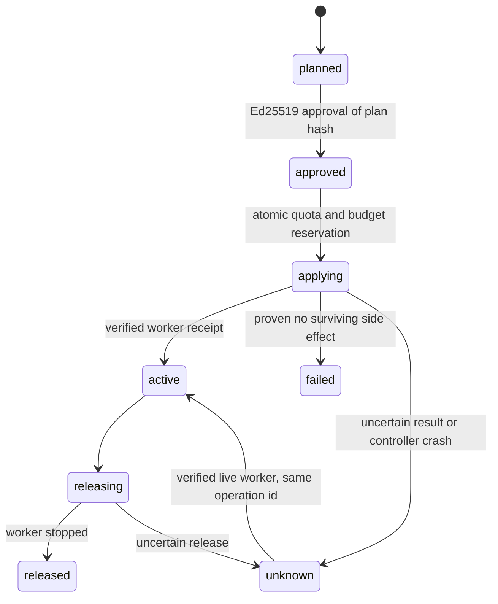

<!-- Copyright 2026 Qianmo AgentNest Team -->
<!-- SPDX-License-Identifier: AGPL-3.0-or-later -->

# 已有资源池扩容与本机模拟

M2 当前没有可调用的云厂商新建实例接口。按负责人 2026-10-08 的授权，本实现从**已登记资源池**制定分配计划，用本机独立 worker 进程模拟节点租约，跑完审核、预约、执行、释放和故障恢复。它不会申请云实例、产生云账单或改变现网节点。

入口为 `qm elastic`，库为 `@qianmo/elastic`。已有 `@qianmo/capacity` 日历/基线决策可通过 `plan --decision` 转为计划；受抑制的决策一律拒绝，计划仍需审批，不能越过人工审核直接执行。

## 状态与不变量



计划本身不占用资源，`apply` 在 SQLite `BEGIN IMMEDIATE` 事务内重新核对并预约。已审批的两个计划争同一份容量时只会有一个执行；失败者不能越过配额。`applying` / `active` / `releasing` / `unknown` 均继续占用容量与预算。`active` 的重复 apply 返回原 receipt，不启动第二个 worker；同一 id 配另一份请求会拒绝。

计划哈希绑定完整请求、租户、选中的节点、catalog 哈希、预算和过期时间。`approve --hash` 必须匹配人实际看到的哈希；签名还绑定租户与有效期。签发者须存在于 catalog 的 approvers 并被允许审批此租户。catalog 改变、审批过期、签名错误或租户不符都拒绝执行。CLI 是拥有私有状态目录的本地操作员界面，不提供面向不可信用户的远程弹性 API，也不把 `--tenant` 声称为身份认证。

## 准备和运行

先在专用 `QIANMO_CONFIG_DIR` 下生成操作员公钥（私钥留在该目录下的 identity 文件）：

```sh
qm elastic identity --actor ops
```

把输出的 publicKey 写入 catalog，人工审核其租户范围。配置例子中的预算是**模拟记账单位**，不代表人民币、美元、云厂商报价或商业计费：

```json
{
  "mode": "existing-pool-local-simulation",
  "nodes": [{
    "id": "local-node-a", "tenant": "team-a", "available": true,
    "cpuCores": 4, "memoryMb": 4096,
    "costMicrosPerHour": 1000000,
    "capabilities": ["code", "tests"]
  }],
  "tenants": [{
    "id": "team-a", "maxCpuCores": 4, "maxMemoryMb": 4096,
    "budgetMicros": 2000000
  }],
  "policy": {
    "maxCpuCores": 4, "maxMemoryMb": 4096,
    "maxLeaseCostMicros": 1000000, "totalBudgetMicros": 2000000,
    "maxDurationMs": 3600000, "cooldownMs": 60000, "planTtlMs": 300000
  },
  "approvers": [{"id": "ops", "publicKey": "<上一步43字符公钥>", "tenants": ["team-a"]}]
}
```

请求文件：

```json
{
  "id": "coding-001", "tenant": "team-a",
  "cpuCores": 2, "memoryMb": 1024, "durationMs": 60000,
  "capabilities": ["code"]
}
```

```sh
qm elastic plan --catalog catalog.json --request request.json
qm elastic approve --catalog catalog.json --tenant team-a --id coding-001 --hash '<plan输出的完整hash>' --actor ops
qm elastic apply --catalog catalog.json --tenant team-a --id coding-001
qm elastic status --catalog catalog.json --tenant team-a
qm elastic release --catalog catalog.json --tenant team-a --id coding-001
# 只有发生未知执行结果时，先核对现场，再尝试查认已有worker：
qm elastic reconcile --catalog catalog.json --tenant team-a --id coding-001
```

`plan --catalog catalog.json --tenant team-a --decision decision.json` 消费真实 `ScaleUpDecision`，调用原 capacity 包的 `needFromDecision`；产生的资源与时长仍被 catalog policy 限制，预测窗口超过 maxDurationMs 会拒绝。

## 容量、费用与执行边界

- 选节点仅来自 catalog 中 `available: true`、同租户且具备所有所需能力的条目；不从请求中接受新端点或运行命令。
- 同时核对单节点、租户和全池的 CPU/RAM 逻辑容量。单次租约预算、租户累计预算、全池累计预算均为硬上限；未知操作保留整个预估费用。费用用整数运算按 CPU/RAM 两者较大占比及租期向上取整，不依赖浮点近似。
- 成功释放后按已运行时长计入累计消耗；预算不会随释放清零。可用额度为预算减已消耗及现存预约。冷却时间按租户持久保存，对并发进程同样生效。
- **CPU/RAM 是调度记账，不是 OS cgroup 限额。**worker 的 HOME、cwd、环境独立，只有私有 Unix socket 的存活/释放接口；不接受用户代码或任意 shell 命令。它证明控制流程能管理真实进程，不证明真实机器提供了登记数量的计算能力。
- worker 使用一次性随机 token，配置及 receipt 文件 0600，目录 0700、socket 0600。CLI 输出删去 token/socket；不在 argv 传秘密。释放收到正确 ACK 后仍须确认该 PID 已不存在才可收回预约，HTTP 错误、超时、身份不符或 listener 关闭都不能替代进程退出证据；到期退出同样检查 PID。PID 复用、权限不足或无法确认会保守保留。
- 资源库 `qianmo/elastic/operations.sqlite` 使用 WAL + FULL synchronous。`elastic_events` 在同一事务追加审核/预约/状态记录；CLI 另写 `AuditSource.Capacity` 的 `elastic.*` 哈希链，跨进程追加使用数据库锁串行化。

## 崩溃和未知结果

控制器在启动 worker **之前**提交 `applying` 和 owner PID。若在 worker 已启动、receipt 未落库之间崩溃，下一次 CLI 检测到旧 owner 已退出，将其标为 `unknown`，不重复执行、不释放预约。`reconcile` 只能查认相同 operationId 的已存 worker receipt，并用私有 token 向活 worker核实 PID；不能查认则继续保留资源，要求操作员现场处理，不能把「没收到回复」解释成「没有资源」。

确认启动失败且进程已退出时才标 `failed` 并释放预约。释放结果未知时也保留预约。进程被杀不等于实例被删；未来真实云适配器必须实现自己的存在性检查、幂等键与删除确认，不能直接把这个本机 worker 适配器改名当云适配器。

## 验证

```sh
bun test --preload ./atlas/tests/preload.ts \
  ./atlas/packages/elastic/test \
  ./atlas/packages/node/test/commands/elastic.test.ts \
  ./atlas/packages/node/test/commands/elasticWorker.test.ts
# 编译入口与 self worker 路由：
QIANMO_TEST_COMPILED_QM=/absolute/dist/qm-darwin-arm64 \
  bun test --preload ./atlas/tests/preload.ts \
  ./atlas/packages/node/test/commands/elastic.test.ts
```

控制器用例覆盖签名/哈希/过期/catalog 变化、租户能力与预算、全局预算、冷却、并发不超售、重复 id、已消费预算保留、确认失败释放与未知结果保留。真实 CLI 用例运行独立 worker：两个并行申请只落一份；重复 apply 仍是同一 PID；释放确认进程退出后不能再接入该 socket。另一用例在真实 worker 已 ready 后对控制器 `SIGKILL`，新 CLI 恢复 `unknown`，查认原 PID 后再释放，未重复启动。另有真实 Unix socket 故障负控：已 ACK 但 status 返回 503/401、畸形 JSON、错误身份、超时或 listener 关闭，只要原 PID 仍存活，均转 `unknown` 持有预约，阻止竞争计划，不重复 release。

设置 `QIANMO_TEST_COMPILED_QM` 后，并行申请/重复申请/释放用例从真实编译 CLI 启动同一 binary 的 `self` worker 分支。崩溃恢复用例的故障注入控制器仍由源码运行，以精确停在 receipt 提交前；随后 reconcile/release 使用指定编译 CLI，不把它声称为编译控制器故障注入。

本轮初验与修复验证分别在 `/Users/cornna/atlas-evidence/m1-work/m1-completion/Gates/elastic-tests.log`、`elastic-release-fixed.log`；最终编译产物与对应复跑以该目录 `RESULTS.md` 为准。这些是本机现有池模拟证据；云 API、真实资源性能、生产节点联调和长期弹性效果未执行。
