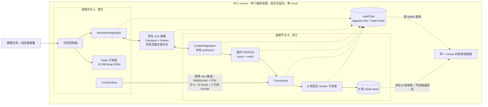

<!-- Copyright 2026 Qianmo AgentNest Team -->
<!-- SPDX-License-Identifier: AGPL-3.0-or-later -->

# 数模竞赛资源借用场景（P2.4 / AC-7，草案）

| 项 | 内容 |
|---|---|
| 文档版本 | v0.1-draft |
| 文档状态 | **草案 / P2.4 未完成**。赛中真实痛点尚待团队依据参赛记录补写，全文尚待全员评审；两项完成前不得把本文标为「评审通过」或把 P2.4 标为完成 |
| 任务包 | [`roadmap.md`](./roadmap.md) P2.4；后续实现与跑批归 P6.1 |
| 验收依据 | [`charter.md`](./charter.md) §4 **AC-7**；本文只把六个环节变成可执行分镜，不改写验收线 |
| 报告真源 | `demo/lib/p61-report-core.ts`。报告字段、七项 `checks` 与 `pass` 汇总逻辑以该文件为准；本文不复制 TypeScript interface |
| 协议真源 | 消息体积、跳数、TTL、速率预算等协议级数值只取 `@qianmo/protocol` 的 `LIMITS`，本文不另写一份 |
| 演示边界 | M0 内的诊断、协商、capability、transport、router、tunnel 与 audit；不接入插件市场、Artifacts、语音或 Computer Use（章程 N-9） |

本文中的 A / B 是**同一个 runner 进程内组合出来的两个逻辑节点**：A 是借方，B 是贷方。常驻链路与按需隧道都使用真实包和 unix socket，测试替身数量必须为 0；OOM 尝试与 B 侧计算则各自运行在真实子进程中。整条链只允许有一个 `taskId`，分块、能力令牌、结果与审计都用它关联。

> **草案出口条件**：①团队把 §1 的真实痛点表按证据补齐；②全员逐条评审六帧、指标与诚实边界；③评审意见落回本文。当前文本只供 P6.1 实现对齐，**不构成 P2.4 DoD 已达成的声明**。

---

## 1. 赛中真实痛点（待团队补写）

本节不得从演示脚本倒推「赛中发生过什么」，也不得把设想、听说或一般性行业问题写成团队事实。每一行都应能指向原始参赛记录；无法取证的内容留空或删除。

| 现象 | 当时处置 | 对应能力 | 证据来源 |
|---|---|---|---|
| 【待团队依据参赛记录填写】 | 【待填写】 | 【待填写；需指向章程 §3 内能力】 | 【待填写：记录名称 / 日期 / 保管人】 |
| 【待团队依据参赛记录填写】 | 【待填写】 | 【待填写；需指向章程 §3 内能力】 | 【待填写：记录名称 / 日期 / 保管人】 |
| 【待团队依据参赛记录填写】 | 【待填写】 | 【待填写；需指向章程 §3 内能力】 | 【待填写：记录名称 / 日期 / 保管人】 |

评审时逐行回答：证据是否真的发生在赛中、处置是否为当时动作而非事后改写、对应能力是否落在 M0 范围。任一项答不上来，该行不进入对外分镜。

---

## 2. 演示拓扑



两条链路不能混称：

- **常驻链路**承载任务提交、资源协商与背景流量；从演示开始前即存在，按需隧道拆除后仍继续工作。
- **按需隧道**只在 B 已授权且租约成立后监听，绑定一个 `taskId` / `offerId`，只承载 A→B 的工作分块。A 的 `TunnelClient.send()` 只等 transport receipt，不等待计算结果。
- B 侧 worker 把结果写进 B 侧 result store；由于这是单机、单 runner 演示，验收读取器直接读该 store 和 AuditTrail。**不存在「B 经隧道把结果推回 A」这一步。**
- 单进程组合指服务拓扑不另起两套节点服务，不代表把计算伪装成函数调用；OOM 与每个计算 worker 都必须是可观察到 PID / 退出码的真子进程。

---

## 3. AC-7 六帧分镜

下列 `report check` 是 `demo/lib/p61-report-core.ts` 已实现的七项汇总判据。审计 kind 中，已有包事件沿用原名；标有「P6.1 场景接线」的 kind 由 runner 补写到 AuditTrail，不表示当前生产接线已经存在。任何审计记录都不得写入 PSK、私钥、完整 capability 或数据正文。

### 帧 1：提交建模任务

| 项 | 定义 |
|---|---|
| **输入** | `p61-reset` 生成并冻结的一份 `qianmo.p61.dataset.v1` 数据集；runner 经常驻 unix 链路提交一条建模任务，记录数据集摘要、seed 与新 `taskId` |
| **期望现象** | A 接受任务并启动本地首次计算；背景流量已在同一条常驻链路上持续收发。此后数据文件与任务参数不再由人或脚本改写 |
| **可执行判据** | 数据集结构校验通过；提交消息取得 accepted receipt；同一 `taskId` 进入后续 OOM、协商、chunk 与 release；AuditTrail 中 `p61.task-submitted` 恰有记录 |
| **report check** | `taskSubmitted` |
| **审计 kind** | `message_accepted`（常驻 transport）；`p61.task-submitted`（P6.1 场景接线） |

### 帧 2：A 真实失败并给出原因级 OOM 诊断

| 项 | 定义 |
|---|---|
| **输入** | A 用 Node 子进程在 `--max-old-space-size=32` 下执行同一任务的内存扩张型首次方案；runner 捕获退出码、stderr、是否由超时监督器发信号等事实，再交给 `@qianmo/diagnosis` |
| **期望现象** | 子进程真实地以 OOM 失败；诊断事件明确给出 `cause = "oom"`、依据与建议动作，不得退化成「执行失败」，也不得把超时猜成 OOM |
| **可执行判据** | `injectOom('node')` 在 32 MB heap 上限下得到非零退出及运行时 OOM 证据，且 `timeoutEnforced !== true`；`diagnose` 返回 `cause === "oom"` 和非空 evidence；同一 task 的审计中出现 `qianmo.diagnosis.v1` |
| **report check** | `diagnosisNamesOom` |
| **审计 kind** | `qianmo.diagnosis.v1`（`source=diagnosis`，只写原因、置信度与证据摘要） |

### 帧 3：A 向 B 发起资源协商

| 项 | 定义 |
|---|---|
| **输入** | runner 根据 OOM 诊断的建议动作自动调用 A 的 `BorrowerNegotiator`，向 B 发送 `resource.request`；借方的 task ID 生成器注入帧 1 的同一个 `taskId`，资源数值遵守贷方本地 policy，协议边界仍只取 `@qianmo/protocol` 的 `LIMITS` |
| **期望现象** | 请求经常驻链路到达 B；协商没有绕到按需隧道，也没有生成第二个任务。M0 的零成本约束保持不变 |
| **可执行判据** | `resource.request` 的 `taskId` 与原任务逐字相同，`costLimit === 0`；request、offer、grant 均经常驻双向 transport 取得 receipt；B 的 reservation 进入 `leased`，grant 各轴不超过 request |
| **report check** | `leaseNegotiated` |
| **审计 kind** | `message_accepted`、`negotiation.offered`、`negotiation.leased` |

### 帧 4：B 本地授权、签 capability 并建立按需隧道

| 项 | 定义 |
|---|---|
| **输入** | B 的 `LenderOptions.authorize` 在报价前执行脚本化本地同意；B 在内存生成临时 Ed25519 密钥，用 `issueCapability` 签发绑定本任务的 `user-confirmed` capability，再由 B 侧 `verifyCapability` 复验 S-1；PSK 只读取 `QIANMO_TRANSPORT_PSK` |
| **期望现象** | 本地授权通过后 B 才报价，A 接受报价形成租约；能力令牌的签发者与验证目标都是 B，复验通过后才启动 `TunnelHost`，随后 `TunnelClient` 经 unix WebSocket + PSK 连接并凭该 capability 获准进入 |
| **可执行判据** | `authorize` 返回 true；令牌 `act` 为 `user-confirmed`、绑定同一 `taskId`、由 B 私钥签发，`verifyCapability` 返回 `ok`；租约成立后才创建 tunnel；运行目录、报告与审计不写私钥、PSK 或完整令牌 |
| **report check** | `authorizedAndTokenMinted` |
| **审计 kind** | `p61.user-authorized`、`negotiation.offered`、`negotiation.leased`、`tunnel.opened`、`tunnel.admitted` |

### 帧 5：同一任务在 B 的借用资源上分块跑完

| 项 | 定义 |
|---|---|
| **输入** | A 按 §6 的确定性分区发送 chunk；正式模式默认 20 个，smoke 默认 4 个。payload 只含 chunk schema、编号、总数、迭代数与数据集摘要，`taskId` 只取 envelope 真源；发送节奏覆盖正式窗口约 85% |
| **期望现象** | 每个 chunk 经 A→B 隧道被 B 接纳，A 只得到 receipt；B 为每块启动真实 worker 子进程，worker 使用共享评分算法处理由编号推导出的区间；runner 把子进程结果原子写入 B 侧 result store 并汇总 |
| **可执行判据** | 所有 chunk 都有 exit 0 的 worker 结果；`chunkBounds` 使区间从 0 连续覆盖到 96；汇总的 best index、best score 和 digest 与 `expectedSolution` 一致；首末完成时间跨度不少于请求运行窗口的 70%；没有 B→A tunnel result payload |
| **report check** | `computedOnBorrowedResource` |
| **审计 kind** | `tunnel.carried`、`p61.chunk-completed`（P6.1 场景接线） |

### 帧 6：release 后拆隧道、再拨失败并保留审计链

| 项 | 定义 |
|---|---|
| **输入** | result store 汇总完成且正式时长已达线后，A 经常驻协商链路发送 `resource.release(reason="completed")`；B 处理 release，按 `released` 原因关闭 host，A 随后关闭 client；runner 再拨同一个 tunnel unix socket |
| **期望现象** | 租约状态释放、按需监听消失、再拨失败；常驻背景流量不受影响并在拆隧道后继续产生 accepted receipt；AuditTrail 能按同一 `taskId` 重建提交、诊断、协商、授权、计算、结果与释放，hash chain 完整 |
| **可执行判据** | B 的 pending reservation 为 0；`tunnel.opened` 与 `tunnel.closed` 各 1 条且 close reason 为 `released`；用相同地址和正确 PSK 再拨仍失败；close 之后至少有一条常驻背景消息被接受；审计 `intact === true`、issues 为 0，必需 kind 齐全且时间顺序满足前五帧 |
| **report check** | `tunnelTornDownClean`、`continuousNoIntervention` |
| **审计 kind** | `negotiation.released`、`tunnel.closed`、`message_accepted`（拆隧道后的常驻背景消息） |

---

## 4. 正式 10 min 时间轴与「不是空转」

正式计时从帧 1 的任务提交被接受开始，到帧 6 的 release、隧道 close 与再拨失败全部完成为止，`elapsedMs` 必须 **≥ 600,000 ms**。准备数据、启动常驻链路的时间不计入；失败后停住等人处理也不计入成功时长。

| 相对时间 | 动作 | 连续性证据 |
|---|---|---|
| T−准备期 | reset、生成数据、启动常驻 unix 链路和背景发送器 | 第一条背景 receipt；不计入 AC-7 时长 |
| T+00:00 | 提交任务，锁定 `taskId` / dataset digest | `p61.task-submitted` + transport receipt |
| T+00:00 起 | A 的 32 MB Node 子进程 OOM，生成原因级诊断 | 子进程退出观测 + `qianmo.diagnosis.v1` |
| 诊断后 | A 经常驻链路请求资源；B 本地授权、报价、grant、签发与复验 capability | negotiation 审计 + token verify verdict |
| 租约成立后 | 建立按需隧道 | `tunnel.opened`；首块发送时出现 `tunnel.admitted` |
| T+00:30 ～09:00 | 正式默认 20 个 chunk 按等距计划点发往 B；smoke 的 4 块按同一比例压缩 | receipt、worker exit、B 侧 store 与 `p61.chunk-completed` |
| T+09:00 ～不早于 10:00 | 汇总已完成，常驻背景流量继续 | result digest、持续的背景 receipt；首末 worker 完成跨度判据已经成立 |
| T≥10:00 | release、close、再拨失败；再发送至少一条常驻背景消息 | close / redial / post-close background 三项证据 |

调度器把第一块放在请求窗口约 5% 处、最后一块放在约 90% 处，中间计划点等距。报告以真实完成时间计算 `compute.spanMs`，要求不少于请求窗口的 70%；因此不能把所有 worker 在开头跑完后等待到十分钟。smoke 使用同一调度器压缩到 1 min，但无论其余 check 是否全绿，`ac7Eligible` 都必须为 `false`。

一轮被称为「不是空转」，还必须同时满足：

1. 所有计划 chunk 都触发真实的 B worker 子进程并成功落入 result store；
2. chunk 完成跨度达到运行窗口 70%，最终 digest 与预期一致；
3. 常驻背景流量有成功投递，并在 tunnel 拆除后仍至少成功一次；
4. runner 可以为等距调度等待，但**不能以等待本身充当完成证据**；过早收齐结果会使 `computedOnBorrowedResource` 失败；
5. 没有人工改文件、改数据、重发某个 chunk 或手工执行 release。任何人工补救都使本轮无资格进入 3/3。

---

## 5. 指标清单

下表定义需要观测的事实与判据，不定义第二份报告接口。字段归并、类型与 `pass` 计算只在 `demo/lib/p61-report-core.ts` 实现；审计仍使用 `@qianmo/audit` 的记录形状。

| 字段 / 字段组 | 采集点 | 判据 |
|---|---|---|
| `mode`、`seed`、`taskId` | runner 启动与帧 1 | mode 合法；seed 来自已解析数据集；同一 task ID 贯穿六帧 |
| `versions.bun/node` | runner 启动时采集：`Bun.version` 与 PATH 中 `node --version` 的实测输出 | **元数据，不参与七项 checks**；采不到时留空串，不用本进程的 `process.version` 冒充子进程 |
| `startedAt`、`durationMs`、`requiredDurationMs` | 帧 1 提交与帧 6 完成 | 单轮达到请求时长；正式至少 600,000 ms |
| `beats[1..6]` | 每帧成功边界 | 相应报告 check 只接受 `ok=true` 的帧 |
| `diagnosis` | `diagnose` 输出 | runtime 为 Node；cause 为 `oom`；evidence 非空；审计含 `qianmo.diagnosis.v1` |
| `negotiation.requested/granted/offerId/leased` | Borrower / Lender 状态 | leased；offer ID 非空；grant 各轴不超过 request |
| `authorization` | B 的 authorize、issue 与 verify | 固定 `scripted-hook`；authorized、minted、tokenVerified 均为 true；act 为 `user-confirmed` |
| `tunnel.takenWork/closedReason` | `TunnelHost` 的计数器 | `takenWork` 等于 chunk 总数；结束原因为 `released`。`admitted` 与 `carried` 是同一个计数器的两个名字、不是两个量，报告只留一个数；隧道审计侧的 `tunnel.admitted`（恰 1 条）与 `tunnel.carried`（≥ chunks−1）是另一个来源，由 `computedOnBorrowedResource` 与 `takenWork` 交叉核对 |
| `compute` | worker exit、B result store 与汇总 | completed / workerOks 等于 chunks；digest 与 expected 一致；span 不少于窗口 70% |
| `teardown` | release、host close 与同址探测 | redial 失败；lender pending 为 0；released；opened / closed 平衡 |
| `background` | 常驻 transport 的 A 侧 handler；`uncaught` 由 runner 注册的 `uncaughtException` / `unhandledRejection` 处理器计数 | delivered 大于 0；拆 tunnel 后仍有投递；uncaught 为 0。处理器在起任何 socket 之前注册，每条同时写 stderr |
| `trail.intact/counts` | `readTrail` | hash chain 完整；七项 check 所需 kind 均存在 |
| `failures/skipped` | `failures` 取 runner 捕获边界；`skipped` 取「计划 chunk 集合 − 实际派发记录」的差集 | 两者均为空，否则 `continuousNoIntervention` 失败。差集里的一块意味着派发循环中途停了，后面的块一条也没发出去 |
| `checks/pass/ac7Eligible` | `buildP61Report` | 七项 checks 全 true 才 pass；仅正式、时长达线且 pass 才 eligible |

所有时间一律由 runner 在同一时钟域采集。展示层可以换算为秒，原始报告保留毫秒；不得把不同进程各自的 wall clock 直接相减后称为延迟。

---

## 6. 数据集与 worker 契约

### 6.1 数据集规格

数据集标签固定为 `qianmo.p61.dataset.v1`，文件包含整数 `seed`、`target`、`weights` 与 `candidates`：

- `candidates` 是 **96×24** 的整数矩阵；每一行是一组候选参数。
- `target` 是长度 24 的整数向量；`weights` 是长度 24 的正整数向量。
- 生成器是 xorshift32，状态更新顺序固定为 `x ^= x << 13`、`x ^= x >>> 17`、`x ^= x << 5`，每步按 uint32 截断，输出为最终无符号状态；零 seed 的初始状态按 1 处理。
- 随机数消费顺序固定：先生成 24 个 target，再生成 24 个 weight，最后按 row-major 生成 96×24 个 candidate。target / candidate 都是 `random() % 1000`，即 `[0, 999]`；weight 是 `1 + random() % 9`，即 `[1, 9]`。
- reset 把完整数组落盘；正式运行只读该文件，不在 worker 内凭 seed 另生成一份。runner 对文件字节计算 SHA-256，并把摘要放入任务与 chunk 契约；seed 用于复现而不是替代数据证据。

第 `i` 行的分数定义为：

`score(i) = Σ(j=0..23) abs(candidates[i][j] - target[j]) * weights[j]`

最终答案是 score 最小的行；如有并列，取 row index 最小者。已知小向量的单元测试负责证明公式实现，端到端跑批不以「两个独立实现碰巧相等」冒充数学正确性。

正式默认 20 个 chunk，smoke 默认 4 个。总数为 `of` 时，第 `k` 个半开区间统一由 `chunkBounds` 推导：

- `start = floor(96 * k / of)`
- `end = floor(96 * (k + 1) / of)`

因此各 chunk 可以有不同的行数，但排序后必须首尾相接且恰覆盖 `[0, 96)`；实现不得维护手写分区表。

### 6.2 真实子进程契约

1. A 发送的 chunk payload 只携带 schema、数据集摘要、chunk 编号、总数与迭代数；任务身份只取 envelope 的 `taskId`，不携带结果回传地址。
2. B 的 `TunnelHost.onWork` 校验 lease / task / capability 后，runner 再校验 chunk 契约，并交给 **spawn 出来的 worker 子进程**；直接在 runner 内调用评分函数不算通过。
3. worker 重新解析完整数据集，按 `chunkBounds` 只计算自己的半开区间，stdout 输出 `ChunkResult`；非零退出、超时、非 JSON 或契约不匹配都不能计作完成。
4. runner 把结果、worker PID、完成时间、task ID 与 dataset digest 先写临时文件，再原子 rename 到 B 侧 result store。worker 与 runner **import 同一个评分函数**；该复核证明跨进程输入、分区、落盘与汇总契约没有漂移，不是「两套算法独立互证」。
5. runner 只在 B 侧 store 收齐全部结果后汇总。A 的 tunnel API 只见 receipt；不得新增 B→A result 帧来让演示看起来像双向 RPC。
6. 任一 chunk 的 task ID、dataset digest、编号或迭代数与本轮契约不符时整轮失败，不自动修补、不静默重跑。失败目录保留；下一轮使用新的 task ID、临时密钥与 socket。

---

## 7. 重置、冒烟、正式与 3× 验收

### 7.1 环境

| 项 | 要求 |
|---|---|
| 工作目录 | 仓库根；命令统一从根调用 `make -C demo ...` |
| 运行时 | Bun 用于 runner / 包组合；Node 用于可控 32 MB OOM 子进程；两者版本作为元数据写入报告的 `versions.bun` / `versions.node`（后者取 PATH 中 `node --version` 的实测输出，不取 runner 自己的 `process.version`） |
| PSK | 只从进程环境 `QIANMO_TRANSPORT_PSK` 读取；缺失或空值立即失败。不得提供默认值、命令行参数或配置文件回退 |
| Ed25519 | B 每轮临时生成；私钥只在内存对象中存在，不写 dataset、result store、report、audit 或失败目录 |
| 网络 | 常驻链路与按需隧道均为 unix socket；不占用 TCP 端口，不把单机演示描述成跨机 e2e |
| 数据与代码 | 从任务提交到本轮结束全程禁止人工修改；协议 envelope 仍受 `@qianmo/protocol` `LIMITS` 约束 |

建议在 shell 历史不可见的安全方式下预先注入环境变量，然后执行：

```bash
make -C demo p61-reset
make -C demo p61-smoke
make -C demo p61
make -C demo p61-accept
```

### 7.2 命令语义

| 命令 | 必须完成的动作 | 成功输出 |
|---|---|---|
| `p61-reset` | 用显式 `--reset` 按 seed 重建入库的确定性数据集；不生成或清理秘密 | schema、seed、行列数与输出路径 |
| `p61-smoke` | reset 后走同一六帧、4 个 chunk、真实 OOM / worker / tunnel / audit，把调度窗口压缩为约 1 min | 单行 JSON 报告；`pass` 可为 true，但 `ac7Eligible` **恒为 false** |
| `p61` | reset 后执行一轮正式模式，任务 accepted 到 release / redial / audit 完成不少于 `MINUTES`（默认 10） | 单行 JSON 报告及明确的 `pass` / `ac7Eligible` |
| `p61-accept` | 严格串行调用 `p61` 三次；每轮重建 task ID、临时 Ed25519、socket 与运行目录，不复用上一轮活状态 | 三份原样单轮报告；任一轮失败则立即停止并返回非零 |

运行态目录默认遵循「成功清理、失败保留」，另有一个显式保留开关：

- 每轮结构化报告写到 stdout，`p61-accept` 保持三份原样输出；调用方可按验收环境保存日志。
- 成功时清理本轮 socket、AuditTrail、result store 与临时报告；失败时停止 listener 并保留完整运行目录，同时向 stderr 打印绝对路径供取证。后续不得在原目录上修补后续跑。
- **`QIANMO_P61_KEEP_ARTIFACTS`（非空即生效）：成功也保留运行目录**，并在 stdout 的 JSON 报告之后多打一行 `p61-scenario: QIANMO_P61_KEEP_ARTIFACTS is set, evidence kept at <绝对路径>`。要归档正式三轮的现场就设它——默认清理会把 AuditTrail 与 result store 一起清掉，事后只剩报告那一行。不设时行为与上面两条完全一致（含 stdout 仍是单行 JSON）。开关只改保留与否，不改任何判据。
- 私钥与 PSK 无论成功失败都不在运行目录中。完整 capability 同样不落盘，报告只保留授权模式、mint / verify verdict 与 act。**保留开关不改变这条**：留下来的目录里同样没有私钥、PSK 或完整令牌。

---

## 8. 诚实边界

1. **授权是脚本化本地同意，不是真人点击。**它真实调用 B 的 `LenderOptions.authorize`，而且发生在报价前；它证明授权位置与顺序正确，不证明已有交互式审批 UI。
2. **拓扑是单进程组合真实包，不是两台机器。**常驻 transport、router、negotiation、capability、tunnel 与 audit 都跑真实现、零 mock；unix socket 证明本机接线，不证明跨机部署质量。
3. **隧道 API 是单向 A→B。**A 发 chunk 后只得到 receipt；B worker 写 B result store，同一 runner 为验收直接读取。本文不声称 B 经隧道推回结果。
4. **worker / runner 共用算法。**真实子进程和独立落盘证明进程契约，已知向量测试证明评分公式；它不是两套独立算法互相背书。
5. **OOM 是受控注入。**A 在 Node `--max-old-space-size=32` 下运行内存扩张型首次方案，OOM 是真的，但 96×24 数据本身并不天然需要超出 32 MB。该帧证明原因级诊断与自动转协商，不证明这份小数据集具有真实竞赛规模。
6. **加密不自创新协议。**本机演示的 unix WebSocket 使用 M0 transport 的 PSK 握手，不把 unix 链路虚称为 TLS；「按需」指租约前不监听、release 后不再监听。跨机 TLS 配置与生产接线留到 P8.2，capability 表达的授权与 PSK 接入门禁仍是两回事。
7. **私钥只在内存不等于可承诺擦除。**代码保证不持久化、不进入活动对象之外的存储；垃圾回收运行时无法诚实承诺某个时刻物理内存已被逐字节抹除。
8. **生产接线留 P8.2。**本草案与 P6.1 演示 runner 只证明单进程组合链路；协商 / capability / 按需隧道接入常驻生产运行时、跨机 TLS 配置与部署复核都属于 P8.2，本文不提前宣称完成。
9. **N-9 能力不进演示。**插件市场、Artifacts、语音、Computer Use 即使基座已有，也不作为本场景步骤、指标或加分项。

---

## 9. 3/3 验收记录模板

只有 `make -C demo p61-accept` 的三个**连续正式轮次**可填入本表。smoke、手工拼接的三次单跑、失败后在原目录修补再续跑，均不得计数。

| 轮次 | task ID | commit / 机器 | seed | startedAt / durationMs | 七项 checks | `pass` / `ac7Eligible` | audit intact / kind counts | 命令输出记录 | 执行人 / 备注 |
|---|---|---|---|---|---|---|---|---|---|
| 1 | `958fef1f-c6e3-4eb3-a1a9-3f38d0dde515` | `87c4609b` / macOS（Darwin 25.5.0 arm64） | 6101 | 1786804951648 / 600988 ms | 七项全绿 | true / true | intact / 必需 kind 齐全 | 归档包 `p61-accept-87c4609b-20260815-082113.tar.gz`（sha256 `2be9d926…3140`，含三轮 report/audit/results 与完整 stdout） | 主 agent；无人工补救 |
| 2 | `722fb1ef-8c27-48fb-977e-39bacb8610e3` | 同上 | 6101 | 1786805552758 / 600236 ms | 七项全绿 | true / true | intact / 必需 kind 齐全 | 同一归档包 | 主 agent；无人工补救 |
| 3 | `eddd4942-7cdd-4ed8-8b2c-1d6798cca199` | 同上 | 6101 | 1786806153127 / 600259 ms | 七项全绿 | true / true | intact / 必需 kind 齐全 | 同一归档包 | 主 agent；无人工补救 |

> 首次 3/3（2026-08-14，见 roadmap v2.30）跑在**未提交的工作树**上且成功产物按当时默认被清理，无 SHA 可锚、无留档；上表为提交 `87c4609b` 上开 `QIANMO_P61_KEEP_ARTIFACTS` 的重跑，**以本表为正式验收记录**。归档包暂存本地私有验收目录，真机（workbench-host）副本待其 SSH 恢复后补传，补传前「已归档真机」不得勾选。

**3/3 总判据**：三行都满足单轮 `pass === true`、`ac7Eligible === true`、`elapsedMs ≥ 600,000`、审计完整且无人工补救，汇总才可写 `3/3 PASS`。汇总不得用平均值掩盖单轮失败；任何一轮失败，结论就是未达 AC-7，需要修复后从第 1 轮重新连续执行。

| 评审项 | 状态 |
|---|---|
| 赛中真实痛点已由证据补齐 | 【待团队填写】 |
| 六帧输入 / 现象 / 判据已全员确认 | 【待全员评审】 |
| 指标、数据集与诚实边界已全员确认 | 【待全员评审】 |
| 连续正式运行结果 | **3/3 PASS；三轮均 `durationMs ≥ 600000`、`pass=true`、`ac7Eligible=true`** |
| 最终结论 | **AC-7 已通过；本文仍是草案，真实痛点和全员评审完成前不得填写 P2.4 完成** |
