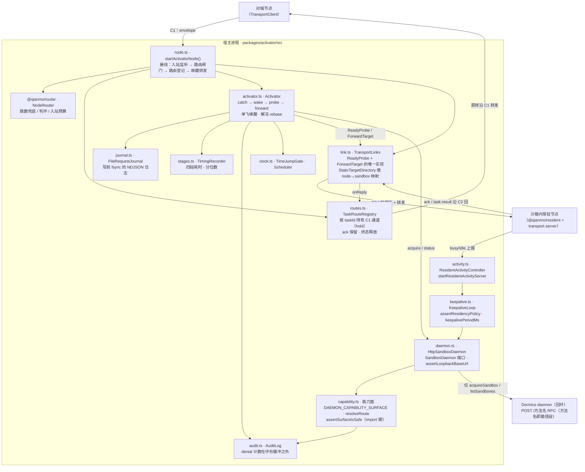

<!-- Copyright 2026 Qianmo AgentNest Team -->
<!-- SPDX-License-Identifier: AGPL-3.0-or-later -->

# @qianmo/activator —— 宿主侧的唤醒转发与常驻保活

**一句话定位**：一个组件的两张面孔，都在宿主侧、都代表沙箱内的节点去打沙箱 daemon 的 API——**activator** 接住发给休眠节点的请求、唤醒它、等它真的 ready 再转发；**keepalive** 以严格小于冻结阈值的周期打心跳，把常驻节点摁在冻结线之外。两张面孔共用同一把无权限分级的凭据，因此也共用同一个**够不到破坏性动词**的能力面。

| 项 | 指针 |
| --- | --- |
| 任务包 | roadmap **P2.5**（跨节点 activator + 常驻 keepalive，v2.2 新增）；回程 task route 由 **P4.1** 补入；入站路由闸门由 **P4.2** 接线 |
| 章程条目 | 无独立 §3 条目——它是 P2.5 识别出的必需组件，同时压着 **AC-2**（跨节点端到端）与 **AC-6(c)**（智能体删不掉自己的沙箱）；沙箱架构前提见 charter §3.1 A-1，宿主侧加固归 roadmap P0.7 |
| 完成状态 | roadmap「完成状态速查」P2.5 行（四条 DoD 全部真机验证）与 P4.1 行 |

## 1. 模块架构图



## 2. 对外 API 面

读 `src/index.ts`：

- **`startActivatorNode` / `ActivatorNodeOptions` / `ActivatorNodeHandle`** —— 一次调用把整条链立起来：入站 transport 监听 + `NodeRouter` 闸门 + task route 登记 + `Activator`。
- **`Activator` / `ActivationRequest` / `ActivationOutcome` / `ReadyProbe` / `ForwardTarget` / `FailureSink` / `RecoveryReport`** —— 唤醒转发本体，**刻意无端口**（两个端口由 `link.ts` 实现），另含三个默认值 `DEFAULT_MAX_IN_FLIGHT` / `DEFAULT_READY_TIMEOUT_MS` / `DEFAULT_READY_POLL_INTERVAL_MS`。
- **`TransportLinks` / `StaticTargetDirectory` / `TargetDirectory` / `TargetSite` / `UnknownTargetError` / `LinkReplyHandler`** —— 两个端口的唯一实现，跑在一跳 `@qianmo/transport` 之上；目录做 `node ↔ sandbox` 映射，构造时拒绝重复行。
- **`TaskRouteRegistry` / `TaskRouteError` / `DEFAULT_TASK_ROUTE_CAPACITY`** —— 回程路由表：`register` 时 `hold()` 住源通道并按任务时限布过期定时器，`forward` 时按 `taskId` + 地址反向 + sandbox 三重校验。
- **`KeepaliveLoop` / `assertResidencyPolicy` / `keepalivePeriodMs` / `ResidencyPolicy` / `ResidencyPolicyError` / `KeepaliveBeat` / `KeepaliveDegraded` / `KeepalivePort`** —— 心跳面，含 `DEFAULT_PERIOD_RATIO` / `MAX_PERIOD_RATIO` / `MIN_RETRY_DELAY_MS` / `DEFAULT_MAX_CONSECUTIVE_FAILURES`。
- **`ResidentActivityController` / `startResidentActivityServer` / `DEFAULT_RESIDENT_KEEPALIVE_TIME_JUMP_FACTOR`** —— 常驻节点 busy/idle 上报 → 宿主心跳起停的桥。
- **`HttpSandboxDaemon` / `SandboxDaemon` / `SandboxState` / `SandboxStatus` / `assertLoopbackBaseUrl` / `assertSandboxName` / `tokenFromEnv` / `DaemonRequestError` / `SandboxNotFoundError`** 与 `DAEMON_URL_ENV_VAR` / `DAEMON_TOKEN_ENV_VAR` / `DEFAULT_DAEMON_TIMEOUT_MS` —— daemon 端口与它唯一的 RPC 实现。
- **`DaemonOp` / `DAEMON_CAPABILITY_SURFACE` / `ALLOWED_METHODS` / `ALLOWED_BODY_KEYS` / `DESTRUCTIVE_WORDS` / `resolveRoute` / `capabilitySurface` / `assertSurfaceIsSafe` / `CapabilityDeniedError`** —— 能力面三层守卫的全部出口。
- **`FileRequestJournal` / `MemoryRequestJournal` / `RequestJournal` / `defaultJournalPath` / `AcceptedRecord` / `TerminalRecord`** —— 写前日志。
- **`TimingRecorder` / `StageTimeline` / `durationsOf` / `statsOf` / `StageTimings` / `TimingReport`** —— 四段埋点与分位数，输出给 P3.1 / P4.1 / P7.3。
- **`AuditLog` / `ActivatorEventType` / `AuditSink`**、**`TimeJumpGate` / `Clock` / `Scheduler` / `systemClock` / `timerScheduler`** —— 审计与时钟。

## 3. 最容易被改坏的五条不变式

| # | 不变式 | 改坏了会怎样 | 钉住它的测试 |
| --- | --- | --- | --- |
| 1 | **`destroy` 在代码层面不可达，三层守卫**：类型面无该成员 / 运行时 `resolveRoute` 走 allowlist 并要求 route 路径**恰为** `/` + op 名 / import 期 `assertSurfaceIsSafe` 拒绝被拓宽的面 | daemon 的 bearer 无权限分级，`destroySandbox` 与我们要调的方法只差一个路径段——任何一层松掉，AC-6(c) 当场不成立 | `test/capability.test.ts`（含红方向：DELETE / GET / 危险词 / 无辜名字挂危险路径 / 夹带 body key）；`test/destroy-unreachable.test.ts`（**带对照组**：裸 fetch + 同一把 bearer 真的销毁一个沙箱，证明路由与凭据都有效）；`test/surface-invariant.test.ts`（全 `src/` 扫描 + 红方向 fixture） |
| 2 | **写前日志的两条顺序**：`accepted` 记录 fsync 在「承认收下」**之前**；终态记录在「已转发 / 已明确失败」**之后** | 顺序反过来，`kill -9` 的代价从「对端可能收到两次」（传输层会去重）变成「静默丢一条」——后者下游没人能吸收，DoD ④ 直接不成立 | `test/crash-recovery.test.ts`（真子进程、真 SIGKILL、两轮崩溃重启）；`test/activator.test.ts`「a journal that will not write means the request was never accepted」「a journal that breaks after the forward does not un-forward it」 |
| 3 | **`stopAfterSeconds: null` 被拒，心跳周期被强制压在冻结阈值之下** | 「设成永不停止」不是解法，它把「掉到停止态、下次冷启」换成「冻结在半途、永久静默」——E3 实测过的最反直觉一条 | `test/keepalive.test.ts`「the residency policy E3 rejected」「the period is forced under the freeze threshold」两组 |
| 4 | **回程沿注册时那条 C1 通道**：`ack` 保留路由、终态释放，重复 `taskId` 不能串线，回复必须来自同一 sandbox 且地址与请求严格反向 | 换一条连接回程，AC-2 独立核验里的「`link.opened=1`、回程没有第二条连接」就作废；放宽校验则两条并发路由会串 | `test/routes.test.ts` 四条；`test/chain.test.ts`「ack and result return over C2 then the original C1 channel」 |
| 5 | **daemon 只能是回环地址，且拒绝理由里点名 AC-6(c)** | 把 daemon 端点改成可路由地址，等于把沙箱内的智能体和宿主控制面接通 | `test/loopback.test.ts`「loopback only」组，含「the refusal names AC-6(c), so the reason travels with it」「the client refuses to be constructed against a routable address」 |

另一条同样有专门用例、值得记住的性质：**readiness 是每次新握手取来的证据，不是缓存标志**——冻结只暂停进程、不关 socket，缓存的 ready 可能是几分钟前的（`test/chain.test.ts`「readiness is fresh evidence, never a cached flag」；`test/activator.test.ts`「the wait for readiness is a wait, not a single look」）。

## 4. 与基座的关系

- **自研，无先例可抄。** roadmap 现状基线把它列为「此前完全不在计划里」的必需组件：内核 accept queue 的缓冲只在同机有效，沙箱 daemon 只听本机、不提供这一层（已实测确认）。
- [`base-adoption.md`](../../docs/dev/base-adoption.md) §3.1「休眠与唤醒」判定为**无**（可复用的只有 supervisor 骨架），§3.2「跨节点传输通道」判定为**无**。
- 代码层面：本包只从基座取一样东西——`journal.ts` 用 `src/config/paths.ts` 的 `occConfigPath()` 派生日志路径。Dormice daemon 是**外部系统**，不是基座。
- 上游包：`@qianmo/protocol`、`@qianmo/transport`、`@qianmo/router`、`@qianmo/resident`（只取 `/activity` 子入口的消息判定）。

## 5. 边界与已知未做

照 roadmap「完成状态速查」P2.5 行与 `src/index.ts` 头的自陈：

- **stub daemon 只复现线形，不是真 daemon 行为的证据**：`test/stub-daemon.ts` 让我们自己的调度、重试、allowlist、日志与恢复逻辑跑在真 socket 上，但它对真实 daemon 的行为**不作任何陈述**。DoD ① 的十轮真机在 `demo/ac2-wake-forward.sh`，DoD ② 的对照组实测在 `keepalive.ts` 的注释里，都不在包内。
- **一处防护如实记为已失去**（roadmap v2.8）：真实 API 里保活与唤醒是**同一个调用**，原先「keepalive 面连唤醒都做不到」的类型窄化保证不复存在；不受影响的是 AC-6(c) 真正依赖的那条——`destroySandbox` 仍然够不到。
- **receipt 只带一个固定码**：`E_TTL_EXPIRED` / `E_RATE_LIMITED` / `E_UNKNOWN_AGENT` 到发送方都变成 `E_UNDELIVERABLE`，具体码只在本地（审计、`failures`、`onOutcome`）。见 `src/node.ts` 的「Known limitation」段。
- **M0 不支持「同一任务并发派给同一节点的多个 agent」**：判环层放行，但回程路由以 `taskId` 为唯一键会拒（`E_BAD_ENVELOPE`，不是 `E_LOOP`）。这是相关性约束不是判环，两件事分别断言在 `test/chain.test.ts`「the routing gates in front of the wake (P4.2)」组里；详见 roadmap P4.2 实施记录。

## 6. 怎么跑测试

```bash
bun test packages/activator
```

实测：**242 pass / 0 fail，13 个测试文件**（`activator` / `activity` / `capability` / `chain` / `clock` / `crash-recovery` / `destroy-unreachable` / `journal` / `keepalive` / `loopback` / `routes` / `stages` / `surface-invariant`），零 mock；崩溃恢复用例起真子进程并发真 SIGKILL。

## 7. P9.3 双人签字

> owner 栏语义见 roadmap「任务包字段说明」（v2.3）：主开发一律是喻永昌，owner 栏原名单读作「方向辅助人 / 第二知情人」，括号内 backup 读作「第二辅助」。下表按 P2.5 的 owner 栏填名——roadmap 在该行另注「排期归属与 owner 为提案，负责人可调」。

| 角色 | 姓名 | 签字 | 日期 |
| --- | --- | --- | --- |
| owner（P2.5 owner 栏） | 董宗岳 | | |
| backup（P2.5 括号内） | 陈曦宇 | | |

### backup 需能独立复述的 3 道题

1. 「`destroy` 不可达」是靠哪三层实现的？为什么其中的**否定词清单**不是安全机制本身？再说明：`destroy-unreachable.test.ts` 里那个「用裸 fetch 真的销毁一个沙箱」的用例存在的意义是什么——如果删掉它，剩下的断言还证明了什么？
2. 一条请求被接住、还没转发就 `kill -9` 了。请按顺序说出日志里会有什么、重启后会发生什么、发送方最坏情况看到什么。再说明：如果把「先记终态、再转发」调换过来，代价具体是什么、为什么下游吸收不了。
3. 为什么不能靠「把沙箱配置成永不停止」来代替心跳？E3 实测到的那个失败形态是什么？现在的心跳周期是怎么从冻结阈值推出来的，为什么比例有上限？
