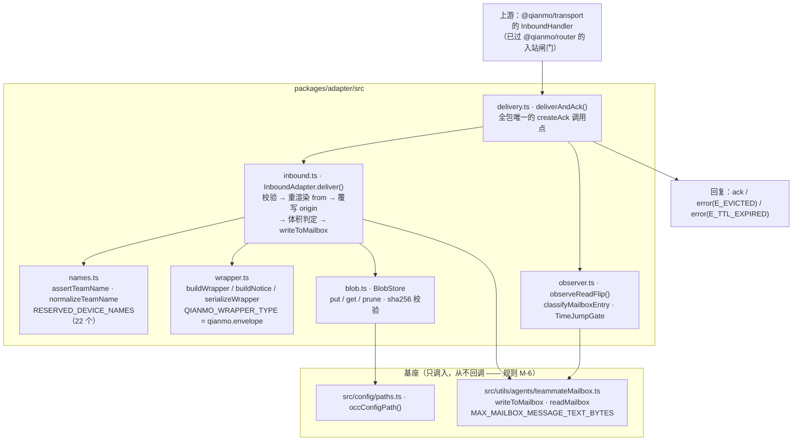

<!-- Copyright 2026 Qianmo AgentNest Team -->
<!-- SPDX-License-Identifier: AGPL-3.0-or-later -->

# @qianmo/adapter —— 跨节点投递的最后一跳

**一句话定位**：把一条已经到达本节点的阡陌信封，送进目标智能体的基座文件信箱，并在**智能体真的读进去之后**才回 `ack`。三个部件：入站适配器、`read` 翻转观察器、大 payload 暂存区。

| 项 | 指针 |
| --- | --- |
| 任务包 | 无独立编号的任务包——它是 `protocol.md` **§12.1 第 8 项**（P1.1 的后续动作表）的落地，触发条款是 §4.5 与 §9；roadmap 完成状态速查里单列一行「**@qianmo/adapter** 入站适配器」 |
| 章程条目 | charter **§5.5**「与基座既有单机信箱机制的关系定性：上层封装」——最后一跳**复用基座既有文件信箱**；相关能力面在 §3.3 C-1 / C-2 |
| 协议真源 | `protocol.md` §4.5（ack 由谁发出）、§9（与基座信箱的关系，六条硬规则 M-1~M-6）、§9.3（体积冲突）、§9.4（来源标注） |
| 完成状态 | roadmap「完成状态速查」`@qianmo/adapter` 行——**AC-2 的最后一跳** |

## 1. 模块架构图



三个终态，没有第四个（§4.5）：`read` 翻转 → `acked`；条目消失 → `dropped`（`E_EVICTED`）；到点仍未读 → `expired`（`E_TTL_EXPIRED`）。写前被拒的消息**根本不进观察器**，直接回协议错误。

## 2. 对外 API 面

读 `src/index.ts`（另有 `./inbound` / `./names` / `./wrapper` 三个子入口，供 CI 断言与常驻侧接线单独引用）：

- **`deliverAndAck` / `DeliveryReply` / `DeliveryObserveOptions` / `ErrorReplyPayload`** —— 一次调用完成「投递 + 观察 + 生成回复」。`acked` / `dropped` / `expired` / `rejected` 四支，每支带上要发回去的信封。
- **`InboundAdapter` / `InboundAdapterOptions` / `InboundDelivered` / `InboundRejection` / `InboundResult` / `InboundVerification`** —— 写信箱本体，返回观察器需要的身份三元组、归一化后的 team、扣除本地冻结重叠后的投递截止时刻，以及（若落盘了）`BlobRef`。`InboundVerification` 是路由层递进来的两项**已核实**结论（`capIss` 与 `trust`），本包只誊写不推导——它没有密钥、没有目录、没有信任集，缺省即最低档。
- **`observeReadFlip` / `classifyMailboxEntry` / `ObserveOptions` / `DeliveryOutcome` / `MailboxEntryIdentity` / `MailboxEntryState`** 与三个周期常量 `DEFAULT_POLL_INTERVAL_MS` / `BASE_INPROCESS_POLL_INTERVAL_MS` / `BASE_PANE_POLL_INTERVAL_MS` —— 观察器。基座不给消息 id，所以身份是它自己写下的 `[from, timestamp, text]` 三元组。
- **`BlobStore` / `BlobRef` / `isBlobRef` / `blobStoreDir` / `BLOB_DIR_SEGMENTS`** —— 暂存区，路径经 `occConfigPath()` 派生；取回时先核 sha256，取不到就是 `E_PAYLOAD_UNAVAILABLE`，绝不静默降级。
- **`buildWrapper` / `buildNotice` / `serializeWrapper` / `QIANMO_WRAPPER_TYPE` / `BASE_RESERVED_MESSAGE_TYPES` / `isReservedBaseMessageType` / `assertWrapperTypeIsNotReserved` / `textBytes` / `QianmoWrapper` / `QianmoNotice`** —— 写进 `text` 的包装对象。`buildNotice(origin, trust)` 按档位选模板，两档各是一段完整文本而不是一段加从句；档位的定义与判据以 `docs/dev/protocol.md` §9.4 / §10.2 为准，本文不复制。
- **`assertTeamName` / `normalizeTeamName` / `isNormalizedTeamName` / `isReservedDeviceName` / `RESERVED_DEVICE_NAMES` / `TEAM_NAME_PATTERN` / `MAX_TEAM_NAME_LENGTH` / `InvalidTeamNameError`** —— 名字归一化，避开基座两个互相矛盾的 sanitizer。

体积阈值不在本包写死：它从基座常量 `MAX_MAILBOX_MESSAGE_TEXT_BYTES` import；协议级上限一律以 `@qianmo/protocol` 的 `LIMITS` 为唯一出处。

## 3. 最容易被改坏的五条不变式

| # | 不变式 | 改坏了会怎样 | 钉住它的测试 |
| --- | --- | --- | --- |
| 1 | **ack 是端到端的，永不在写返回时发出**——`createAck` 全包只有一个调用点，且只在观察器看到 `read` 翻转之后的那一支 | 基座的信箱配额是**靠丢消息（含未读）**实现的，写时回 ack 会把被驱逐的消息报成已送达；发送方看到的现象是「ack 来了、result 永远不来」，AC-2 的 10/10 就是这样丢的 | `test/delivery.test.ts`「the ack is end-to-end, never write-time」组，含「the mailbox entry is unread the moment the write returns」与「one identical write reaches three different terminal states」 |
| 2 | **`from` 由适配器按自己的解析重渲染，不复制来的那个字符串**（规则 E-1） | 基座在多处用字符串相等判定 leader 身份（权限响应、计划审批、关机审批都走它），裸名字进来就能让远端节点冒充 `team-lead` | `test/inbound.test.ts`「rule E-1」组，含「a remote sender can never equal a local identity」 |
| 3 | **包装 `type` 不得落进基座保留的 10 个类型，远端内容只能嵌在 `envelope` 之下**（规则 M-2） | 基座按 `text` 的**顶层** `type` 分派，把远端对象直接当顶层写进去，等于给远端一条投递 `shutdown_request` / `permission_response` 的通道 | `test/wrapper.test.ts`「rule M-2」组，含「a remote payload cannot reach the top level」与守卫的红方向「the guard fires if a wrapper type ever collides」 |
| 4 | **超限 payload 落盘、`text` 只放引用；阈值从基座常量 import，且测的是最终写出去的字符串** | `MAX_MAILBOX_MESSAGE_TEXT_BYTES` 是基座信箱**读写共用**的不变式——一条超限条目落盘后，该信箱此后每次读**和**写都抛错，智能体活着但永久失聪。这是毒丸不是退信 | `test/inbound.test.ts`「§9.3」组：「the threshold in force is MAX_MAILBOX_MESSAGE_TEXT_BYTES」「the text actually written is measured and under the limit」「the mailbox stays readable and writable after a huge message」 |
| 5 | **观察周期不得超过基座自身的轮询周期**，超了就直接拒绝构造 | 观察器一旦比基座慢，它就成了 ack 预算里的主项，白白多出一个基座周期的延迟（`protocol.md` §4.4 预算表第 5 行） | `test/observer.test.ts`「the observation period may not exceed the base poll period」 |

另有一条与 P3.1 联动的性质：**解冻不会让所有在飞投递一起判死**——大于两倍周期的间隔会被加回截止时刻（`test/observer.test.ts`「rule T-2」组）。

## 4. 与基座的关系

- **定性：上层封装。** charter §5.5 / P0.5 结论定死：跨节点这一段由阡陌协议层全程负责，消息到达目标节点后的**最后一跳复用基座既有的文件信箱，不另造、不改基座核心**；节点内同 team 的 teammate 消息原样走基座、不进阡陌协议层。
- 逐项判定见 [`base-adoption.md`](../../docs/dev/base-adoption.md) §3.2「按名寻址」「消息协议」两行。
- 代码层面本包**直接 import 基座两处**：`src/utils/agents/teammateMailbox.js`（`writeToMailbox` / `readMailbox` / `MAX_MAILBOX_MESSAGE_TEXT_BYTES` / `TeammateMessage`）与 `src/config/paths.js`（`occConfigPath`）。
- **规则 M-6：只写、无回调。** 阡陌 → 基座是单向调用导出函数，基座不反向调用本包任何东西。这既是「不改基座核心」的保证，也是循环依赖棘轮（`bun run check:cycles`）上的安全边界。
- `protocol.md` §9.2 的六条硬规则（M-1 直调导出函数不取道 `SendMessageTool`、M-2 顶层类型、M-3 = E-1、M-4 顶层 `type` 同时买到最高保留档与正常投递路径、M-5 体积由测量决定、M-6 单向）**每一条都在这个包里**，且每条的基座出处都写在对应源文件的头注释里。

## 5. 边界与已知未做

- roadmap 完成状态速查该行：入站适配器 + `read` 翻转观察器 + blob 暂存区已完成，**76 用例零 mock**。
- **该信箱在 ACP 宿主下没有读者**——roadmap P3.1 的「交付物追加（v2.15）」记录：唯一能在空闲时唤醒会话的读者是 REPL 专有的 hook，`src/services/acp/` 全目录零信箱引用。处置是**保信箱、给 ACP 补等价轮询器**，由 `@qianmo/resident` 承担；本包的协议与规则一条未改。
- `protocol.md` §12.3 未查证项里与本包直接相关的三条：第 3 条（窗格形态下 `read` 翻转的确切时机未逐行核实，本包只核实了进程内与附件两条路径）、第 5 条（基座信箱在阡陌身份下的行为未实测）、第 9 条（附件路径有一道 `USER_TYPE !== 'ant'` 的提前返回，本包未查证阡陌节点态下该变量取值）。
- `protocol.md` §12.1 第 10 项列的四条 CI 断言（保留设备名、team 名正则、包装 `type`、lead 名字符）——本包用例覆盖了判定函数本身，全仓门禁化的落点见该表。

## 6. 怎么跑测试

```bash
bun test packages/adapter
```

实测：**76 pass / 0 fail，6 个测试文件**（`blob` / `delivery` / `inbound` / `names` / `observer` / `wrapper`），零 mock——用例直接读写真实的基座信箱文件。

## 7. P9.3 双人签字

> 本包**没有独立任务包，因而没有自己的 owner 栏**。它是 `protocol.md` §12.1 第 8 项的落地，而 §12.1 是 P1.1 的后续动作表，故下表按 **P1.1 的 owner 栏**填名；若负责人认为应归 P2.1，请在签字时就地更正。owner 栏语义见 roadmap「任务包字段说明」（v2.3）：主开发一律是喻永昌，owner 栏原名单读作「方向辅助人 / 第二知情人」，括号内 backup 读作「第二辅助」。

| 角色 | 姓名 | 签字 | 日期 |
| --- | --- | --- | --- |
| owner（P1.1 owner 栏） | 喻永昌 | | |
| backup（P1.1 括号内） | 陈曦宇 | | |

### backup 需能独立复述的 3 道题

1. 为什么「写完信箱就回 ack」是错的？请说出基座信箱的哪一个机制会让这种 ack 报假，以及发送方最终看到的现象是什么。本包用什么结构手段保证这种写法写不出来？
2. 一条体积在协议上限之内、却超过基座信箱上限的合法阡陌消息到了最后一跳，会发生什么？如果不做落盘、硬写进信箱，坏掉的**不是**这一条消息而是什么？请说明基座那个上限是「写侧限制」还是别的。
3. 写进信箱条目 `text` 的顶层对象长什么样、`type` 取什么值？这个字段同时买到了哪两件事？如果把远端的信封直接当作 `text` 的顶层写进去，远端节点能做到什么？
