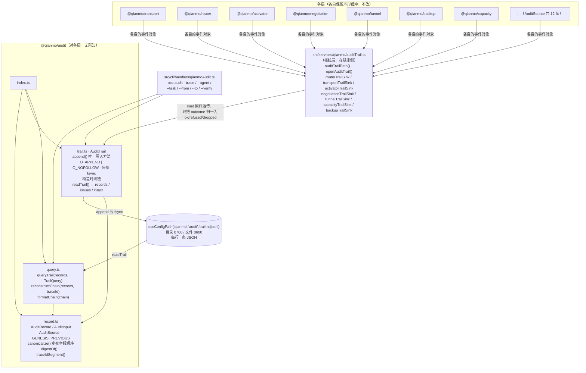

<!-- Copyright 2026 Qianmo AgentNest Team -->
<!-- SPDX-License-Identifier: MIT -->

# @qianmo/audit —— 全链路审计追踪

**一份追加式文件、一种记录形状，各层都往里写。**外加把一次跨节点任务从中还原出来的查询——**包括被拒的、被丢的、被限流的、被去重的部分**。

| 项 | 指针 |
| --- | --- |
| 任务包 | roadmap **P7.2 可观测性：审计日志与全链路追踪**（交付物 / DoD「用 trace_id 还原完整消息链」/ v2.28 的落地记录都在那里） |
| 章程条目 | charter §3.3 **C-6 审计与全链路追踪**（基座起点「部分」）；`trace_id` 采用 W3C `traceparent` 格式的决议见 §3.3 C-1 的 v2.2 决议 |
| 协议级数值 | 本包不定义协议级上限；协议级上限一律见 `@qianmo/protocol` 的 `LIMITS` |

**各包自己的环形缓冲留在原地**——那是给运行中的进程看的；这份是给**三天后的那个问题**看的，而那个问题永远是同一个：把这次任务的全过程给我，包括被拒的部分。

---

## 1. 模块架构图



**为什么翻译层在基座侧而不在包里**：`@qianmo/audit` 若认识各层，就得依赖树里的每一个包，依赖方向会反过来。所以 `kind` → 各层自己的事件名**原样透传**（运维手里往往正拿着某一层的日志行，一个把名字全改掉的审计只会让他多做一次翻译），只有 `outcome` 被归一成三值。

---

## 2. 对外 API 面（`src/index.ts`）

| 导出 | 一句话 |
| --- | --- |
| `AuditTrail` | 追加式写入器：只有 `append()` 与 `close()`，没有任何 seek / truncate / rewrite / delete；构造时从盘上最后一条**续链** |
| `readTrail(path)` / `TrailReadResult` / `TrailIntegrityIssue` | 读回并校验；四类问题 `corrupt_line` / `torn_tail` / `broken_chain` / `out_of_order`，`intact` 是端到端结论 |
| `AuditRecord` / `AuditInput` | 落盘记录形状；`seq` 与 `prev` 由 trail 填，调用方给不了 |
| `AuditSource` | 写入层的枚举，12 个值（transport / router / capability / activator / adapter / resident / negotiation / tunnel / backup / diagnosis / registry / capacity） |
| `GENESIS_PREVIOUS` | 首条记录的链值（64 个 `0`，刻意不是空串的 sha-256） |
| `canonicalize(record)` / `digestOf(record)` | 哈希前的规范形式——**字段顺序在这里定死**，不交给 `JSON.stringify` 的键序 |
| `traceIdSegment(traceparent)` | 从 W3C traceparent 里取**跨跳不变的 trace-id 段**；不是完整 header |
| `queryTrail(records, query)` / `TrailQuery` | 按 trace / task / msg / agent / source / 时间窗 / outcome 过滤，全部是 AND |
| `reconstructChain(records, traceId)` / `MessageChain` | 还原一条链：按 `seq` 排序，统计 `refused` / `dropped` / 涉及的 task 与 msg，**从不按 outcome 过滤** |
| `formatChain(chain)` | 一条一行的终端输出；**永不打印任何消息体** |

---

## 3. 最容易被改坏的五条不变式

| # | 不变式 | 改坏会怎样 | 哪个测试钉住 |
| --- | --- | --- | --- |
| 1 | **「不可改」是三句话**：① **写入方改不了**（`O_APPEND \| O_NOFOLLOW` + 类里没有任何 seek / truncate / delete 方法）；② **外部改动可检测**（哈希链，报出第一处断点的 `seq`）；③ **外部改动无法阻止，但一定被检测到（锚定窗口内除外）** | 第三句不是「不可篡改」：机外见证让已锚定前缀的整篇重写可检测，窗口内仍是已知边界。完整边界只见 [`audit-witness.md`](../../docs/dev/audit-witness.md) §7；本表不复制。 | `test/trail.test.ts`：`claim 1 — the writer has no method that modifies` / `claim 1 — records are only ever appended, never replaced` / `claim 2 — editing a line breaks the chain, and the break is located` / `claim 2 — deleting a line is caught too` / **`claim 3 — a full rewrite that recomputes the chain is NOT detected`**；`packages/witness/src/__tests__/witness.test.ts`：变体 A / D1 |
| 2 | **重启续链**：新进程从盘上最后一条接着写 `seq` 与 `prev` | 每次重启都留下一个「长得跟篡改一模一样」的断点，而一个天天喊狼来了的完整性检查没人会读 | `test/trail.test.ts`：`a restart continues the chain instead of starting a new one` / `a crash mid-write is a torn tail, not tampering` |
| 3 | **还原链按 `seq` 排序，不按时间戳；且从不按 `outcome` 过滤** | 两个节点的钟不一致，按时间排会把 ack 排到它回应的消息前面；只显示成功的链，等于用「能跑通的那部分」回答「发生了什么」 | `test/trail.test.ts`：`ordered by seq, not by timestamp` / `includes the dropped and the refused, not just what worked` / `outcome filters exist but the chain reconstruction never uses them` |
| 4 | **按 trace-id 段匹配，不是整条 traceparent** | parent-id 每跳都变（这是设计），拿整条 header 去匹配只会返回链上的**一跳**，而且看起来像成功了 | `test/trail.test.ts`：`matches on the trace-id segment, not the whole traceparent` |
| 5 | **`canonicalize` 的字段顺序定死在一处**；`kind` 原样透传、只归一 `outcome` | 两个写入方以不同键序产出同一条记录会得到不同哈希，链会「毫无缘由地」校验失败；把 `kind` 也归一，运维手里的层内日志行就对不上审计里的名字了 | `test/trail.test.ts`（`claim 2` 两条依赖 canonical 形式）；接线层口径见 `src/services/qianmo/auditTrail.ts` 顶部注释 |

---

## 4. 与基座的关系

- **定性**：charter §3.3 C-6 判「部分」——基座的会话 JSONL 本身就是 append-only 的完整留痕，但 trace_id 贯穿跨节点链路、被丢弃 / 被限流 / 被去重消息的留痕、查询 CLI **都是新建**。依据见 `docs/dev/base-adoption.md` §3.2「审计与全链路追踪」行。
- **本包自身不改基座核心、不导入基座模块**（`dependencies` 为空）。基座侧有两处改造承接它：接线层 `src/services/qianmo/auditTrail.ts` 与 CLI 子命令 `src/cli/handlers/qianmoAudit.ts`。**这两处及其理由见 `docs/dev/base-modifications.md`。**
- 落盘路径由 `auditTrailPath()` = `occConfigPath('qianmo', 'audit', 'trail.ndjson')` 从基座 `src/config/paths.ts` 的 helper 派生（`CLAUDE.md` §1.1②）——**每个常驻节点必须有自己的 `OCC_CONFIG_DIR`**，两个常驻共用一个配置根会把两条审计链落进同一个文件（P8.1 的实测结论，见 `docs/dev/demo-env.md`）。

---

## 5. 边界与已知未做

| 事项 | 一行摘要 | 指针 |
| --- | --- | --- |
| 无法阻止有写权限者整篇重写 | 无法阻止，但已锚定前缀的改写一定被检测到；锚定窗口内除外。边界只见 [`audit-witness.md`](../../docs/dev/audit-witness.md) §7 | `src/trail.ts` 顶部注释「3.」 |
| 不带消息体 | 记录只有 id / 错误码 / 计数；`formatChain` 也不加——support 工程师把链粘进工单前不该先做一次脱敏 | `src/cli/handlers/qianmoAudit.ts` 顶部「What it never prints」 |
| `occ audit` 不带条件不给查 | 这份文件永远增长，默认全量打印是它能做的最没用的事 | `src/cli/handlers/qianmoAudit.ts` 参数校验 |
| 无轮转、无归档、无外部日志系统对接 | M0 只有一份不断增长的本地文件 | roadmap P7.2 交付物 |
| 各层环形缓冲不合并 | 那是给运行中进程看的，与本文件分工不同，刻意不统一 | `src/record.ts` 顶部注释 |

---

## 6. 怎么跑测试

```bash
bun test packages/audit/test                            # 包内：17 用例 / 1 文件（实跑 2026-08-15）
bun test tests/integration/qianmo-audit-chain.test.ts   # 真链路还原（四条消息四种命运）
bun test src/cli/handlers/__tests__/qianmoAudit.test.ts # CLI 三种查法
```

包内 **17 pass / 0 fail / 42 expect**，三组：`the chain a trace_id rebuilds` 5 / `querying by agent and by time window` 3 / `what "cannot be changed" means here` 9。

---

## 7. P9.3 双人签字栏

> roadmap v2.3 起 owner 栏语义为「方向辅助人」，主开发统一为喻永昌；**P9.3 双人签字属明确写「双人」的流程要件，不受该条影响**，仍按本任务包 owner / backup 执行（roadmap v2.3 例外条款）。

| 角色 | 姓名（按 roadmap P7.2 owner 栏） | 签名 | 日期 |
| --- | --- | --- | --- |
| owner | 陈曦宇 | | |
| backup | 陈子轩 | | |

**owner 出给 backup 的三道题**：

1. 「审计日志不可改」拆成三句话分别是什么？我们**做到了哪两句、没做到哪一句**？没做到的那句，要做到需要什么（说出两种手段）？为什么套件里专门留了一条「做不到」的用例？
2. 一个进程重启之后，`AuditTrail` 的 `seq` 和 `prev` 从哪里来？如果不做这件事，完整性检查会输出什么、后果是什么？另外，一次崩溃写到一半的文件被 `readTrail` 判成哪一类问题、为什么不判成篡改？
3. 还原一条链时为什么按 `seq` 而不按 `at` 排序？为什么匹配的是 trace-id **段**而不是整条 traceparent——各自改错了会看到什么现象（提示：其中一个「看起来像成功了」）？最后：为什么 `kind` 原样透传而只归一 `outcome`？
