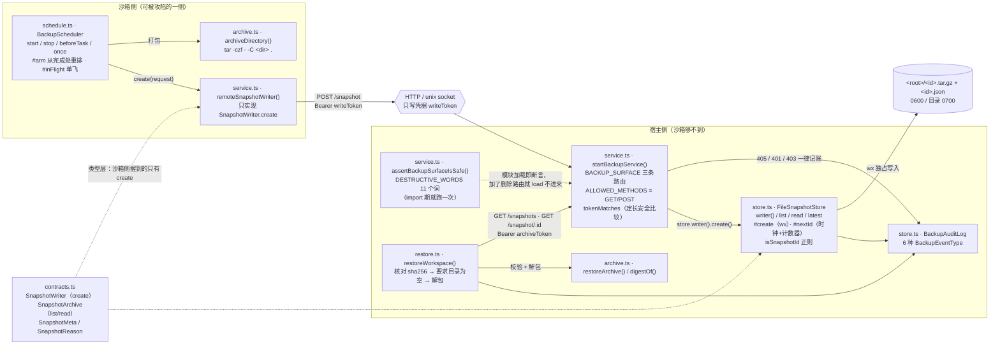

<!-- Copyright 2026 Qianmo AgentNest Team -->
<!-- SPDX-License-Identifier: AGPL-3.0-or-later -->

# @qianmo/backup —— 工作区快照与不可删除保护

智能体**能建、够不到**的工作区备份：宿主侧只增不改的快照库、沙箱侧只有 `create` 一个动词的能力面、定时 + 任务前两个触发，以及把被 `rm -rf` 掉的工作区放回去的恢复路径。

| 项 | 指针 |
| --- | --- |
| 任务包 | roadmap **P4.4 备份与不可删除保护**（交付物 / DoD / v2.23 的十一条 check 实测记录都在那里） |
| 章程条目 | charter §3.2 **R-4 备份与不可删除保护**（基座起点「自研」，以及「不采用沙箱平台自带归档」的依据）+ §4 **AC-6(b)(c)** |
| 协议级数值 | 本包不定义协议级上限；`DEFAULT_MAX_ARCHIVE_BYTES` / `DEFAULT_SNAPSHOT_INTERVAL_MS` 是本地存储策略。跨节点上限一律见 `@qianmo/protocol` 的 `LIMITS` |

**这个包为什么存在**：POSIX 上「删掉一个文件」的权限来自它**所在目录**的写位，和「创建一个文件」是同一个位；sticky bit 收窄成「只能删自己的」，而那恰恰是本例要防的。所以「能加不能删」不是一个 `chmod` 出来的模式，是一条必须**用一个进程**顶住的边界。

---

## 1. 模块架构图



**三层守卫**（AC-6(c) 的说法只与最窄的一层等强）：① **类型层**——沙箱侧拿到的是 `SnapshotWriter`，只声明 `create`，「删快照」是一句写不出来的调用；② **运行时层**——每个请求先撞 `BACKUP_SURFACE` allowlist，不在表上的方法 / 路径在读取任何东西之前就被拒绝**并记账**（这层挡的是不再用我们客户端、直接手写 HTTP 的调用者，也就是一个有 shell 的智能体会做的事）；③ **形状层**——`assertBackupSurfaceIsSafe` 在本模块 import 期对自己的 allowlist 跑一遍，将来谁加一条 `DELETE /snapshot/:id`，这个模块根本加载不起来。

---

## 2. 对外 API 面（`src/index.ts`）

| 导出 | 一句话 |
| --- | --- |
| `FileSnapshotStore` / `FileSnapshotStoreOptions` | 宿主侧快照库：`writer()`（只写面）/ `list` / `read` / `latest`；无任何删除方法 |
| `DEFAULT_MAX_ARCHIVE_BYTES` | 单个归档上限 512 MiB，超了拒收而不是截断 |
| `isSnapshotId` | 快照 id 正则（`\d{14}-\d{4}`）；在碰文件系统之前挡住 `../../etc/passwd` 这类路径 |
| `BackupAuditLog` / `BackupAuditEvent` / `BackupAuditSink` | 有界环形 + 无界计数；sink 抛错被吞（一个失败的 sink 不能把「拒绝」变成「异常」） |
| `startBackupService` / `BackupServiceOptions` / `BackupServiceHandle` | `Bun.serve` 起的宿主本地服务；启动前拒绝过短（<16 字符）或两把相同的凭据 |
| `BACKUP_SURFACE` / `BackupRoute` / `BackupOp` / `BackupAudience` / `ALLOWED_METHODS` | 能力面 allowlist：`POST /snapshot`（writer）、`GET /snapshots`、`GET /snapshot/:id`（archive）。加一条就是一次安全变更 |
| `assertBackupSurfaceIsSafe` / `DESTRUCTIVE_WORDS` | 形状断言与 11 个禁用动词；接受 allowlist 作参数，好让红向可被测试 |
| `remoteSnapshotWriter` / `RemoteWriterOptions` | 沙箱侧客户端：一个方法，`fetch` 被闭包捕获，没有字段可以被改指到别的路径 |
| `BackupScheduler` / `BackupSchedulerOptions` / `DEFAULT_SNAPSHOT_INTERVAL_MS` | 两个触发（定时 15 min + `beforeTask`）+ `once`；从完成处重排、单飞、失败只报不停机 |
| `Scheduler` / `timerScheduler` / `CancelTimer` | 可注入的定时器抽象（`setTimeout` + `unref`，不吊住事件循环） |
| `restoreWorkspace` / `RestoreRequest` / `RestoreOutcome` | 恢复：核对摘要 → 要求目录为空 → 解包，返回 `elapsedMs`（AC-6(b) 预算 10 min） |
| `archiveDirectory` / `restoreArchive` / `digestOf` / `tarAvailable` | `tar` 两端与 sha-256；`tarAvailable` 让「没装 tar」报成一句人话而不是一个退出码 |
| `SnapshotWriter` / `SnapshotArchive` / `SnapshotMeta` / `SnapshotRequest` / `SnapshotReason` / `BackupEventType` | 两张面的契约与元数据形状；`sha256` 由 store 计算，写入方设不了 |

---

## 3. 最容易被改坏的五条不变式

| # | 不变式 | 改坏会怎样 | 哪个测试钉住 |
| --- | --- | --- | --- |
| 1 | **全包没有任何删除路径**——不是「带守卫的删除」，是**根本没有那个方法**；三层守卫（类型 / 运行时 allowlist / import 期形状断言）任何一层都不能省 | 加一个「仅管理员可用」的删除方法，AC-6(c) 从「这样的代码不存在」退回成「这段守卫但愿没写错」；而调用方是一个有 shell 的智能体 | `test/store.test.ts`：`the writer face has exactly one method` / `the store class offers no removal method either`；`test/service.test.ts`：`it refuses a removal route, whatever it is called` / `it refuses a mutating HTTP method` / `it refuses to widen the writer audience` |
| 2 | **两把凭据是两个独立字符串**，不是一个带 scope 字段的凭据：只写凭据能建不能读、宿主凭据能读不能建；服务拒绝以相同或过短的凭据启动 | 合成一个带布尔位的凭据，「被攻陷的一侧读不到备份」这条性质就只差一个布尔写反；连列表都读得到的智能体可以先去找那个最值得攻击的快照 | `test/service.test.ts`：`refuses to start with weak or identical tokens`；`test/ac6-restore.test.ts`：`the write credential creates, and then cannot delete or read` / `the archive credential reads but does not create` |
| 3 | **快照只增不改**：`wx` 独占创建（归档与 sidecar 都是），id 由 store 从自己的时钟与计数器分配，调用方连「故意撞 id」都做不到；`sha256` 记的是**存进来的字节**而不是调用方声称的 | 改成 `w` 或允许调用方指定 id，就出现了一条「覆盖」路径——它和删除等价，只是名字好听 | `test/store.test.ts`：`an existing object is never overwritten` / `two snapshots in the same millisecond are still two snapshots` / `records what it stored, not what the caller claimed` |
| 4 | **恢复的两个前置条件**：先核对 store 记录的 sha256，再要求目标目录为空 | 在残留文件上解包会让 `git status` 报出两个状态的并集，而那**看起来像「恢复好了」**；从损坏归档半成功地恢复比拒绝恢复更糟 | `test/ac6-restore.test.ts`：`a restore refuses to run over surviving files` / `a corrupted archive is refused rather than half-unpacked` / `rm -rf, restore, and git status says exactly what it said before` |
| 5 | **定时快照从「完成」处重排，不是 `setInterval`；同一工作区单飞** | `setInterval` 漏掉的 tick 不补跑（E4），而冻结的节点正是「好久没备份了」最不容易被发现的地方；并发归档会把一个工作区存成两个半截状态 | `test/schedule.test.ts`：`the periodic one re-arms from the end of the previous snapshot` / `two snapshots of one workspace do not overlap` / `a failed snapshot reports and the schedule survives` |

---

## 4. 与基座的关系

- **定性**：**完全自研**。`docs/dev/base-adoption.md` §3.1「备份与不可删除保护」行的判定就是「无」，基座提供的一栏是空的。
- **不采用沙箱平台自带归档**：那是**移动而非备份**（restore 后即删源，全程单副本、无时间点），对 AC-6(b) 零覆盖——判定见 charter §3.2 R-4 的 v2.2 补注与 `docs/dev/selection-m0.md` §4。
- **本包不改基座核心**；接线点在 `src/services/qianmo/resident.ts`（常驻宿主按 agent 建 `BackupScheduler`）。基座改造点全量清单见 `docs/dev/base-modifications.md`。

---

## 5. 边界与已知未做

| 事项 | 一行摘要 | 指针 |
| --- | --- | --- |
| 常驻节点里的任务前快照**不等待** | `await` 它就是把一次 `tar` 挡在 ack 前面，而 AC-2 的 ack 线是已量过的预算；因此语义是「任务开始前后」而非「开始的那一瞬」。要更强保证得由自己掌握任务生命周期的调用方去 `await beforeTask` | `src/services/qianmo/resident.ts` `#snapshotBeforeTask` 注释 |
| 沙箱边界本机测不到 | 本机测试两侧同进程，测的是**凭据与动词面**，不是挂载；真机部署仍须把 store 放在沙箱够不到的位置 | roadmap P4.4 行的「边界」栏 |
| M0 不做保留策略与轮转 | 将来要做也归**宿主侧工具**，不归这条入站路径上的任何方法 | 章程 N-12；`src/store.ts` 顶部注释 |
| 依赖外部 `tar` | 用 tar 而不是自己走目录，是为了可执行位 / 符号链接 / `.git` 里的空目录这三件 `git status` 会报的事；代价是一个真依赖，故有 `tarAvailable()` | `src/archive.ts` 顶部注释 |
| 无压缩调优 / 增量 / 去重 | 每个归档是一个自包含对象，换的是简单性 | `src/archive.ts`「什么刻意不在这里」 |
| 未做 TLS | 宿主本地 socket 或回环端口，非公网端点 | 章程 N-3 |

---

## 6. 怎么跑测试

```bash
bun test packages/backup/test        # 包内：41 用例 / 5 文件（实跑 2026-08-15）
bash demo/ac6b-restore.sh            # AC-6(b)(c) 十一条 check 的一键复现（真 git 工作区）
```

逐文件：`store` 12 / `service` 11 / `archive` 7 / `ac6-restore` 6 / `schedule` 5 = **41 pass / 0 fail / 109 expect**。`archive` 与 `ac6-restore` 两组需要系统上有 `tar` 与 `git`。

---

## 7. P9.3 双人签字栏

> roadmap v2.3 起 owner 栏语义为「方向辅助人」，主开发统一为喻永昌；**P9.3 双人签字属明确写「双人」的流程要件，不受该条影响**，仍按本任务包 owner / backup 执行（roadmap v2.3 例外条款）。

| 角色 | 姓名（按 roadmap P4.4 owner 栏） | 签名 | 日期 |
| --- | --- | --- | --- |
| owner | 董宗岳 | | |
| backup | 陈子轩 | | |

**owner 出给 backup 的三道题**：

1. 为什么「智能体能建备份但不能删备份」这条**不能**用文件权限实现？把 POSIX 的删除权限来自哪里讲清楚，再说明 sticky bit 为什么帮不上忙。本包用什么顶替了它？
2. 说出三层守卫各是什么、各挡住哪一类调用者。如果有人给 `BACKUP_SURFACE` 加一条 `DELETE /snapshot/:id`，会在**哪一步**失败——运行时、还是模块加载时？为什么 `assertBackupSurfaceIsSafe` 要把 allowlist 作为参数收进来而不是直接读常量？
3. 一次恢复要过哪两道前置检查？各自不做会出现什么现象——特别是：在残留文件上解包，为什么比直接失败更危险？另外，`BackupScheduler` 为什么用 `setTimeout` 从完成处重排而不是 `setInterval`，这跟节点会被冻结有什么关系？
