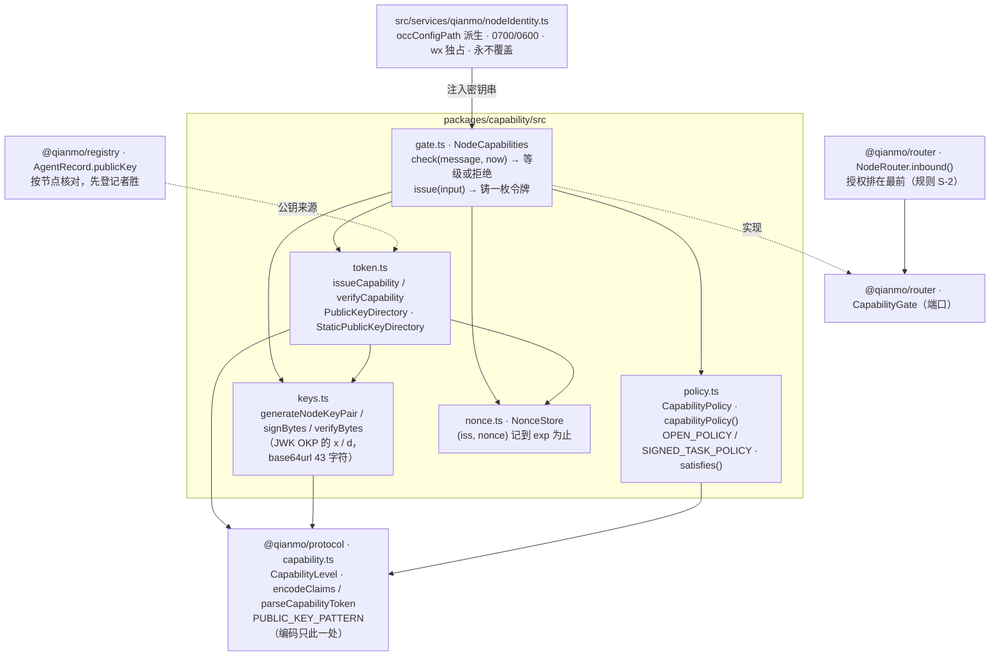

<!-- Copyright 2026 Qianmo AgentNest Team -->
<!-- SPDX-License-Identifier: MIT -->

# @qianmo/capability —— 跨节点授权：密钥、令牌、重放与三级权限

**一句话定位**：把章程 C-5「消息不能替用户授权」从一句约定变成一条**签名校验**。每节点一对 Ed25519（`node:crypto`，零依赖），`<claims>.<sig>` 紧凑令牌，nonce 重放表，三级权限天花板。

| 项 | 指针 |
| --- | --- |
| 任务包 | roadmap **P4.3**（权限分级与授权模型 v0）；令牌**定义**在 P1.1，本包是它的实现 |
| 章程条目 | charter **§3.3 C-5**（三级权限 + 消息不能替用户授权，基座起点：部分）；与 **N-3** 的界线也写在 C-5 里 |
| 协议真源 | `protocol.md` §10.1（capability 形态、规则 S-1 / S-2 / S-3、四条边界） |
| 完成状态 | roadmap「完成状态速查」P4.3 行 |

## 1. 模块架构图



`verifyCapability` 的检查顺序是**故意的**：结构 → 绑定（`aud` / `sub` / `taskId`）→ 时钟 → **规则 S-1** → 验签 → 消耗 nonce。签名之前的每一步都是基于**未验证的声明**做拒绝——这个方向是安全的（拒绝只让攻击者损失一条消息），反方向才是漏洞。

## 2. 对外 API 面

读 `src/index.ts`：

- **`NodeCapabilities` / `NodeCapabilitiesOptions`** —— 节点的授权面，实现 `@qianmo/router` 的 `CapabilityGate`。`check()` 回答「这条消息带着什么等级、够不够」；`issue()` 铸令牌（**没有私钥就只能验不能签**，且这是一条显式的抛错而不是静默降级）。
- **`issueCapability` / `verifyCapability` / `IssueInput` / `VerifyContext` / `VerifyResult`** —— 令牌的签发与校验本体。
- **`PublicKeyDirectory` / `StaticPublicKeyDirectory`** —— 公钥来源端口。**同步**接口：入站门跑在消息处理器里，一个可能阻塞的查表会把「这个处理器要跑多久」交给未认证的对端决定；注册中心背书的实现应当缓存并自行刷新。
- **`generateNodeKeyPair` / `isNodeKeyPair` / `signBytes` / `verifyBytes` / `NodeKeyPair`** —— 密钥面。**不碰文件系统**：知道自己住哪儿的密钥会让每个使用方都继承一套路径约定，而路径的唯一出处是基座 `src/config/paths.ts`（CLAUDE.md §1.1②）。
- **`NonceStore` / `NonceStoreOptions` / `DEFAULT_NONCE_CAPACITY`** —— 重放表，按签发者分域，记到令牌 `exp` 为止（与 `protocol.md` §7.2 去重表同一 TTL 口径）。
- **`CapabilityPolicy` / `capabilityPolicy` / `satisfies` / `OPEN_POLICY` / `SIGNED_TASK_POLICY`** —— 每种消息类型需要什么等级。未列出的类型一律落到 `read`。

三级权限本身（`CapabilityLevel` / `levelAtLeast`）与公钥编码（`PUBLIC_KEY_PATTERN`）在 `@qianmo/protocol`，本包与 `@qianmo/registry` 都 import 它，不各写一份。协议级数值一律以 `LIMITS` 为唯一出处。

## 3. 最容易被改坏的五条不变式

| # | 不变式 | 改坏了会怎样 | 钉住它的测试 |
| --- | --- | --- | --- |
| 1 | **规则 S-1：`user-confirmed` 只认本节点私钥签发的，且这一判在验签之前** | 这是 C-5 从「约定」回到「结构性保证」的**唯一支点**。放开它，任何持钥节点都能声称「用户已确认」——confused deputy 的标准形状 | `test/attacks.test.ts`「a remote user-confirmed token is refused however well signed (S-1)」「a third node cannot confirm on the target's behalf either」；正向对照「a write-limited token from a trusted peer is what actually works」（否则「全都拒绝」的实现也能全绿） |
| 2 | **nonce 最后消耗——在验签成功之后** | 提前消耗，任何能猜到 nonce 的人都能用未签名的垃圾把它烧掉，重放守卫反过来变成让**真令牌**弹回的手段 | `test/token.test.ts`「an unverifiable token cannot burn the nonce of a real one」；配套「the same token twice is refused the second time」「nonces are dropped once the token they came with has expired」 |
| 3 | **令牌过期不过 T-2 时间跳跃闸门** | T-2 是为了让刚解冻的节点不要把在飞投递全判死；把**授权**的寿命按冻结时长顺延是反方向的失败——过期就是过期，重发的代价只是一个来回 | `test/token.test.ts`「expiry is not extended by anything — no time-jump grace here」 |
| 4 | **没有 TOFU**：签发者公钥必须事先登记，未知 `iss` 一律 `E_CAP_INVALID` | 从「第一条声称自己是某节点的消息」学公钥，等于谁先开口谁就**是**那个节点 | `test/token.test.ts`「an unknown issuer is refused — there is no trust on first use」 |
| 5 | **规则 S-3：本包（以及阡陌全部入站路径）没有任何提升本地权限的代码路径**，而且这条是一个**会变红的扫描**、红方向由 fixture 钉住 | 「我们没调那个 API」正是那种会悄悄不再成立的说法；只会绿的断言等于没有断言 | `test/authorization-invariants.test.ts` 四条：扫描覆盖真实文件、无 Qianmo 源调用改权限 API、检测器对真调用会开火、对讨论它的散文不开火 |

另外两条同样有专门用例、值得记住的性质：**签名覆盖的是原样送达的 claims 段**（不重新序列化，于是不需要任何规范化 JSON——`test/token.test.ts`「claims edited after signing no longer verify」），以及**「没出示令牌」与「令牌等级不够」不许塌成同一种拒绝**（`test/policy.test.ts`「the gate's two questions stay apart」组）。

## 4. 与基座的关系

- **定性：部分**（charter §3.3 C-5）——基座有工具权限模式与审批链路，可复用作**本地执行侧**；**跨节点身份与「授权不可跨越」的协议级强制是自研**。
- 与 **N-3 的界线**写在 charter §3.3 C-5 里：N-3 禁的是 PKI（CA、签发链、证书轮换与托管），**节点级密钥对自签 capability 不属于该禁止范围**。
- [`base-adoption.md`](../../docs/dev/base-adoption.md) §3.2「权限分级 / 消息不能替用户授权」行判定为**部分**，缺口是跨节点身份认证、能力清单与协议级强制。
- 代码层面：本包对基座 `src/` **零 import**，只用 `node:crypto`。**节点身份的落盘不在本包**——在 `src/services/qianmo/nodeIdentity.ts`（`occConfigPath` 派生、目录 0700 文件 0600、`wx` 独占创建**永不覆盖**、文件损坏是报错而不是重新生成；密钥就是身份，悄悄换一把等于这个节点悄悄变成另一个节点）。
- `protocol.md` §10.1 原先记的「已知缺口」（同节点两个 agent 可登记不同公钥）由 **`@qianmo/registry`** 闭合：按节点段核对、在租先登记者胜、不建第二张索引表。

## 5. 边界与已知未做

照 roadmap「完成状态速查」P4.3 行与 `protocol.md` §10.1 的**四条边界**，只给指针 + 摘要：

- **默认策略是 `SIGNED_TASK_POLICY`**（自 **P12.4**；此前是 `OPEN_POLICY`）：未签名的 `task.request` / `wake` 被拒。**「校验可选」从来不是这条的内容**——任何**已出示**的令牌都全程校验，伪造的拒、远端 `user-confirmed` 按 S-1 拒、任何消息都不能提升等级；可选的只是「**是否强制出示**」。它当初必须可选，是因为 M0 没有密钥分发（`AgentRecord.publicKey` 有字段有校验，但还没有东西去发布它），`--trust <node>=<publicKey>` 是手工配的 O(N²)；P12.1~P12.3 把分发建起来之后那个理由消失，默认随之翻面（`docs/dev/key-distribution.md` §9.2 ②）。逃生开关 `--open-policy`，**回滚零代价且是结构性的**：两个方向都不改变任何一条已签名消息的命运（§9.3）。**这条必须原样转述，不得简化成「阡陌打开了跨节点鉴权」，也不得简化成「默认就安全了」——L0/L1/L2 是三层，这里只是 L2。**
- **回复类消息不需要授权**：`ack` / `task.result` 是本节点自己请求的回音，`SIGNED_TASK_POLICY` 只抬高 `task.request` 与 `wake` 两类。
- **档位（issue #28）在本包决定，别处只搬运**：`NodeCapabilities.check` 除了「够不够」还答「这条消息的来源标注该写哪一档」，判据是「令牌全过校验 **且** `iss` 在 `trustedIssuers` 里 **且** `act ≥ write-limited`」，三者缺一即最低档。放在这里是因为决定它需要密钥目录与运维给的信任集，而下游的 `@qianmo/router` / `@qianmo/adapter` 两者都没有。定义与文案以 `docs/dev/protocol.md` §9.4 / §10.2 为准，信任集的来源与已知缺口见 `docs/dev/key-distribution.md` §10.5。
- **校验点在终点节点，不在 activator**：令牌的 `aud` 是目标节点，而 activator 跑在宿主上、节点段与沙箱内的常驻节点不同；把闸门放在 activator 会让每一条合法令牌都因 `aud` 不匹配被拒。宿主那一跳仍有判环与限流。
- **一处顺序偏离记录在案**：S-2 表把入站预算排在判环之前，实现是**判环在前**，理由与 `packages/router/src/router.ts` 的模块注释、`protocol.md` §10.1 同文。

## 6. 怎么跑测试

```bash
bun test packages/capability
```

实测：**43 pass / 0 fail，4 个测试文件**（`token` / `attacks` / `policy` / `authorization-invariants`），零 mock。其中 `attacks.test.ts` 是 T-7 的三族攻击用例（伪造凭据 / 内容夹带指令 / 已签名令牌里的越权）+ 一条正向对照，**判据一律是「等级没被抬高 + 审计有记录」，一条都不看模型是否被说服**。

## 7. P9.3 双人签字

> owner 栏语义见 roadmap「任务包字段说明」（v2.3）：主开发一律是喻永昌，owner 栏原名单读作「方向辅助人 / 第二知情人」，括号内 backup 读作「第二辅助」。下表按 P4.3 的 owner 栏填名。

| 角色 | 姓名 | 签字 | 日期 |
| --- | --- | --- | --- |
| owner（P4.3 owner 栏） | 陈曦宇 | | |
| backup（P4.3 括号内） | 喻永昌 | | |

### backup 需能独立复述的 3 道题

1. 一枚 `act = user-confirmed` 的令牌从别的节点送来，签名完全正确、`aud` 也对——会发生什么，在校验流程的第几步、为什么排在验签**之前**？这条规则保护的是章程里的哪一条判断？
2. nonce 为什么在最后才消耗？把它提到验签之前，攻击者能做到什么（注意：不是「重放成功」）？
3. 「M0 默认允许未签名的 `task.request`」——请把这句话完整地说对：什么是可选的、什么不可选，为什么现在必须可选，切成强制版的开关是什么、什么时候切。
