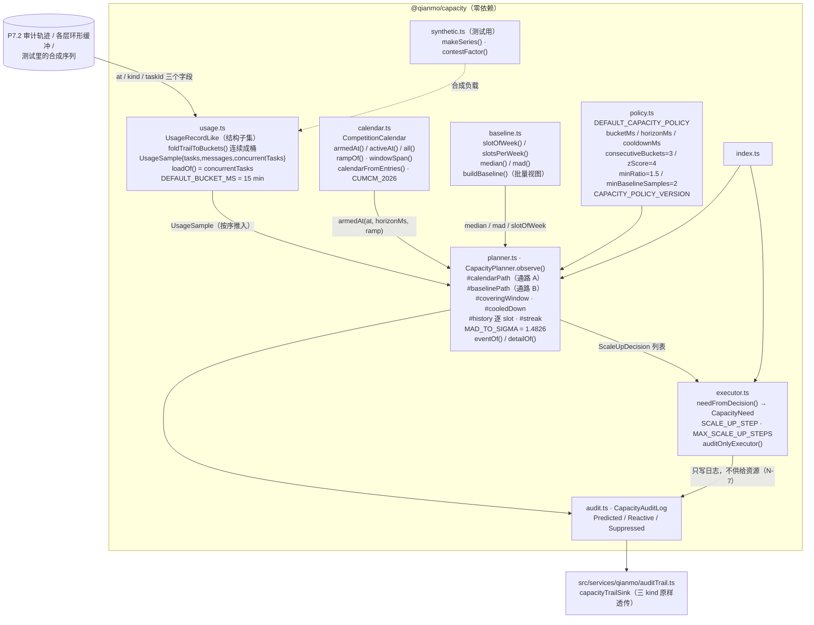

<!-- Copyright 2026 Qianmo AgentNest Team -->
<!-- SPDX-License-Identifier: MIT -->

# @qianmo/capacity —— 预测性扩容 v0

把用量折成桶、学出「本周此刻的正常值」，在负载到达之前决定扩容。**双通路分开命名、互不冒充**；**只写审计，不供给任何真实资源**。

| 项 | 指针 |
| --- | --- |
| 任务包 | roadmap **P6.2 预测性扩容 v0**（交付物 / DoD 两条判据 / v2.32 的实测数据与一处待确认解读都在那里） |
| 章程条目 | charter §3.4 **S-4 预测性扩容 v0**（基座起点「自研」）；**N-7**（不做真实弹性扩容）与 **N-1**（不做计费）是本包的两条硬边界 |
| 协议级数值 | 本包的任何数值**都不上线**——没有消息携带 z-score，没有对端读得到冷却时间；两节点跑不同的 `zScore` 也完全互通。协议级上限见 `@qianmo/protocol` 的 `LIMITS` |

**对外表述纪律**：路径 A 的「提前量」全部来自日历条目上人手写的 `rampBeforeMs`——**这是对人写的日期做算术，不是预测模型**。「预测性扩容」这个词最容易让读者（或一页幻灯片）听成「模型预测了峰值」，它没有。章程 §5.8 关于「不夸大」的纪律同样适用于我们自己的能力。

---

## 1. 模块架构图



**通路 A（日历）**：`at + horizonMs >= startAt - rampBeforeMs` 即武装；`leadMs = startAt - at`。一个 window 只扩一次（一场比赛跨多少个桶都是一件事，逐桶触发 72 小时不是决策，是卡住的位）。

**通路 B（同槽基线偏离）**：三条件 **AND** 且连续 `consecutiveBuckets` 个桶——① `value > median + zScore × 1.4826 × MAD`；② `value > median × minRatio`；③ 该 slot 至少有 `minBaselineSamples` 周历史。

**抑制**：`covered-by-calendar`（通路 A 已为这个窗口买过容量）与 `cooldown`；两种都**写记录**（`scale-up-suppressed`，审计里记 `dropped` 不记 `refused`）——一份看不到「想触发但被拦住」的审计，无法区分「什么都没发生」与「拦住了」。

---

## 2. 对外 API 面（`src/index.ts`）

| 导出 | 一句话 |
| --- | --- |
| `CapacityPlanner` / `CapacityPlannerOptions` | 纯桶推进器：`observe(sample)` 推一个桶、返回该桶产出的决策。**无 timer、无时钟、从不调 `Date.now()`**，一切时刻都从入参来 |
| `ScaleUpDecision` / `ScaleUpKind` / `ScaleUpPath` / `ScaleUpReason` | 决策形状：三种 kind（predicted / reactive / suppressed）、两条 path、四种 reason；`leadMs` 是 DoD 的「提前多久」，reactive 上诚实地写 0 |
| `MAD_TO_SIGMA` | 1.4826——让 MAD 成为正态数据下 σ 的一致估计，这样「z-score」大致就是读者以为的那个意思 |
| `eventOf` / `detailOf` | 决策 → 审计事件 / 明细（**只含标量**，`leadMs` 直接入 detail 作举证字段） |
| `CapacityAuditLog` / `CapacityEventType` / `CapacityEvent` / `CapacityAuditSink` | 三种事件的有界环形 + 无界计数 |
| `CapacityPolicy` / `DEFAULT_CAPACITY_POLICY` / `CAPACITY_POLICY_VERSION` | 全部阈值与其版本号（改默认值就升版本号，好让旧审计行仍可读） |
| `CompetitionCalendar` / `CompetitionWindow` / `CalendarEntryLike` / `calendarFromEntries` | 只读日历视图；**不加载、不监听、不写文件**——数据从哪来是调用方的事，这样本包保持零依赖 |
| `rampOf` / `windowSpan` / `activeAt` / `armedAt` | 提前量、抑制跨度（从 ramp 打开到比赛结束）、覆盖判定 |
| `CUMCM_2026` / `seedCalendar` | **建模假设，不是权威赛程**——真实日期由组委会每年发布，这里的数字没有核对过，存在只为让回放有个靶子 |
| `slotOfWeek` / `slotsPerWeek` / `median` / `mad` / `buildBaseline` / `Baseline` / `BaselineSlot` | 同槽基线的统计原语与批量视图（planner 内部是增量维护同一个统计量） |
| `foldTrailToBuckets` / `FoldOptions` / `UsageSample` / `UsageRecordLike` / `loadOf` / `DEFAULT_BUCKET_MS` / `MESSAGE_ACCEPTED_KIND` | 审计流 → **连续**桶；三个计数里 planner 只看 `concurrentTasks` |
| `needFromDecision` / `CapacityNeed` / `SCALE_UP_STEP` / `MAX_SCALE_UP_STEPS` / `ScaleUpExecutor` / `auditOnlyExecutor` | 决策 → 资源诉求（三轴、**无价格轴**）与 M0 唯一的执行器 |
| `makeSeries` / `contestFactor` / `SyntheticSpec` / `SyntheticShape` | 合成负载生成器，供回放判据使用 |

---

## 3. 最容易被改坏的五条不变式

| # | 不变式 | 改坏会怎样 | 哪个测试钉住 |
| --- | --- | --- | --- |
| 1 | **`minRatio` 挡的是 MAD=0 时的退化**：三条件必须 AND，条件② 不是冗余 | 一个安静时段每周都恰好读到 4，MAD **就是 0**，`z × 1.4826 × MAD` 整项塌掉，条件① 退化成 `value > median`——周日多了一条任务就扩容。刚重启的节点同理 | `test/planner.test.ts`：`one extra task on a dead-flat history does not trigger — the ratio floor holds` / `…and the same history does trigger once the rise clears the floor`；`test/baseline.test.ts`：`a constant series has a MAD of exactly zero` |
| 2 | **用中位数与 MAD，不用均值与标准差** | 基线学习的历史里**本来就含有它要检测的峰值**（去年九月的赛事和今年落在同一批 slot）。均值随离群点走、标准差随其**平方**走：三周历史里混一个 8× 的赛事周就能让检测器学会忽略它存在的理由 | `test/baseline.test.ts`：`one contest week does not drag the baseline with it` |
| 3 | **两条通路分开命名、互不冒充**：`scale-up-predicted` 的 `leadMs` 只来自日历 ramp，与负载无关；`scale-up-reactive` 的 `leadMs` 恒为 0 | 让 reactive 也报一个非零提前量，就是在把「事后察觉」包装成「事前预测」；让 predicted 去看负载，则 DoD 判据 1 的「四个 seed 逐字相同的 leadMs」这条直接证据就没了 | `test/replay.test.ts`：`the lead comes out the same for every seed — it is the calendar, not the load` / `the scale-up lands well over 30 minutes ahead, by three separate clocks` |
| 4 | **桶必须按序推入，且历史在判定之后才写入**；被抑制的判断也要写记录 | 悄悄接受乱序桶，会让一个未来值进入自己的基线——检测器已经看过答案了；抑制不写记录，判据 2「平稳负载不误报」的那个「没有事件」就无法与「探测器根本没带电」区分 | `test/planner.test.ts`：`a bucket that predates the last one is refused, not folded in` / `every decision reaches the planner's own audit log`；`test/replay.test.ts`：`the detector really was armed — the same week with a real rise fires` / `one contest is one scale-up, with the near misses on the record` |
| 5 | **`needFromDecision` 严格三轴、无 `costLimit`，且拒绝为被抑制的决策定量**；`foldTrailToBuckets` 产出的桶必须**连续** | 加一个价格轴就是在编一个 M0 任何部分都兑现不了的数（N-1）；给 suppressed 决策定量，会变成「没人下单的机器」；桶不连续则基线以为系统永远繁忙，而「连续三个桶」会数到相隔数天的三个桶 | `test/planner.test.ts`：`the ask has three axes and no price on it` / `a suppressed decision asks for nothing, loudly`；`test/baseline.test.ts`：`quiet buckets come back as zeroes, not as gaps` |

---

## 4. 与基座的关系

- **定性**：**完全自研**（charter §3.4 S-4；`docs/dev/base-adoption.md` §3.2「资源协商 / 加密隧道 / 预测性扩容」行判「无」）。
- 本包**零依赖**（`package.json` 的 `dependencies` 为空），既不导入基座模块也不导入其他 `@qianmo/*` 包——连读 P7.2 审计记录都是走**结构子集** `UsageRecordLike` 而不是 `import type { AuditRecord }`。
- 基座侧唯一的接线点是 `src/services/qianmo/auditTrail.ts` 的 `capacityTrailSink`；改造点全量清单见 `docs/dev/base-modifications.md`。

---

## 5. 边界与已知未做

| 事项 | 一行摘要 | 指针 |
| --- | --- | --- |
| **不供给任何真实资源** | 一次决策的全部效果就是审计里的一行；`auditOnlyExecutor` 是唯一实现，M2+ 才接协商借机器或供应 API。**这是留白，不是遗漏** | 章程 N-7；`src/executor.ts` 顶部注释 |
| `SCALE_UP_STEP` 三个数是留白 | 没人量过一个 CUMCM 周末实际要多少，M0 也无从量；刻意做得「明显是临时值」，好让将来的执行器**必须替换**而不是顺手继承 | `src/executor.ts` `SCALE_UP_STEP` 注释 |
| `CUMCM_2026` 是建模假设 | 不是历史记录也不是权威赛程；在意的部署用 `calendarFromEntries` 自己加载 | `src/calendar.ts` `CUMCM_2026` 注释 |
| 不接演示链路 | 章程 P-3（需求漂移）：本包不「顺手」接进 AC-7 的演示 | roadmap v2.32 末段 |
| 「7 天回放」的解读**待负责人确认** | 实现为 21 天序列、前 14 天热身、后 7 天计分——纯 7 天冷回放里通路 B 全程弃权，0 假阳性什么也证明不了 | roadmap v2.32「一处解读待负责人确认」 |
| 冷 slot 静默弃权 | 「还不知道」不是决策；头两周每 15 分钟记一条会把真正的决策埋掉 | `src/planner.ts` `#baselinePath` 注释 |

---

## 6. 怎么跑测试

```bash
bun test packages/capacity/test    # 包内：51 用例 / 4 文件（实跑 2026-08-15）
```

逐文件：`planner` 18 / `baseline` 14 / `calendar` 11 / `replay` 8 = **51 pass / 0 fail / 173 expect**。`replay.test.ts` 是 DoD 的两条判据本身（判据 1：contest 形态 + CUMCM 日历上的 `leadMs`，三种时钟口径各断言一次；判据 2：24 个 seed × 7 天计分窗的假阳性预算，外加一条「探测器确实带电」防弃权假绿）。全程零 timer、零真实时钟——7 天回放跑在毫秒级。

---

## 7. P9.3 双人签字栏

> roadmap v2.3 起 owner 栏语义为「方向辅助人」，主开发统一为喻永昌；**P9.3 双人签字属明确写「双人」的流程要件，不受该条影响**，仍按本任务包 owner / backup 执行（roadmap v2.3 例外条款）。

| 角色 | 姓名（按 roadmap P6.2 owner 栏） | 签名 | 日期 |
| --- | --- | --- | --- |
| owner | 李怡康 | | |
| backup | 喻永昌 | | |

**owner 出给 backup 的三道题**：

1. 通路 B 的三个条件是什么？把 `minRatio` 那条拿掉，在一个每周都读到常数 4 的安静时段会发生什么——请把 `z × 1.4826 × MAD` 这一项的值算出来，说明条件① 退化成了什么。另外：为什么用中位数与 MAD 而不是均值与标准差？（提示：基线学习的历史里有什么）
2. `scale-up-predicted` 的 `leadMs` 是从哪儿来的？如果对外说「我们的模型预测了峰值」，错在哪、违反了章程哪一条？为什么 `scale-up-reactive` 的 `leadMs` 必须写 0 而不是估一个数？
3. 为什么被抑制的判断也要写审计记录、而且记成 `dropped` 而不是 `refused`？如果不写，DoD 判据 2 的「0 假阳性」会失去什么？另外：`CapacityPlanner` 为什么不许乱序桶、为什么历史在判定**之后**才写入？
