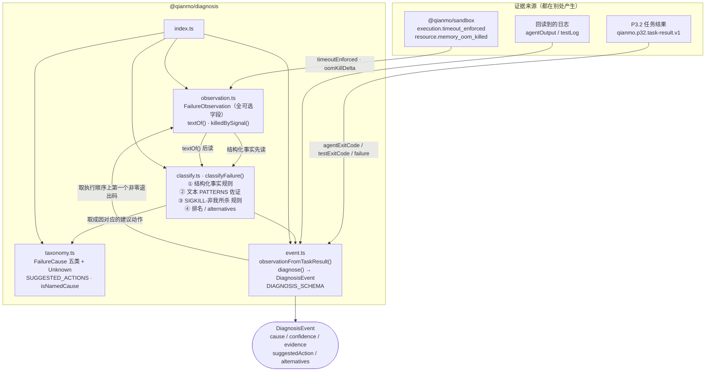

<!-- Copyright 2026 Qianmo AgentNest Team -->
<!-- SPDX-License-Identifier: AGPL-3.0-or-later -->

# @qianmo/diagnosis —— 原因级故障诊断 v0

把「任务失败了」变成**五类具名成因之一 + 命名它的证据 + 建议动作**，或者一个诚实的 `unknown`。规则式、零依赖、无模型。

| 项 | 指针 |
| --- | --- |
| 任务包 | roadmap **P5.1 原因级诊断 v0**（交付物 / DoD 六条 check / v2.24 的 50 条盲分类实测记录都在那里） |
| 章程条目 | charter §3.4 **S-1 原因级诊断**（基座起点「部分」——有错误分类与重试分类可借鉴接口形状）；AC-7 第二拍是运维读到成因 |
| 协议级数值 | 本包不定义任何数值上限；协议级上限见 `@qianmo/protocol` 的 `LIMITS` |

---

## 1. 模块架构图



**规则顺序就是设计本身**：`exit 137` 是 SIGKILL，**谁杀的都长这样**——靠关键词在超时与 OOM 之间挑一个等于抛硬币。分辨它的是**杀人者当场记下的事实**（`timeoutEnforced` / `oomKillDelta`），所以结构化证据一律先读，文本只作佐证。两个结构化信号同时命中（我们按期限杀了它 **且** 内核 OOM 计数器动了）时判 OOM，超时留在 `alternatives`：一个撞了内存上限、时钟到点时还在跑的任务首先是内存问题——抬期限什么也改变不了，抬上限可能可以。

---

## 2. 对外 API 面（`src/index.ts`）

| 导出 | 一句话 |
| --- | --- |
| `classifyFailure(observation)` | 核心分类器：永不抛错、永不返回「失败」，最坏是带证据的 `Unknown` |
| `Diagnosis` | 判定结果：`cause` / `confidence`（`high`/`medium`/`low`）/ `evidence`（每条注明来自哪个字段）/ `suggestedAction` / `alternatives` |
| `DiagnosisConfidence` | 三档置信度；文本命中最高只能给 `medium` |
| `FailureObservation` | 分类器**唯一**允许看的输入：退出码 / 信号 / stderr / stdout / 时长 / 期限 / `timeoutEnforced` / `oomKillDelta` / `httpStatus` / `service` / `context`。字段全可选——真实观测通常是残缺的 |
| `textOf(observation)` | stderr + stdout 拼成的小写干草堆，供文本规则使用 |
| `killedBySignal(observation, signal)` | 信号判定，兼容 `128 + signum` 的退出码约定（SIGKILL=137 等） |
| `FailureCause` / `FAILURE_CAUSES` | 五类成因（`oom` / `timeout` / `missing-dependency` / `disk-full` / `quota-exhausted`）+ `unknown` |
| `SUGGESTED_ACTIONS` | 每类成因的建议动作，含 `unknown` 那条——诊断不给下一步就只是趣闻 |
| `isNamedCause(cause)` | 是否为「肯定识别出来的」成因（即非 `unknown`） |
| `diagnose(observation, {at, taskId})` / `DiagnosisEvent` / `DIAGNOSIS_SCHEMA` | 把判定包成结构化事件（`qianmo.diagnosis.v1`，带诊断时刻而非失败时刻） |
| `observationFromTaskResult(result, logs)` / `TaskResultLike` / `CapturedLogs` | P3.2 结果 → 观测的桥；按**结构子集**而非导入 runner 接口打类型（包不该依赖 `scripts/`） |

---

## 3. 最容易被改坏的四条不变式

| # | 不变式 | 改坏会怎样 | 哪个测试钉住 |
| --- | --- | --- | --- |
| 1 | **结构化事实先于文本**：`oomKillDelta` / `timeoutEnforced` / `httpStatus` / `exitCode===127` 四条规则跑在任何 `PATTERNS` 匹配之前；并列时结构化的先入榜、排名相同取先者 | 把文本规则提前，超时与 OOM 的区分退化成词汇学。这不是理论——Bun 撑爆内存时被系统 SIGKILL 且**一个字都不写**，文本规则无从下手，首轮 OOM 只有 5/10 | `test/classify.test.ts`：`a killed process alone is not a diagnosis` / `the same exit code is a timeout when the enforcer says so` / `and an OOM when the kernel counter moved` / `both at once resolves to OOM, with the timeout kept as an alternative` |
| 2 | **「不是我们杀的 SIGKILL」这条规则只给 medium**，且必须同时满足 `timeoutEnforced === false`；有 `oomKillDelta` 时才升到 high | 升成 high 会把运维手动 `kill -9` 报成 OOM（两者长得一模一样）；去掉 `timeoutEnforced === false` 的守卫，我们自己发出的 SIGKILL 会被回读成 OOM | `test/classify.test.ts`：`SIGKILL that our supervisor did not send reads as OOM` / `the same kill with the kernel counter present is high confidence` / `a SIGKILL we did send is never re-read as an OOM` |
| 3 | **分类器故意保守**：裸 ENOENT / “no such file or directory” **不算**缺依赖；普通测试失败保持 `unknown`，`unknown` 是答案不是兜底桶 | 放宽这两条，任何打不开文件的任务都会被报成「环境缺依赖」，运维照建议去装包，而真因在别处；`unknown` 一旦被别的名字顶掉，「诊断可复核」就没了 | `test/classify.test.ts`：`a missing input file is not called a missing dependency` / `an ordinary test failure stays unknown rather than being named` |
| 4 | **桥取执行顺序上第一个非零退出码**（agent 先于 test），且每条判定必须带证据、每类成因必须带建议动作 | 取最后一个非零码是典型的「诊断症状而非病因」——agent 死了的话，test 的退出码描述的是一次根本没发生的运行 | `test/classify.test.ts`：`the bridge takes the first non-zero exit code, not the last` / `a clean agent with failing tests keeps the test exit code` / `every cause has an action, including unknown` / `a diagnosis always carries the evidence it used` |

---

## 4. 与基座的关系

- **定性**：charter §3.4 S-1 判「部分」——基座有错误分类与重试分类机制可借鉴**接口形状**，但没有原因级成因表。本包**不改基座核心、不导入基座模块**（`package.json` 的 `dependencies` 是空的）。
- **刻意不用模型**：把模型调用放到失败路径上，而失败路径最可能正因为模型不可用；这同时是 AC-5 模型中立的要求。判定见 `docs/dev/base-adoption.md` §3.1 与 roadmap v2.24 ①。
- 基座改造点全量清单见 `docs/dev/base-modifications.md`。

---

## 5. 边界与已知未做

| 事项 | 一行摘要 | 指针 |
| --- | --- | --- |
| 样本是我们自己造的失败 | 比野外样本弱；真机跑批应把 P3.2 的真实失败并进语料 | roadmap v2.24 ⑦ |
| `oomKillDelta` 需要 cgroup v2 | macOS 上拿不到，所以同一个 OOM 在笔记本上是中等置信、在真机上才是高置信 | roadmap P5.1 行「边界」栏；`src/classify.ts` 该规则注释 |
| 只有五类 + `unknown` | 这五类是「代码没错但任务死了」的五种方式，即运维能动手的那一集；加一类就必须同时给出建议动作 | `src/taxonomy.ts` 顶部注释 |
| 不产生也不消费审计条目 | 本包只返回结构化事件，落审计由调用方（`@qianmo/audit`）负责 | `src/event.ts` |
| 文本模式表是英文关键词 | 上游工具链的输出语言即中文环境下也多为英文；中文错误文本目前无对应模式 | `src/classify.ts` `PATTERNS` |

---

## 6. 怎么跑测试

```bash
bun test packages/diagnosis/test    # 包内：21 用例 / 1 文件（实跑 2026-08-15）
bash demo/p51-diagnosis.sh          # 50 条真实注入样本的盲分类跑批（需真环境）
```

包内 **21 pass / 0 fail / 47 expect**，四组：`the 137 problem` 8 / `the other three causes` 5 / `what the classifier refuses to do` 4 / `the event and the P3.2 bridge` 4。注入器与跑批脚本在 `demo/lib/p51-inject.ts` 与 `demo/lib/p51-diagnosis.ts`——**标注只进报告，分类器只看观测**。

---

## 7. P9.3 双人签字栏

> roadmap v2.3 起 owner 栏语义为「方向辅助人」，主开发统一为喻永昌；**P9.3 双人签字属明确写「双人」的流程要件，不受该条影响**，仍按本任务包 owner / backup 执行（roadmap v2.3 例外条款）。

| 角色 | 姓名（按 roadmap P5.1 owner 栏） | 签名 | 日期 |
| --- | --- | --- | --- |
| owner | 李怡康 | | |
| backup | 董宗岳 | | |

**owner 出给 backup 的三道题**：

1. 什么是「137 问题」？给一个只有 `exitCode: 137` 的观测，分类器会给出什么？再分别加上 `timeoutEnforced: true`、`oomKillDelta: 3`、两者都有——各是什么结论、置信度多少、`alternatives` 里是什么？为什么两者都有时判 OOM 而不是超时？
2. 「SIGKILL 且不是我们杀的 → OOM（中等置信）」这条规则是怎么来的？（说出跑批里那个 5/10 的实测过程）为什么它只能给 medium 而不能给 high？为什么必须带 `timeoutEnforced === false` 这个守卫？
3. 为什么裸 ENOENT 不算「缺依赖」、普通测试失败要留在 `unknown`？说明「保守」在这里换来了什么。另外：`observationFromTaskResult` 为什么取第一个非零退出码而不是最后一个？
