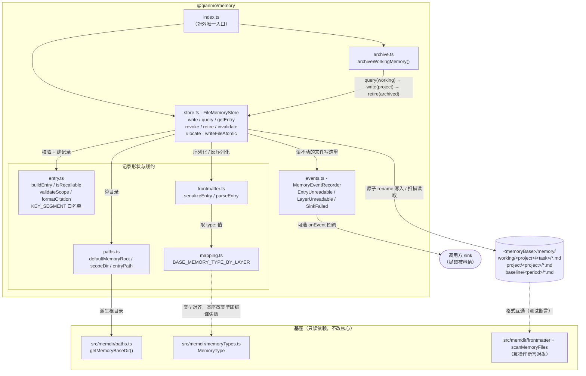

<!-- Copyright 2026 Qianmo AgentNest Team -->
<!-- SPDX-License-Identifier: MIT -->

# @qianmo/memory —— 分层记忆的存储层

把章程 §1.5 的工作 / 项目 / 基线三层记忆落成**三张以目录为主键的表**，每条记录强制带来源、双时间轴与废止标记；只存储与规约，不做检索注入（那是 `@qianmo/recall`）。

| 项 | 指针 |
| --- | --- |
| 任务包 | roadmap **P2.3 分层记忆存储 schema**（owner / 交付物 / DoD、以及 v2.14 的落地与评审打回记录都在那里） |
| 章程条目 | charter §3.2 **R-2 分层记忆**（基座起点三态判定与 v2.2 补注在那里） |
| 协议级数值 | 本包不定义任何协议级上限；跳数 / 体积 / TTL / 速率一律见 `@qianmo/protocol` 的 `LIMITS` |

---

## 1. 模块架构图



**两条主数据流**：

- **写入**：`write(input)` → `buildEntry`（补齐强制字段、校验 scope / tag / 时间轴）→ `entryPath` → `serializeEntry` → `writeFileAtomic`（同目录临时文件 + `fsync` + `rename`）。
- **召回**：`query(q)` → `searchRoots`（按 scope 收窄到最小目录）→ `listMarkdownFiles` → `parseEntry` → `isRecallable(asOf)` → `matchesFilters` → `compareEntries` 排序 → `limit`。读不动的文件**跳过并记事件**，不中断整次扫描。

---

## 2. 对外 API 面（`src/index.ts`）

| 导出 | 一句话 |
| --- | --- |
| `FileMemoryStore` | 三张表的文件实现：`write` / `query` / `getEntry` / `revoke` / `retire` / `invalidate`，外加常驻的 `events` 记录器 |
| `MemoryStoreOptions` / `MemoryQuery` | 构造参数（`root`、可注入 `now` / `newId`、`onEvent`）与确定性查询条件（层 / 主键 / 标签 AND / 子串 / `asOf` / `includeRetired` / `limit`） |
| `MemoryStoreError` | 定点操作的失败：id 不存在、重复废止、重复失效、`invalidAt` 早于 `validAt` |
| `archiveWorkingMemory` + `ArchiveOptions` / `ArchiveDecision` / `ArchiveResult` | 沉淀归档任务：逐条 promote 或 discard，返回 `promoted` / `sealed` / `discarded` 三组 |
| `MemoryEntry` / `MemoryWriteInput` | 落盘记录形状与写入入参；四个时间戳分属两根轴 |
| `MemoryScope` / `WorkingScope` / `ProjectScope` / `BaselineScope` / `MemoryLayer` / `MEMORY_LAYERS` | 三层的作用域联合类型——工作层按 `projectKey`+`taskId`、项目层按 `projectKey`、基线层按 `period` |
| `MemorySource` / `MemorySourceKind` / `MEMORY_SOURCE_KINDS` | 来源（`session` / `agent` / `user` / `archive` / `import` + id），强制字段 |
| `MemoryRetirement` / `MemoryRetirementKind` / `MEMORY_RETIREMENT_KINDS` | 废止标记（`revoked` 人工废止 / `archived` 沉淀封存 + 原因 + 操作人） |
| `isRecallable(entry, asOf)` | 双轴判定：`expiredAt` 非空即永不召回；`validAt`/`invalidAt` 决定该 `asOf` 时刻是否命中 |
| `formatCitation(entry)` | AC-4 要求的引用串：`[id · sourceKind:sourceId · createdAt]`，其中 id 可被 `getEntry` 反查 |
| `MemoryValidationError` | 写入前的规约失败：空标题 / 非法标签 / 非法 scope 段 / 时间轴倒置 |
| `serializeEntry` / `parseEntry` / `MemoryParseError` | 落盘格式的两端；值一律 JSON 编码，兼作合法 YAML 标量 |
| `MemoryEventRecorder` / `MemoryEventType` / `MemoryEvent` / `MemoryEventDetail` / `MemoryEventSink` / `DEFAULT_EVENT_CAPACITY` | 扫描失败的显式通道（有界环形，默认 256 条） |
| `defaultMemoryRoot()` / `scopeDir()` / `QIANMO_MEMORY_DIRNAME` | 路径派生；根目录来自基座 `getMemoryBaseDir()`，不手工拼 |
| `BASE_MEMORY_TYPE_BY_LAYER` | 层 → 基座四类型的声明表（`project` 有对应，`working` / `baseline` 为 `null`） |

---

## 3. 最容易被改坏的五条不变式

| # | 不变式 | 改坏会怎样 | 哪个测试钉住 |
| --- | --- | --- | --- |
| 1 | **`revoke` 与 `invalidate` 是两个独立操作**：前者动摄取轴（撤下记录，任何 `asOf` 都不再召回），后者动事件轴（事实失效但记录仍 live，问过去仍命中） | 合并成一个「废止」，记忆系统开始与自己的历史矛盾——要么问过去也召不回，要么撤下的记录还在答题 | `test/revocation.test.ts`：`a revoked entry stops being recalled — from a fresh store, at any asOf` / `an invalidated fact leaves recall for now but still answers about the past` |
| 2 | **单文件损坏只损失一条记录，不拖垮整次 `query`**；同一个坏文件被 `getEntry(id)` 点名时**必须抛错**而不是返回 `null` | 前者一改回抛错，唤醒路径上「节点每次醒来一条记忆都召回不到」（P2.3 评审实测打回的正是这处）；后者一改成 `null`，AC-4 的引用核验会把真条目判成伪造 | `test/resilience.test.ts`：`the healthy records are still recalled, and query does not throw` / `the named record being corrupt is an error, not a null` |
| 3 | **废止是标记不是删除**：`expiredAt` + `retirement` 写回原文件，文件永不 unlink；审计用 `includeRetired: true` 取回，连同「谁、为什么」 | 改成真删，章程 §1.5「可人工废止」从可审计变成破坏性，且审计最该抓的那类事件（记录悄悄不见了）恰好抓不到 | `test/revocation.test.ts`：`the revoked entry is still there for an audit, with who and why` / `revoking twice is refused rather than rewriting the first reason` |
| 4 | **根目录只从基座 `getMemoryBaseDir()` 派生，scope 段走白名单正则**（首字符不得为点，故 `.`/`..` 及一切遍历被排除） | 手拼 `join(homedir(), '.occ')` 会击穿身份隔离与 `CLAUDE_CODE_REMOTE_MEMORY_DIR` 持久化挂载（醒来即无记忆）；放宽正则则把跨节点消息里的 `projectKey` 变成路径遍历面（T-7） | `test/paths.test.ts`（三条）+ `test/schema.test.ts`：`scope keys become path segments, so they are whitelisted` / `rejects a traversal arriving through a query filter too` |
| 5 | **落盘格式对基座保持可读**：`name` / `description` / `type` 三键与基座逐字一致，阡陌自有字段一律 `qm_*` 命名空间；排序确定（`createdAt` 倒序，同秒按 id），不依赖目录读取顺序 | 改键名 / 加非命名空间字段，基座解析器与 manifest 立刻读不动；排序改成依赖目录顺序，评审复现出的引用会指向与 agent 所见不同的记录 | `test/frontmatter.test.ts`：`base parseFrontmatter sees the base's own three keys` / `base scanMemoryFiles builds a usable manifest over a Qianmo layer dir`；`test/schema.test.ts`：`ordering is newest ingest first, ties broken by id — not by directory order` |

---

## 4. 与基座的关系

- **定性**：**上层封装 + 共用文件格式**（不是替换，也不是第二套并行存储）。判定与三条否决依据见 roadmap P2.3 行与 `src/mapping.ts` 顶部注释 §2；基座起点为「部分」的依据见 `docs/dev/base-adoption.md` §3.1「分层记忆」行。
- **复用了什么**：基座记忆文件格式与前言契约、`getMemoryBaseDir()` 路径派生（含 `OCC_IDENTITY` / `OCC_CONFIG_DIR` / `CLAUDE_CODE_REMOTE_MEMORY_DIR`）、`MemoryType` 类型对齐。
- **没有复用什么**：基座召回路径 `findRelevantMemories()` 是模型调用，与章程 N-8「M0 只做确定性检索」冲突，本包的 `query` 不含任何模型。
- **改了基座吗**：没有——本包只 `import type` / `import` 基座既有导出，未改基座核心文件。基座改造点的全量清单见 `docs/dev/base-modifications.md`。

---

## 5. 边界与已知未做

| 事项 | 一行摘要 | 指针 |
| --- | --- | --- |
| 不做向量 / 语义检索 | M0 只做确定性检索，用可解释性换召回率 | 章程 N-8；roadmap P3.3 |
| 基座召回不识别 tombstone | `scanMemoryFiles` 读到什么算什么，没有废止概念——这正是权威记录放在基座扫描根之外的原因 | `src/mapping.ts` §2「边界」 |
| 向基座注入链的投影是单向且属 P3.3 | 本包只负责让 `type:` 值已经写在文件里，让投影是复制而非再分类 | `src/mapping.ts` §2(c) |
| 沉淀归档在 promote 与 seal 之间崩溃会留重复 | 顺序是刻意的：反过来会直接丢内容；重复项下次运行会再次 promote | `src/archive.ts` 行内注释 |
| 无跨进程写锁 | 写入是原子 rename（不会半截），但并发写同一 id 的先后由文件系统决定，本包不仲裁 | `src/store.ts` `writeFileAtomic` 注释 |

---

## 6. 怎么跑测试

```bash
bun test packages/memory/test          # 包内：43 用例 / 6 文件（实跑 2026-08-15）
bun test tests/integration/qianmo-memory-recall.test.ts   # 与 recall 的集成腿
```

用例分布（逐文件实跑）：`schema` 15 / `resilience` 10 / `revocation` 6 / `frontmatter` 5 / `roundtrip` 4 / `paths` 3，共 **43 pass / 0 fail / 125 expect**。

---

## 7. P9.3 双人签字栏

> roadmap v2.3 起 owner 栏语义为「方向辅助人」，主开发统一为喻永昌；**P9.3 双人签字属明确写「双人」的流程要件，不受该条影响**，仍按本任务包 owner / backup 执行（roadmap v2.3 例外条款）。

| 角色 | 姓名（按 roadmap P2.3 owner 栏） | 签名 | 日期 |
| --- | --- | --- | --- |
| owner | 董宗岳 | | |
| backup | 李怡康 | | |

**owner 出给 backup 的三道题**（DoD 要求 backup 能独立复述设计原理并接手改动）：

1. `revoke` 和 `invalidate` 各自动哪一根时间轴？给一条 `validAt=T1`、`invalidAt=T2` 的记录，分别用 `asOf<T1`、`T1<asOf<T2`、`asOf>T2` 查，各能不能召回？如果这条记录被 `revoke` 了呢？为什么这两个操作**不能**合并成一个「废止」？
2. 一次 `query` 扫到一个被手改坏的 `.md` 文件会发生什么？同一个文件被 `getEntry(id)` 点名要，又会发生什么？这两者为什么必须相反——各自不这么做的话，分别撞上哪条验收标准？（提示：一条是 P2.3 评审打回项，一条关系到 AC-4 的引用核验）
3. 为什么阡陌的三层不直接写进基座的记忆目录、映射成基座四类型？说出三条否决依据中的至少两条，并指出各自在基座代码里的位置。另外：`defaultMemoryRoot()` 为什么必须走 `getMemoryBaseDir()` 而不能自己拼路径——列出两个会因此坏掉的部署场景。
