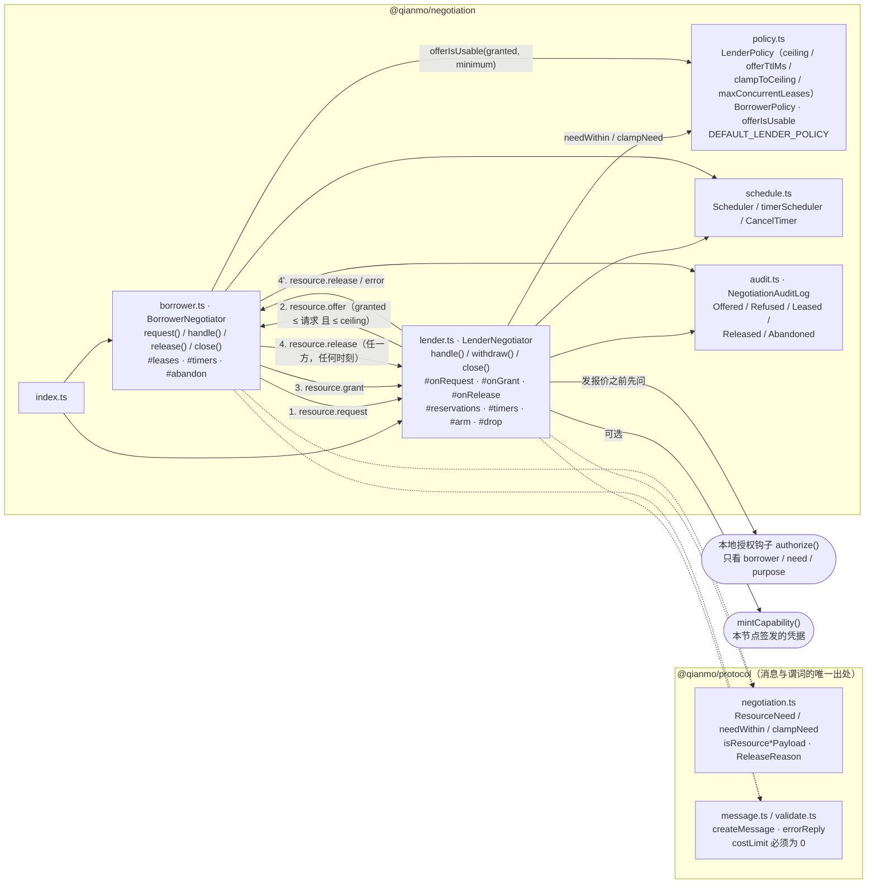

<!-- Copyright 2026 Qianmo AgentNest Team -->
<!-- SPDX-License-Identifier: MIT -->

# @qianmo/negotiation —— 资源协商协议（四段式）

把节点之间「借一台机器」这件事落成两台状态机：请求 → 报价 → 授权 → 释放。**报价永远不大于请求**，**上限在本地且线上够不到**，**任何一方沉默都不会留下悬挂状态**。

| 项 | 指针 |
| --- | --- |
| 任务包 | roadmap **P5.2 资源协商协议**（交付物 / DoD「报价阶段超时后自动放弃且不留悬挂状态」在那里） |
| 章程条目 | charter §3.4 **S-2 资源协商协议**（基座起点「自研」）；§3.3 **C-5**「消息不能替用户授权」是本包的硬约束；N-1（不做计费）由 `costLimit` 恒为 0 承担 |
| 协议定义 | 四种消息、`ResourceNeed` 三轴、`ReleaseReason` 全部定义在 `@qianmo/protocol`（`src/negotiation.ts`）与 `docs/dev/protocol.md` §13 |
| 协议级数值 | `LIMITS` 是全网必须一致的那组数；**本节点肯借多少不是其中之一**，故 `LenderPolicy.ceiling` 与 `offerTtlMs` 住在本包 |

---

## 1. 模块架构图



**出借方四态无第五态**：`idle → offered → leased → released`。每一态都有一条**不依赖对端再说话**的出口——`offered` 自己的定时器到期、`leased` 到租期尽头、任一方的 `release` 提前结束。一个中途消失的对端因此只花掉本节点一个定时器，不是一份永久预留：**一份没人能回收的预留和一次泄漏无法区分**。

---

## 2. 对外 API 面（`src/index.ts`）

| 导出 | 一句话 |
| --- | --- |
| `LenderNegotiator` / `LenderOptions` / `LenderReply` / `Reservation` | 出借方状态机：`handle()` 路由三种入站消息、`withdraw()` 由运维撤回、`close()` 清空全部定时器 |
| `BorrowerNegotiator` / `BorrowerOptions` / `BorrowerReply` / `BorrowedLease` | 借入方状态机：`request()` 开局并自带等待超时、`handle()` 收报价、`release()` 归还 |
| `DEFAULT_REQUEST_TIMEOUT_MS` | 借入方对未答复请求的耐心，默认 30 s |
| `LenderPolicy` / `DEFAULT_LENDER_POLICY` | 本节点的出借上限（默认 15 min / 2 核 / 2048 MiB）、报价有效期 60 s、`clampToCeiling` 默认开、并发租约上限 4 |
| `BorrowerPolicy` / `offerIsUsable` | 借入方的可用下限，三轴逐一比较——低于它就不值得占一次租约去发现 |
| `NegotiationAuditLog` / `NegotiationEvent` / `NegotiationEventType` / `NegotiationAuditSink` | 五种事件（含 `Released`——只有授予没有归还的审计读起来像「只借不还」）；有界环形 + 无界计数，sink 抛错被吞 |
| `Scheduler` / `timerScheduler` / `CancelTimer` | 可注入定时器（`setTimeout` + `unref`），测试用假时钟推进 |

**没有导出的东西也是设计**：这里没有任何「用户已同意」的字段、没有第五种消息、没有任何金额相关的类型。

---

## 3. 最容易被改坏的五条不变式

| # | 不变式 | 改坏会怎样 | 哪个测试钉住 |
| --- | --- | --- | --- |
| 1 | **报价永远不大于请求**，也永远不大于本节点 ceiling（`clampNeed(payload.need, ceiling)` 两头都夹） | 借出比人家要的更多不是慷慨，是一次长着友善面孔的资源泄漏；越过 ceiling 则本节点的容量承诺失效 | `test/negotiation.test.ts`：`an offer is never larger than the request` / `a request over it comes back smaller, never as asked` / `with counter-offers off, the same request is refused outright` |
| 2 | **没有任何字段能表达「用户同意」**：授权钩子跑在出借方本地、在发出报价之前，且只看到 `borrower` / 夹紧后的 `need` / `purpose` 三样 | 只要在四种消息上开一个 `userConfirmed` 之类的字段，就是章程 C-5 明令禁止的 confused-deputy 形状——借入方一句话就能替出借方的用户点头 | `test/negotiation.test.ts`：`a lender whose operator says no makes no offer` / `the hook sees the clamped need and the purpose, and nothing else` |
| 3 | **不留悬挂状态**：报价、租约、等待中的请求各有自己的定时器；`close()` 必须把两侧定时器全部清掉 | 少一条到期路径，一个中途消失的对端就换来一份永久预留；`close()` 漏清则测试进程与常驻节点都会被吊住 | `test/negotiation.test.ts`：`an offer nobody takes expires and frees the reservation` / `a request nobody answers stops being waited on` / `the lease itself expires when its duration runs out` / `close drops every timer on both sides` |
| 4 | **`costLimit !== 0` 在预留任何东西之前就被拒**（协议 `validateMessage` 已拒一次，出借方再拒一次） | N-1「M0 不做计费」若只靠协议层单点，一次协商正是花销最可能溜进系统的地方 | `test/negotiation.test.ts`：`a non-zero cost ceiling is refused before anything is reserved` |
| 5 | **同一份报价不能被取第二次，也不能被第三方取走**；「释放一个已经没了的东西」不算错误 | 前两条一破，一份预留可以被兑现多次或被冒领；后一条一改成报错，release 与 expiry 撞车这个**正常竞态**会天天报假警 | `test/negotiation.test.ts`：`the same offer cannot be taken twice` / `another peer cannot take an offer it was not made` / `a grant that arrives after the offer expired is refused` / `releasing something already gone is not an error` |

---

## 4. 与基座的关系

- **定性**：**完全自研**（charter §3.4 S-2；`docs/dev/base-adoption.md` §3.2「资源协商 / 加密隧道 / 预测性扩容」行判「无」，基座提供栏为空）。
- 本包**不改基座核心、不导入基座模块**，唯一依赖是 `@qianmo/protocol`。
- 基座改造点全量清单见 `docs/dev/base-modifications.md`。

---

## 5. 边界与已知未做

| 事项 | 一行摘要 | 指针 |
| --- | --- | --- |
| 只到「有一份租约 + 一枚凭据」 | 承载借用工作的隧道是 P5.3 `@qianmo/tunnel` 的事，本包不建连接 | `src/index.ts` 顶部注释末段 |
| 没有第五种消息（grant 的显式回执） | 租约的凭证是报价里带的 capability token，借入方用它就是占有证明；只为说「真的收到了」而加一种消息，会给每张超时表加一个没人能据以行动的状态 | `packages/protocol/src/negotiation.ts` 顶部注释 |
| `mintCapability` 可选 | 没接凭据体系的部署照样能协商，只是没东西可交；Ed25519 签发与校验属 P4.3 | roadmap P4.3 |
| 不排队，直接拒 | 到达 `maxConcurrentLeases` 的节点拒绝而不是排队——排队会把「拒绝」变成「无限等待」 | `src/lender.ts` `#onRequest` |
| 拒绝理由刻意含糊 | 「不存在」与「已过期」对外是同一句话，否则会告诉陌生人某个 id 是否真的存在过 | `src/lender.ts` `#onGrant` 注释 |
| 无金额、无计费 | `costLimit` 恒为 0，三轴只有时长 / CPU / 内存 | 章程 N-1 |

---

## 6. 怎么跑测试

```bash
bun test packages/negotiation/test    # 包内：19 用例 / 1 文件（实跑 2026-08-15）
```

**19 pass / 0 fail / 56 expect**，四组：`the whole four-message flow` 2 / `the ceiling` 5 / `local authorization` 3 / `nothing is left hanging` 9。全部用可注入时钟与假调度器驱动，无真实 `setTimeout` 等待。

---

## 7. P9.3 双人签字栏

> roadmap v2.3 起 owner 栏语义为「方向辅助人」，主开发统一为喻永昌；**P9.3 双人签字属明确写「双人」的流程要件，不受该条影响**，仍按本任务包 owner / backup 执行（roadmap v2.3 例外条款）。

| 角色 | 姓名（按 roadmap P5.2 owner 栏） | 签名 | 日期 |
| --- | --- | --- | --- |
| owner | 喻永昌 | | |
| backup | 陈曦宇 | | |

**owner 出给 backup 的三道题**：

1. 出借方有哪四个状态？逐个说出它**不依赖对端再说一句话**的那条出口是什么。如果去掉报价的 `offerExpiresAt`，一个中途掉线的借入方会给出借方留下什么？
2. 借入方想借 8 核，出借方 ceiling 是 2 核：`clampToCeiling` 开和关分别会发生什么？反过来，借入方只要 1 核而 ceiling 是 2 核，报价里是几核、为什么？把「报价永不大于请求」这条不变式的理由讲出来。
3. 「消息不能替用户授权」在本包是怎么落地的？`authorize` 钩子在什么时刻跑、能看到哪三样东西、看不到什么？如果有人提议在 `ResourceRequestPayload` 上加一个 `userConfirmed: true` 字段来省掉出借方的人工确认，请说明这为什么是章程 C-5 明令禁止的形状。
