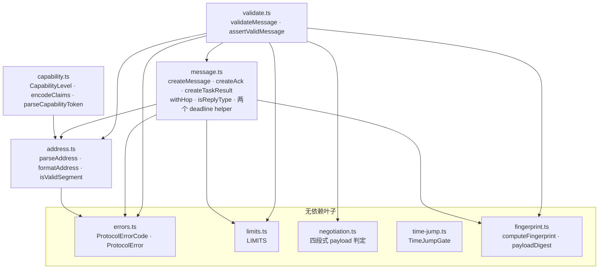

<!-- Copyright 2026 Qianmo AgentNest Team -->
<!-- SPDX-License-Identifier: AGPL-3.0-or-later -->

# @qianmo/protocol —— 阡陌网络的线上契约

**一句话定位**：定义「一条合法的阡陌消息长什么样」的**纯类型 + 纯函数**包——地址、信封、两个时限、判环字段、指纹、错误码、capability 令牌形状、时间跳跃闸门。无 I/O，无第三方依赖，节点与工具共用同一份定义。

| 项 | 指针 |
| --- | --- |
| 任务包 | roadmap **P1.1**（消息协议草案 v0.1） |
| 章程条目 | charter **§3.3 C-1**（消息协议与信封）；数值上限的唯一出处约定见 **§3.3 C-4** |
| 协议真源 | [`docs/dev/protocol.md`](../../docs/dev/protocol.md)——本包是它的代码面 |
| 完成状态 | roadmap「完成状态速查」P1.1 行（状态的唯一出处） |

## 1. 模块架构图



`index.ts` 是唯一出口，把上面九个模块原样再导出一遍；它不含任何逻辑。

数据流只有一条：调用方用 `createMessage` 造信封（`message.ts` 顺手算 `fingerprint`、播 `origin`、按 `LIMITS` 填两个时限），传输层收到后用 `validateMessage` 逐字段判（`validate.ts` 把结构、边界、payload 字段封闭性一起报出来），路由层用 `withHop` / `isReplyType` / `deliveryExpiresAt` 做判定。`time-jump.ts` 是被 transport / registry / adapter / resident / activator 各自 new 一份的共享闸门，不持全局状态。

## 2. 对外 API 面

读 `src/index.ts`。按模块分组，每组一句话：

- **`address.ts`** —— `parseAddress` / `formatAddress` / `assertAddress` / `isValidAddress` / `isValidSegment` / `addressEquals` / `nodeOf` / `ADDRESS_SCHEME` / `MAX_SEGMENT_LENGTH`：`qianmo://<node>/<agent>` 的唯一解析与渲染入口，热路径返回 `null` 而不抛。
- **`message.ts`** —— `createMessage` / `createAck` / `createTaskResult` / `errorReply` 造信封；`withHop` / `advanceTraceparent` / `newTraceparent` 管跳链与 W3C `traceparent`；`isReplyType` 区分「回答」与「派活」；`deliveryExpiresAt` / `taskExpiresAt` / `isDeliveryExpired` / `isTaskExpired` 是两条时限线各自的判定；`isAckPayload` / `isTaskResultPayload` 是字段封闭校验；另有 `MESSAGE_TYPES` / `MessageType` / `ENVELOPE_VERSION` / `TRUST_UNTRUSTED` / `messageBytes` / `serializeMessage` / `newId` / `destinationNode`。
- **`validate.ts`** —— `validateMessage`（一次报全部问题）/ `assertValidMessage` / `firstErrorCode`：入站校验的唯一实现。
- **`errors.ts`** —— `ProtocolErrorCode`（线上码表）/ `ProtocolError` / `issue`。
- **`fingerprint.ts`** —— `computeFingerprint` / `payloadDigest` / `isFingerprint`：二级去重键。
- **`capability.ts`** —— `CapabilityLevel` / `levelAtLeast` / `encodeClaims` / `decodeClaims` / `parseCapabilityToken` / `isCapabilityClaims` / `isNodePublicKey` / `PUBLIC_KEY_PATTERN` / `SIGNATURE_PATTERN`：令牌的形状与编码，**不含签名与验签**（那在 `@qianmo/capability`）。
- **`negotiation.ts`** —— 四类资源协商 payload 的字段封闭判定 + `clampNeed` / `needWithin` / `RELEASE_REASONS`。
- **`time-jump.ts`** —— `TimeJumpGate` 与三个默认常量：解冻检测、宽限窗口与截止时间 rebase。
- **`limits.ts`** —— `LIMITS`：**协议级数值上限的唯一出处**（章程 §3.3 C-4）。具体数值只在这里和 `docs/dev/protocol.md` §5 出现，本文与其他包一律不复制。

## 3. 最容易被改坏的五条不变式

| # | 不变式 | 改坏了会怎样 | 钉住它的测试 |
| --- | --- | --- | --- |
| 1 | **`ack` / `task.result` 的 payload 字段封闭，相关标识只存在于信封**（规则 K-1 / C-1） | 往 payload 里塞 `ofMsgId` / `taskId` 会让同一事实有两个出处，且逐支精确校验失效 | `test/validate.test.ts`「keeps the ack payload field-closed (K-1)」「keeps both task.result branches field-closed」；`test/message.test.ts`「the payload type is closed — no room for IDs, status or ETA」 |
| 2 | **`isReplyType` 是判环表的排除线**，且它住在本包而不在路由包 | 把它改窄（例如「只有 ack 算回复」），AC-2 的回程会在第一条回复上被判成环 | `test/message.test.ts`「isReplyType splits answers from work requests」；反向由 `packages/router/test/loop.test.ts`「replies are never judged by the loop key」钉住 |
| 3 | **两个时限字段不可合并**：投递时限管 `created → acked`，任务时限管 `created → completed/failed` | 合回一个字段就回到「消息在回执线到达之前就先过期」那条根因（charter §3.3 C-4 与 `protocol.md` §5.1） | `test/message.test.ts`「the two deadlines」组，尤其「delivery can be long past due while the task is still alive」；`test/validate.test.ts`「the task deadline is not an envelope-validity question」 |
| 4 | **入站校验不得用「`hops` 含本节点即 `E_LOOP`」**——那是节点粒度判环，D-2 已废；`options.node` 只是调试提示 | 恢复它会误杀合法 spiral（同一节点不同处理者），且失败是静默的 | `test/validate.test.ts`「options.node still reports E_LOOP — debug hint, never used inbound」「does NOT reject duplicated hops without a node hint」；`test/message.test.ts`「does NOT reject a node revisited for a different handler」 |
| 5 | **错误码表与 `protocol.md` §11 逐条对齐，19 条不多不少**——码是线上契约 | 悄悄加一个码，对端会收到它读不懂的字符串；悄悄删一个，已有审计记录失去含义 | `test/errors.test.ts`「matches the §11 table exactly — all 19, no extras」 |

## 4. 与基座的关系

- **定性：自研**（charter §3.3 C-1「基座起点：自研」）。与基座既有单机信箱机制的整体关系定性为**上层封装**——P0.5 的结论，见 charter §5.5 与 roadmap 完成状态速查 P0.5 行。
- 逐项缺口判定见 [`base-adoption.md`](../../docs/dev/base-adoption.md) §3.2「消息协议」行：基座有结构化协议消息类型，但**无信封、无 hop/trace/fingerprint 字段、无生命周期状态机、无错误码表**。
- 代码层面：本包对基座 `src/` **零 import**，唯一的运行时依赖是 `node:crypto`。它是整个 `@qianmo/*` 图的叶子。
- 历史：本包是旧洁净室三包之一，按负责人 2026-08-11 决议**原样复活**（charter §5.5 / roadmap v2.1），P1.1 在其上落地信封与两个时限。

## 5. 边界与已知未做

照 roadmap「完成状态速查」P1.1 行与 `protocol.md` 的自陈，给指针 + 一行摘要：

- **`protocol.md` §12.1 表**：P1.1 只写文档、当时全部未落地；各行的落地情况散在交付它的任务包里，本表**不逐行改写**。第 9 项（`withHop` 两处接线）已由 P4.2 落地。
- **`protocol.md` §12.3 未查证 / 开放项 9 条**：包括「轮询循环解冻后是否属热页」（A 类 ack 成立的关键假设）、`fs.watch` 在 gVisor 下的行为、窗格形态 `read` 翻转时机等——如实列出、不以推断充事实。
- **`protocol.md` §12.2 B 项**：`LIMITS.maxMessageBytes` 与基座信箱 `MAX_MAILBOX_MESSAGE_TEXT_BYTES` 的硬冲突选了「落盘 + 引用」，**四个数值一个未动**；体积方案落在 `@qianmo/adapter`。

## 6. 怎么跑测试

```bash
bun test packages/protocol
```

实测：**90 pass / 0 fail，4 个测试文件**（`address` / `errors` / `message` / `validate`），零 mock。

## 7. P9.3 双人签字

> owner 栏语义见 roadmap「任务包字段说明」（v2.3 重定义）：**全部任务包的主开发均为喻永昌**，各任务包 owner 栏原名单改读作「方向辅助人 / 第二知情人」，括号内 backup 读作「第二辅助」。下表按 P1.1 的 owner 栏填名。

| 角色 | 姓名 | 签字 | 日期 |
| --- | --- | --- | --- |
| owner（P1.1 owner 栏） | 喻永昌 | | |
| backup（P1.1 括号内） | 陈曦宇 | | |

### backup 需能独立复述的 3 道题（owner 出题，现场口头验证）

1. `ack` 与 `task.result` 的 payload 里为什么不许出现 `ofMsgId` / `taskId`？相关标识改放在哪里、依据哪条规则？如果有人把它加回 payload，本包哪一个测试会先红？
2. `isReplyType` 为什么放在本包而不是放在 `@qianmo/router`？请说出「回复类消息不进判环表」这条如果没有，AC-2 已验收的哪一跳会在第几条消息上断掉。
3. `defaultTtlMs` 与 `defaultTaskTtlMs` 各自约束生命周期的哪一段？当年「把投递时限的默认值调大」为什么被判为绕过而不是修根因？两个数值现在的唯一出处在哪一个文件、哪一个常量？
