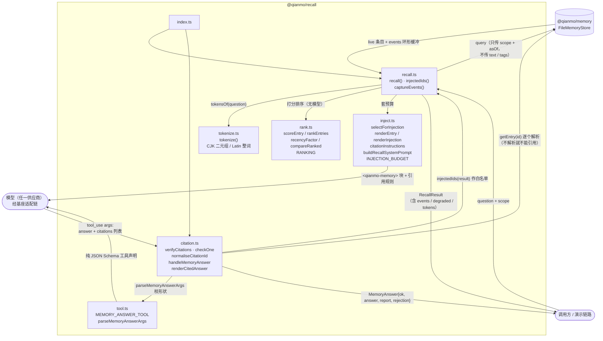

<!-- Copyright 2026 Qianmo AgentNest Team -->
<!-- SPDX-License-Identifier: AGPL-3.0-or-later -->

# @qianmo/recall —— 记忆检索唤醒与强制引用

在 `@qianmo/memory` 之上做**确定性检索 + 小规模全量注入 + 工具层强制引用**：候选集只按 scope 取，排序不进模型，模型给出的每个引用 ID 都要回存储里解析一次，解析不到就不能被引用。

| 项 | 指针 |
| --- | --- |
| 任务包 | roadmap **P3.3 记忆检索唤醒 v0**（交付物 / DoD 三条真机判据 / 完成记录都在那里） |
| 章程条目 | charter §3.2 **R-2 分层记忆**的「检索唤醒」半边 + §4 **AC-4**；N-8「不做向量检索」是本包的硬约束 |
| 关键决策 | D-6（小规模全量注入 + 工具层强制引用，取代供应商原生引用块）——出处 `docs/dev/selection-m0.md` |
| 协议级数值 | 本包的 `INJECTION_BUDGET` / `RANKING` 是**召回层策略，不跨节点边界**，故不属 `@qianmo/protocol` 的 `LIMITS`；协议级上限一律见 `LIMITS` |

---

## 1. 模块架构图



**关键顺序**：`scope 取候选` →`排序（只决定次序，从不过滤）` → `套预算` → `注入` → `模型经工具回答` → `逐 ID 回查存储` → 通过才渲染来源行。来源行由存储自己的 `formatCitation` 生成，**不取模型文本**，所以模型写错写入时间也进不了用户面前。

---

## 2. 对外 API 面（`src/index.ts`）

| 导出 | 一句话 |
| --- | --- |
| `recall(store, request)` | 一次完整检索：按 scope 取 live 候选 → 排序 → 套预算，返回 `RecallResult` |
| `RecallRequest` / `RecallScope` | 入参：`question`（只用于排序）、`tags`（奖励项）、`scope`（层/项目/任务/周期）、`asOf`、`halfLifeMs`、`budget` |
| `RecallResult` | 结果：`entries` / `mode`（`full` \| `ranked`）/ `candidateCount` / `omittedCount` / `tokens` / `events` / `degraded` / `asOf` |
| `injectedIds(result)` | 模型实际看到的 ID 集合——引用核验的白名单 |
| `rankEntries` / `scoreEntry` / `compareRanked` / `recencyFactor` / `tokensOf` / `RankedEntry` / `RankingInput` | 确定性排序：标签命中 ×4、题面词 ×2、正文词 ×1，再乘以 30 天半衰期的衰减因子；全序（分数 → 写入时间 → id） |
| `RANKING` | 上述权重与 `decimals: 6` 的舍入位（浮点尾数不得决定顺序） |
| `tokenize(text)` | 确定性分词：Latin/数字整词（≥2 字符、去极小停用词表），CJK 按**字符二元组**；固定 Unicode 区间而非 `\p{Script=Han}` |
| `selectForInjection` / `Selection` / `InjectionBudget` / `INJECTION_BUDGET` | 预算裁剪（50 条 / 20 000 字符），按排序次序走，第一条超限即停 |
| `renderEntry` / `renderInjection` / `InjectionView` / `InjectionMode` | 渲染 `<qianmo-memory>` 块；块头写明 `mode` 与 `omitted`，降级时额外打一条 WARNING |
| `citationInstructions` / `buildRecallSystemPrompt` | 提示词的**协作半边**（规则在前、记忆在后）；强制半边在 `verifyCitations` |
| `MEMORY_ANSWER_TOOL` / `MEMORY_ANSWER_TOOL_NAME` / `RecallToolDefinition` / `ToolInputSchema` | 供应商中立的工具声明（`qianmo_memory_answer`，`answer` + `citations` 双必填、`additionalProperties: false`） |
| `parseMemoryAnswerArgs` / `MemoryAnswerArgs` / `RecallToolError` | 只校**形状**（缺 `citations` 是违约不是空列表），不判内容真假 |
| `verifyCitations` / `CitationReport` / `CitationCheck` / `CitationStatus` | 六种判定：`ok` / `unknown` / `malformed` / `retired` / `not-injected` / `unreadable`，互不合并 |
| `normaliseCitationId` | 从模型给的整行引用里抠出裸 ID——对格式宽容，对实质不让步 |
| `handleMemoryAnswer` / `MemoryAnswer` / `MemoryAnswerOptions` | 强制点：核验 → 通过就附来源行，不通过给出可喂回模型的 `rejection` 文本 |
| `renderCitedAnswer` | 把 `accepted` 条目按引用顺序渲染成「来源 / sources」列表 |

---

## 3. 最容易被改坏的五条不变式

| # | 不变式 | 改坏会怎样 | 哪个测试钉住 |
| --- | --- | --- | --- |
| 1 | **候选集只按 scope 取，绝不按词过滤**——`recall()` 调 `store.query` 时不传 `text` / `tags`；分词与标签只进 `rank.ts` 作打分信号 | 加一条词过滤就复现 D-6 实测的 0 结果失败面：问「语义搜索」而条目写「向量数据库」，返回空集，答案里一条记忆都没有 | `test/recall.test.ts`：`a question that shares no wording still gets every entry` / `scope is a partition, not a guess: another project is not a candidate` |
| 2 | **引用解析不到即无法被引用**，且六种判定互不合并——尤其 `unreadable`（真条目坏了）不得并进 `unknown`（伪造） | 合并两者会把一条**真记忆报成幻觉**，这是本链路最坏的错误；放宽解析则 AC-4 的负向判据从「查表」退回「祈祷模型别编」 | `test/citation.test.ts`：`a fabricated id resolves to nothing and is rejected` / `a damaged genuine entry is reported as unreadable, never as fabricated` / `a real entry that was never shown is not a grounded citation` |
| 3 | **只投 live 条目，每次从盘上重建，不缓存**——废止后下一次召回即消失，且已废止条目不可被引用 | 加缓存或放开 `includeRetired`，「废止后必须重投」从自动性质退回成一条要人记得执行的流程 | `test/recall.test.ts`：`a revoked entry is gone from the very next recall` / `an invalidated fact leaves the present but keeps answering the past`；`test/citation.test.ts`：`a revoked entry may not be cited` |
| 4 | **工具声明是纯数据：无 SDK、无供应商名、不使用任何原生引用块** | 改回原生 `search_result` 引用块，AC-4 与 AC-5 从此永久打架——该路径与结构化输出互斥、且只在一家的线上存在 | `test/tool.test.ts`：`is plain data: no vendor, no SDK, no native citation feature` / `declares both fields as required` |
| 5 | **存储的降级事件必须抬到结果上**（`RecallResult.events` + `degraded`），上层不得重新盖回静默；排序里衰减是**乘子不是加项** | 前者一盖回，`@qianmo/memory` 为「一个坏文件不拖垮召回」所做的修复就白做了——节点醒来记忆变少而无人知晓；后者一改成加项，常驻节点每隔数周醒来一次，榜首会随墙钟静默漂移 | `test/recall.test.ts`：`recall returns the healthy entries and carries the failure out` / `only the events of this recall are reported`；`test/rank.test.ts`：`relevance dominates recency: a stale hit outranks a fresh miss` |

---

## 4. 与基座的关系

- **定性**：本包**不改基座核心**，只消费基座的两样东西——① 模型适配链（`anthropicToolsToOpenAI` 等）把中立工具声明转成各家格式，这正是 AC-5「切换供应商不改代码」成立的地方；② 全量注入这一形态本身照搬基座 `MEMORY.md` 每轮整体载入的做法，只是叠加了条目级 ID 与写入时间。
- **不采用基座的召回路径**：基座 `findRelevantMemories()` 是一次 Sonnet 调用，与章程 N-8 冲突；本包检索路径零模型。判定依据见 `docs/dev/base-adoption.md` §3.1「分层记忆」行。
- 基座改造点全量清单见 `docs/dev/base-modifications.md`。

---

## 5. 边界与已知未做

| 事项 | 一行摘要 | 指针 |
| --- | --- | --- |
| 不做向量 / 语义检索 | M0 用可解释性换召回率；语义检索是 M1「记忆能力上线」的事 | 章程 N-8；roadmap M1 表 |
| 二元组会过匹配 | CJK 二元组会跨词边界命中，是刻意的取舍——过匹配只损失排序精度，欠匹配会丢条目 | `src/tokenize.ts` 顶部注释 |
| 提示词只是协作半边 | 引用规则本身不被信任，唯一强制点是 `verifyCitations`；章程 §6.1 T-7「不以模型是否被说服验收」 | `src/inject.ts` `citationInstructions` 注释 |
| 单条超预算的条目仍会被注入 | 字符预算不得把块压成空——从模型内部看，空块与「没有记忆」无法区分 | `src/inject.ts` `selectForInjection` 注释 |
| `requireCitation` 默认关 | 「记忆里没有记录这件事」是正确答案，AC-4 的负向判据依赖模型能这么答 | `src/citation.ts` `MemoryAnswerOptions` 注释 |

---

## 6. 怎么跑测试

```bash
bun test packages/recall/test                              # 包内：51 用例 / 5 文件（实跑 2026-08-15）
bun test tests/integration/qianmo-memory-recall.test.ts    # AC-4 集成腿：23 用例
```

- 包内逐文件：`citation` 15 / `recall` 11 / `rank` 9 / `tokenize` 8 / `tool` 8 = **51 pass / 0 fail / 132 expect**，零 mock。
- 集成腿共 **23 个用例**；无 `OPENAI_API_KEY` + `OPENAI_BASE_URL` 时真调用整组自动 skip（实跑 **3 pass / 20 skip**），留下不需要凭据的确定性检查。凭据只从环境变量读，仓库内不存密钥。

---

## 7. P9.3 双人签字栏

> roadmap v2.3 起 owner 栏语义为「方向辅助人」，主开发统一为喻永昌；**P9.3 双人签字属明确写「双人」的流程要件，不受该条影响**，仍按本任务包 owner / backup 执行（roadmap v2.3 例外条款）。

| 角色 | 姓名（按 roadmap P3.3 owner 栏） | 签名 | 日期 |
| --- | --- | --- | --- |
| owner | 董宗岳 | | |
| backup | 李怡康 | | |

**owner 出给 backup 的三道题**：

1. 为什么 `recall()` 调 `store.query` 时**不传** `text` 和 `tags`，而分词器和标签权重明明就在同一个包里？如果给候选集加一条词过滤，会在哪个具体场景下把答案变成空？（说出 D-6 实测到的那个例子）
2. 模型回了一个 `citations: ["qm-mem-xxxx"]`，请把 `handleMemoryAnswer` 走一遍：这个 ID 可能落进哪六种判定？其中哪两种绝对不能合并、为什么合并了会产生「本链路最坏的错误」？（提示：`@qianmo/memory` 的 `getEntry` 为此专门选择抛错而不是返回 `null`）
3. 为什么工具声明里一个供应商名字都不能出现？如果改用某家的原生引用块，AC-4 和 AC-5 会在什么时候、以什么形式打架？另外：`INJECTION_BUDGET` 和 `RANKING` 为什么不放进 `@qianmo/protocol` 的 `LIMITS`？
