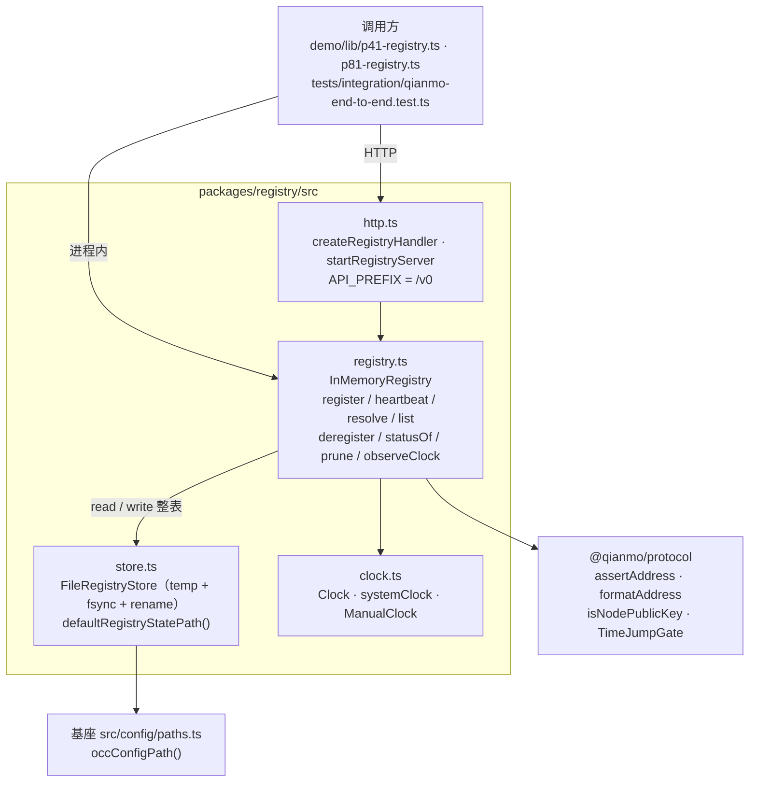

<!-- Copyright 2026 Qianmo AgentNest Team -->
<!-- SPDX-License-Identifier: MIT -->

# @qianmo/registry —— 智能体登记与按名寻址

**一句话定位**：智能体向哪里报到、别人到哪里找它。一张带 TTL 租约的进程内表，加一层可选的崩溃安全落盘，加一个 `Bun.serve` 上的 HTTP v0 面；零第三方依赖。

| 项 | 指针 |
| --- | --- |
| 任务包 | roadmap **P2.1**（注册中心与按名寻址）；复合键与 `publicKey` 见 `protocol.md` §12.1 第 7 项 |
| 章程条目 | charter **§3.3 C-2**（注册中心与按名寻址，基座起点：部分） |
| 协议真源 | `protocol.md` §2.4（注册键）、§10.1（一节点一把公钥） |
| 完成状态 | roadmap「完成状态速查」P2.1 行 |

## 1. 模块架构图



路由表（`http.ts`，四条 + 一条健康检查）：`POST /v0/agents` 注册 / 续租，`GET /v0/agents` 列活，`GET|DELETE /v0/agents/:address` 解析与注销，`POST /v0/agents/:address/heartbeat` 续租，`GET /v0/health` 报活体数。地址在一个路径段里 percent-encoded 传输。

## 2. 对外 API 面

读 `src/index.ts`：

- **`InMemoryRegistry`** —— 表本体。`register`（完整声明，能力/公钥/状态是替换不是合并）、`heartbeat`、`resolve`、`list`（按地址排序）、`deregister`、`statusOf`、`prune`、`clear`、`observeClock`（喂时间跳跃闸门并 rebase 全表租期）。
- **`AgentStatus` / `DeclaredStatus`** —— `online` / `dormant` 可声明，`offline` **只能由租期推导**、从不落库。
- **`AgentRecord` / `RegisterInput` / `RegisterResult` / `RegistryErrorCode`** —— 记录形状、入参（`unknown`，在信任边界处校验）与三个失败码（`E_BAD_REQUEST` / `E_CONFLICT` / `E_NOT_FOUND`，与 HTTP 状态码 1:1）。
- **`isValidEndpoint` / `isValidPublicKey`** —— 端点接受 `qianmo://`、`http(s)`、`ws(s)`（含 `dialUrl` 产出的 `ws+unix`）；公钥形状取自 `@qianmo/protocol` 的 `isNodePublicKey`，不另写一套正则。
- **`FileRegistryStore` / `RegistryStore` / `defaultRegistryStatePath`** —— 落盘层。接口两端都是 `unknown`：文件层只搬字节，schema 与信任边界归 `registry.ts`。
- **`createRegistryHandler` / `startRegistryServer` / `RegistryServerHandle` / `API_PREFIX`** —— HTTP v0 面，handler 与 server 分开导出，便于用裸 `Request` 测。
- **`Clock` / `systemClock` / `ManualClock`** —— 注入式时钟，TTL 行为不靠等待来测。
- **`DEFAULT_TTL_MS` / `MAX_CAPABILITIES` / `REGISTRY_SNAPSHOT_VERSION`** —— 本包自己的默认值。**注意**：这三个不是协议级上限，协议级数值仍以 `@qianmo/protocol` 的 `LIMITS` 为唯一出处（章程 §3.3 C-4）。

## 3. 最容易被改坏的五条不变式

| # | 不变式 | 改坏了会怎样 | 钉住它的测试 |
| --- | --- | --- | --- |
| 1 | **键是复合的 `<node>/<agent>`，入参只接受完整 `qianmo://` 地址**（一种规范形式） | 退回裸 agent 名，两个节点上的同名 `reviewer` 会互相覆盖 | `test/registry.test.ts`「composite `<node>/<agent>` key」整组，尤其「only full qianmo addresses are accepted — one canonical form」 |
| 2 | **`offline` 由租期推导，不能被声明** | 允许声明 offline，崩掉的节点就会永远停在它最后一次声明的状态上 | `test/registry.test.ts`「offline cannot be declared — it is derived from the lease」「a missed heartbeat turns the status offline on its own」 |
| 3 | **一个节点只能有一把公钥；在租者先登记先赢，且不建第二张索引表**（闭合 `protocol.md` §10.1 的已知缺口） | 同节点两个 agent 登记不同公钥，故障会推迟到「签名对一个 agent 验得过、对另一个验不过」才暴露 | `test/registry.test.ts`「one node, one key (protocol.md §10.1, closed in P4.3)」整组，含「once every agent on the node has expired, a new key is accepted」 |
| 4 | **盘上的东西只是可恢复，不是权威**：`expiresAt` 按当下 TTL 重算，未知 schema 版本整篇丢弃，写入是 temp + fsync + rename | 直接采信盘上的 deadline，停机一小时的注册中心会拿一小时前的地址回答查询 | `test/persistence.test.ts`「the deadline is recomputed from the TTL in force, not read off disk」「a document from an unknown schema version is ignored wholesale」与「crash safety」整组 |
| 5 | **持久化失败只损失持久性，不损失可用性**——写盘异常被吞并走 `onPersistError`，不冒泡到调用方 | 让写盘异常冒泡，一次磁盘满会把整个注册中心变成不可用 | `test/persistence.test.ts`「a failing store costs durability, not availability」「a write failure is swallowed even with no error hook installed」 |

另有一条与 P3.1 联动、同样有用例的性质：**时间跳跃期间不删条目**——`observeClock` 判定解冻后先 rebase 全表，宽限窗口内 `#live` 直接返回记录（`test/registry.test.ts`「a thaw rebases leases and lets heartbeat recover」「ordinary elapsed time still expires after time-jump protection is enabled」）。

## 4. 与基座的关系

- **定性：部分**（charter §3.3 C-2）——基座的 Agent Teams 有单机 roster 与按名信箱寻址；**v2.5 勘误**：跨主机确实不支持，但同主机跨进程 / 跨会话是支持的。跨节点这一层是我方新建。
- 逐项缺口见 [`base-adoption.md`](../../docs/dev/base-adoption.md) §3.2「注册与发现」「按名寻址」两行：**跨节点注册中心、心跳租约、状态持久化全无**。
- 整体关系定性为**上层封装**（P0.5 结论，charter §5.5）。
- 代码层面：本包只从基座取一样东西——`store.ts` 用 `src/config/paths.ts` 的 `occConfigPath()` 派生状态文件路径。这是 CLAUDE.md §1.1② 的硬规则，不得改成手拼 `~/.occ`。
- 历史：本包是旧洁净室三包之一，按负责人 2026-08-11 决议**原样复活**（charter §5.5），P2.1 在其上补齐复合键、`publicKey`、状态标记与持久化。

## 5. 边界与已知未做

- roadmap「完成状态速查」P2.1 行：DoD 三条已覆盖，**单点部署、不做高可用**（章程 N-6）。
- roadmap P3.1「阈值体检」记录了一处数值撞车：本包的 `DEFAULT_TTL_MS` 小于 E4 实测的冻结时长，且过期走的是删除、`heartbeat()` 此后返回 `null`——处置是接上时间跳跃闸门（已落地，见上文第 3 节末尾），不是改数值。
- 密钥分发在 M0 不存在：`AgentRecord.publicKey` 有字段、有校验，但**还没有东西去发布它**（`protocol.md` §10.1 边界 4）。

## 6. 怎么跑测试

```bash
bun test packages/registry
```

实测：**77 pass / 0 fail，3 个测试文件**（`registry` / `persistence` / `http`），零 mock；HTTP 用例绑真实端口。

## 7. P9.3 双人签字

> owner 栏语义见 roadmap「任务包字段说明」（v2.3）：主开发一律是喻永昌，owner 栏原名单读作「方向辅助人 / 第二知情人」，括号内 backup 读作「第二辅助」。下表按 P2.1 的 owner 栏填名。

| 角色 | 姓名 | 签字 | 日期 |
| --- | --- | --- | --- |
| owner（P2.1 owner 栏） | 陈曦宇 | | |
| backup（P2.1 括号内） | 喻永昌 | | |

### backup 需能独立复述的 3 道题

1. 一个注册中心重启之后，为什么不能直接采信盘上记的 `expiresAt`？现在是怎么处理的，未知 schema 版本又是怎么处理的？各自的理由是什么？
2. 「一个节点只能有一把公钥」这条约束是靠一张索引表实现的还是别的办法？请说明「某节点全部 agent 过期后可以重新登记」这条性质为什么不需要额外写释放逻辑。
3. `offline` 为什么不允许被声明？如果允许了，哪一类故障会变得不可见？本包里判活的那个私有方法在解冻宽限窗口内为什么要提前返回记录？
