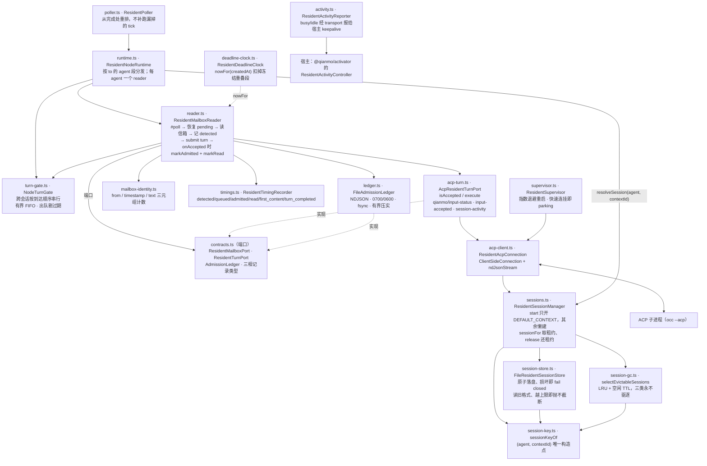

<!-- Copyright 2026 Qianmo AgentNest Team -->
<!-- SPDX-License-Identifier: MIT -->

# @qianmo/resident —— 常驻 ACP 宿主的读者、账本与闸门

**一句话定位**：给 ACP 宿主补上一个**在空闲时也会醒来的信箱读者**，并让「检测到 → 输入被受理 → 翻转 read → 一个 turn 打完」这四步落在一本可崩溃恢复的账本上；外加节点级 turn 串行、解冻感知的截止时钟、以及向宿主上报忙闲的活动通道。

| 项 | 指针 |
| --- | --- |
| 任务包 | roadmap **P3.1**（休眠与唤醒）；网络任务改为逐条 ACP turn、durable read 后发 ack 由 **P4.1** 补入 |
| 章程条目 | charter **§3.2 R-3**（休眠与唤醒，基座起点：部分，v2.7 定案） |
| 协议真源 | `protocol.md` §4.5（ack 由谁发出）、§5.3（时间跳跃闸门 T-2）、§4.6（`task.result` 契约） |
| 完成状态 | roadmap「完成状态速查」P3.1 行 |

## 1. 模块架构图



`deadline-clock.ts` 的 `nowFor` 同时被上层（`src/services/qianmo/resident.ts`、`@qianmo/router` 的 `deadlineNow`）用作「过闸门的时钟」，因此一个刚解冻的节点不会把所有在飞投递一起判死。

## 2. 对外 API 面

读 `src/index.ts`（另有 `./activity` 与 `./timings` 两个子入口，供宿主侧的 `@qianmo/activator` 单独引用）：

- **`ResidentNodeRuntime` / `ResidentAgentBinding`** —— 节点级门面：`deliver(message)` 按收件地址的 agent 段选 reader，`pollAll()` 全量轮询；`assertDeliverable(message)` 是 `deliver` 的同步半边，供宿主在**落盘之前**问「这条本节点收不收」。
- **`ResidentMailboxReader` / `ResidentMailboxReaderOptions` / `ResidentPollResult`** —— 一个 agent 的准入循环，单飞（同一时刻只有一次 `poll` 在跑）。
- **`ResidentPoller` / `DEFAULT_RESIDENT_POLL_INTERVAL_MS`** —— 驱动轮询的定时器，从**完成**处重排。
- **`NodeTurnGate` / `NodeTurnRequest` / `NodeTurnQueueFullError` / `NodeTurnExpiredError`** —— 节点级 turn 串行闸门：显式有界 FIFO 队列，上界取 `LIMITS.maxQueuedTurns`，出队时按 `deadlineAt` 剔除过期项。
- **`FileAdmissionLedger`** 与端口类型 **`AdmissionLedger` / `AdmissionRecord`（`detected` / `admitted` / `read`）/ `PendingAdmission` / `AdmissionQueryResult` / `AdmissionIntegrityIssue`** —— 崩溃恢复账本。
- **`ResidentMailboxPort` / `ResidentTurnPort` / `ResidentTurnInput` / `ResidentTurnResult` / `ResidentMailboxMessage`** —— 两个端口，让整包不依赖任何具体信箱或 ACP 实现。
- **`AcpResidentTurnPort` / `AcpPromptConnection` / `ACP_INPUT_ACCEPTED_METHOD` / `ACP_INPUT_STATUS_METHOD` / `ACP_SESSION_ACTIVITY_METHOD`** —— `ResidentTurnPort` 的 ACP 实现与三个扩展方法名。
- **`ResidentAcpConnection` / `createResidentAcpStream` / `ResidentAcpClientOptions` / `ResidentActivitySink`** —— ACP 客户端侧连接。
- **`ResidentSessionManager` / `ResidentSessionResolver` / `ResidentAgentSession` / `ResidentSessionConnection` / `ResidentSessionManagerOptions` / `pendingSessionIds`**、**`FileResidentSessionStore` / `MemoryResidentSessionStore` / `ResidentSessionStore` / `ResidentSessionRecord` / `ResidentSessionStoreOptions` / `MAX_STORED_RESIDENT_SESSIONS`** —— `(agent, contextId) → sessionId` 的映射、落盘与租约。
- **`sessionKeyOf` / `agentOfSessionKey` / `contextOfSessionKey` / `isSessionKey` / `DEFAULT_CONTEXT` / `SESSION_KEY_SEPARATOR`** —— 会话键的**唯一**构造与解析点。
- **`selectEvictableSessions` / `assertGcPolicy` / `DEFAULT_RESIDENT_SESSION_GC_POLICY` / `ResidentSessionGcPolicy` / `ResidentSessionGcInput`** —— 会话 GC 的纯选择器与它的显式常量。
- **`ResidentSupervisor` / `ResidentChildConnection` / `ResidentSupervisorOptions`** —— ACP 子进程监督。
- **`ResidentDeadlineClock`** —— 解冻感知的截止时钟，导出 `nowFor(createdAt)`。
- **`ResidentTimingRecorder` / `ResidentTimingStage` / `ResidentTimingEvent` / `ResidentTimingSink` / `DEFAULT_RESIDENT_TIMING_CAPACITY`** —— 全链路埋点（P4.1 的独立核验取的就是它）。`queued` 阶段带 `queueDepth`（该 turn 交接时排到的位次，1 = 直接进门），**只观察不参与任何判定**（hermes B8）。
- **`ResidentActivityReporter` / `RESIDENT_ACTIVITY_AGENT` / `isResidentActivityMessage` / `isResidentActivityPayload` / `ResidentActivityPayload`** —— 忙闲上报。
- **`residentMailboxIdentity` / `readCountsByIdentity` / `messageCountsByIdentity`** —— 基座信箱条目的身份三元组与计数（基座不给消息 id）。

协议级数值一律以 `@qianmo/protocol` 的 `LIMITS` 为唯一出处，本包不复制。

## 3. 最容易被改坏的六条不变式

| # | 不变式 | 改坏了会怎样 | 钉住它的测试 |
| --- | --- | --- | --- |
| 1 | **ack 必须晚于 durable read**：账本三相 `detected → admitted → read` 只能单向推进，`onRead` 是唯一的 ack 钩子（接线在 `src/services/qianmo/resident.ts` 的 `#ackTask`） | 提前发 ack，AC-2 独立核验里「每条 ack 都晚于沙箱内的 durable read」这条就不成立，且崩溃后无法判断消息到底进没进模型输入 | `test/ledger.test.ts`「advances detected to admitted to read without going backwards」；`test/reader.test.ts`「fsyncs detection before prompt and flips read from the admission callback」「the read callback fires after the flip, the terminal one after the turn」 |
| 2 | **turn 在输入被受理之前就结束 = 失败，不是空成功**；取消 / 拒答 / 触顶都是失败；不认识的 stop reason **不许**被编成失败 | 把它们报成 `completed`，请求方会收到一个它区分不出真假的成功 `task.result` | `test/reader.test.ts`「fails promptly when a turn completes before admission」；`test/acp-turn.test.ts`「a cancelled turn is a failed result, not an empty completed one」「refusals and ceiling stops are failures too, not truncated successes」「an unfamiliar stop reason is not invented into a failure」 |
| 3 | **节点级 turn 串行，且失败的 turn 也必须放行下一个** | 并行开 turn 会让同一节点的两个会话互相踩；失败不释放则整个节点在第一个异常上永久停摆 | `test/turn-gate.test.ts` 两条；`test/reader.test.ts`「returns after admission while retaining the gate until turn completion」 |
| 4 | **账本损坏是报错，不是跳过**：`poll()` 一旦查到 integrity issue 直接抛，压实也拒绝在损坏上进行 | 静默跳过损坏行 = 悄悄丢一条已经承诺过要处理的消息，而这正是账本存在的理由 | `test/ledger.test.ts`「reports a torn tail and refuses to compact damage」「rejects malformed records and unknown fields at runtime」 |
| 5 | **定时器从完成处重排、不补跑漏掉的 tick；截止时间按冻结重叠段扣除** | 冻结期间定时器不补跑（E4），补跑会在解冻瞬间打出一串堆积调用；不扣冻结段则所有「距上次多久」的判据会在同一毫秒一起越阈 | `test/poller.test.ts`「reschedules after each completed poll instead of replaying missed ticks」；`test/deadline-clock.test.ts`「the first deadline query after thaw observes the freeze」「excludes only the overlapping parts of multiple freezes」 |
| 6 | **传输回执与协议 ack 是两层，不许合并**（P13.3）：链路回执只承诺「已落盘」，在 `adapter.deliver` 返回处就发；协议 `ack` 承诺「已进模型输入」，仍只在 `markRead` 翻转成功之后由 `#ackTask` 发出。`#receive` **不再 await 轮询** | 合成一层有两种错法，各错一个方向：让回执等 turn ＝ 排队顶穿发送方 5 s 预算，一个忙节点在每个对端眼里等同于失联（H-3 本身）；让 ack 跟着回执提前 ＝ 基座信箱按「丢消息（未读也丢）」执行配额，写完即回的 ack 会替一条可能被驱逐的消息背书 | `src/services/qianmo/__tests__/resident.integration.test.ts`「a second request is receipted inside the budget while a turn holds the gate」（占门时第二条 5 s 内 Accepted，且该 taskId 的 ack **没有**发出）、「an ACP crash while busy comes back as a failed task.result」（回执 Accepted 之后的失败仍从 `task.result` 回去） |

另有两条有专门用例、容易被「优化」掉的性质：**一个 turn 的正文不能漏进下一个**（`test/acp-turn.test.ts`），**未知的受理通知不能翻转任何信箱条目**（同上）。

### 3.1 多会话隔离与会话 GC 的不变式（P13.4）

设计出处：`docs/dev/resident-botization.md` §4.3（hermes C1 / C5 / C6，关 G-5 / G-6，缓解 G-9）。

| # | 不变式 | 改坏了会怎样 | 钉住它的测试 |
| --- | --- | --- | --- |
| 7 | **`sessionKeyOf(agent, contextId)` 是全仓唯一的键构造点**（解析同理，`agentOfSessionKey` / `contextOfSessionKey`） | 第二处拼法不会报错，它只是把一个请求者的 turn 悄悄送进另一个请求者的历史——这正是本模块存在的理由 | `test/session-key.test.ts`「sessionKeyOf is the only place in the repository that builds the key」（含正向对照：先证明扫描规则确实认得那三种手拼形状，再断言全仓零命中） |
| 8 | **无 `contextId` 一律回退 `DEFAULT_CONTEXT`**，且此时行为与多会话之前逐字一致 | 不回退＝所有不带 contextId 的远端请求者塌缩成一条上下文，也就是改造前的状态 | `test/sessions.test.ts`「no contextId lands in the default context, exactly as before」；`test/multi-session.test.ts` 里 `m4` 那条 |
| 9 | **三类永不驱逐**：① 有在途 turn 的（`sessionFor` 取的租约，`release` 还）② 每 agent 最近 N 条（前缀缓存最值钱）③ **账本还有 pending 记录的**（第③条是阡陌特有、最容易漏） | ③ 被漏掉＝把一条已经承诺过要 durable 处理的消息连同它的会话一起丢掉 | `test/sessions.test.ts` 三条负向用例各一；`test/session-gc.test.ts` 的 LRU / TTL / 每 agent 计数 |
| 10 | **`session-store` 到上限先驱逐后写，绝不静默截断**：策略层（manager）先 GC 腾位，存储层越限直接抛 | 静默丢一条映射＝一条活着的 ACP 会话从此没有任何东西指向它，而且没有任何地方会报出来（G-6） | `test/session-store.test.ts`「refuses to grow past the ceiling instead of dropping an entry to fit」；`test/sessions.test.ts`「evicts to make room before writing a new context, never truncating」 |
| 11 | **旧格式 `sessions.json`（`{agent: sessionId}`）必须读得动**，并抬到 `sessionKeyOf(agent, DEFAULT_CONTEXT)` | 拒读＝升级当场丢掉全部会话，这比 fail-closed 想防的那个失败更糟 | `test/session-store.test.ts`「reads the legacy one-session-per-agent file and lifts it onto the default context」 |

两条容易误读的地方：

- **驱逐 = 从映射表删除 + 不再 resume，不删 ACP 侧会话数据**——那是基座的东西，且 `--resume` 还要用。
- **GC 的三个数值全是显式常量**（`DEFAULT_RESIDENT_SESSION_GC_POLICY`），**不做任何 `auto` 推导**（hermes C6：`memory_high_mb: auto` 在 1.9 GB 机上算出 1278 MB，而四台节点里三台是无 sudo 小 VPS）。`lastUsedAt` 的写盘按 60 s 合并，因为它唯一的消费者是一把以小时计的 LRU，每轮 fsync 一次是纯写放大。

### 3.2 队列治理的不变式（P13.3）

设计出处：`docs/dev/resident-botization.md` §4.2(a)。表 #6 是同一批次的另一半（回执解耦，§4.2(b)）。

| # | 不变式 | 改坏了会怎样 | 钉住它的测试 |
| --- | --- | --- | --- |
| 12 | **队列上界只有一个数**：`LIMITS.maxQueuedTurns`，`NodeTurnGate` 直接读它，本包不复制、不允许构造参数覆盖 | 抄一份就会漂——协议里写 32、节点上跑 64，于是发送方按 32 深度估的等待时间是错的，而这个数正是「等多久还值得等」的唯一依据 | `test/turn-gate.test.ts`「refuses at the queue bound instead of growing without one」（深度序列 `0,1,…,32` + 第 33 个被拒） |
| 13 | **过期项在出队时丢弃，且 `work` 从未被调用** | 现状是「信封 timeout 到期发了 `E_TASK_TIMEOUT`，门内的 work 照跑」——节点为一个已经宣告失败的任务烧掉一整个 turn，这是本批次能拿到的最大一笔资源回收 | `test/turn-gate.test.ts` 两条（**spy 断言 work 调用次数为 0，不是断言耗时**）；`test/reader.test.ts`「an entry past its task deadline is never detected, nor blocks the next」 |
| 14 | **队列满的拒绝发生在信箱写入之前**，且按 N-1 降级（对端声明了后 legacy 类型才发 `E_BUSY`，否则 `E_RATE_LIMITED`） | 先写再拒＝refused 吃掉了收件人的信箱配额，把别人的未读挤出去（rule L-1）；不降级＝老对端把整条 `task.result` 判为畸形并拒收，答案根本到不了 | `src/services/qianmo/__tests__/resident.integration.test.ts`「a full turn queue refuses before the mailbox write, downgrading for old peers」 |
| 15 | **同一 `sessionId` 的两个 turn 永不重叠**，且这条断言**不引用门的粒度** | 写成「因为门是全局的所以不会」，将来门变细时它不会红——而那正是唯一需要它红的时刻 | `test/queue-governance.test.ts`「two turns of one session never overlap」（三个 agent 共用一条会话，按 turn 的进出区间判交叠） |

三处容易误读：

- **恢复路径故意不带 `deadlineAt`**。账本里的 `detected` 记录是本节点已经写下的承诺，而账本除了推进到 `read` 没有别的退休方式（`abandoned` 是 P13.5 的）。在那里丢弃 turn 会把记录永久搁浅，此后每次 poll 都重新发现、重新丢弃、重新报错——用一个 500 ms 的错误循环换掉一个 turn，不划算。过期判定因此放在**写任何东西之前**的准入过滤里。
- **`#receive` 问的是 `gate.saturated`，不是接住门抛出来的拒绝**。回执解耦之后，门内抛出的异常已经不可能回到 `#receive`；而「写之前拒绝」与「`#receive` 看得见」这两条要同时成立，只有先问后写这一种写法。门自己的上界仍在，那条是硬不变式，`saturated` 只是发送方听得到的那半。
- **没有优先级轴，FIFO**。值守作业与人工请求谁更急是产品判断，M1 没有判据要求它，加了就得维护一张会长歪的表。

## 4. 与基座的关系

- **定性：部分**（charter §3.2 R-3，v2.7 定案；P0.2 复核完成）。roadmap P3.1 的 v2.15 勘误把理由改写过一次，结论未变：
  - **唤醒半边零核心改动**——正解是 ACP 自带的 `session/prompt`，不是原文列的四条通道（在 ACP 宿主下一条都不通）。
  - **休眠半边必须改核心**——真正的理由不是「基座没有 idle 事件」（它有四个），而是**基座没有任何进程内扩展点**：插件清单能声明的全是子进程或 Markdown。
- [`base-adoption.md`](../../docs/dev/base-adoption.md) §3.1「休眠与唤醒」判定为**无**（可复用的只有 supervisor 骨架）。
- 代码层面：**本包对基座 `src/` 零 import**——它是端口化的，信箱与 ACP 都是注入进来的。真正的基座核心改动面在 `src/services/qianmo/resident.ts` 与 `src/cli/handlers/resident.ts`（`occ resident`），按章程 T-5 对策④，那些 PR 需注明「为什么扩展点不够用」。
- 外部依赖：`@agentclientprotocol/sdk`（ACP 宿主协议），以及 `@qianmo/protocol` / `@qianmo/transport`。

## 5. 边界与已知未做

- roadmap「完成状态速查」P3.1 行的边界原文：**本包只完成 AC-2 后半（休眠 → 唤醒 → 可响应）；跨节点 ack/result 仍归 P4.1，不在此冒领。**
- 真机验收数据（baseline 2/2 与 candidate 1.1/1.5 各 10/10、accept→first content P95 等）在 roadmap v2.17 与 `demo/p31-resident-wake.sh`，**不在包内**；A/B 只决定了两个专用默认值（resident activity 重连 1.1、宿主 resident keepalive 1.5），通用 transport/协议默认仍为 2。
- 长时驻留的内存与吞吐基线属 **P7.3**，roadmap 完成状态速查 P7.3 行标注「本地腿就绪、正式 24 h / n=100 唤醒 / T3 吞吐数据待真机」。
- `protocol.md` §12.3 第 1 条与本包直接相关：**「轮询循环解冻后是否属热页」是 A 类 ack 成立的关键假设，尚未实测**。

## 6. 怎么跑测试

```bash
bun test packages/resident
```

实测：**83 pass / 0 fail，14 个测试文件**（`acp-turn` / `deadline-clock` / `ledger` / `multi-session` / `poller` / `queue-governance` / `reader` / `session-gc` / `session-key` / `session-store` / `sessions` / `supervisor` / `timings` / `turn-gate`），零 mock；宿主侧接线的集成用例另在 `src/services/qianmo/__tests__/resident.integration.test.ts`。

`session-key.test.ts` 会扫全仓源码（`src/**` 与 `packages/*/src|test/**`，跳过 `node_modules` 与 `packages/@ant`），约 3700 个文件、几百毫秒。

## 7. P9.3 双人签字

> owner 栏语义见 roadmap「任务包字段说明」（v2.3）：主开发一律是喻永昌，owner 栏原名单读作「方向辅助人 / 第二知情人」，括号内 backup 读作「第二辅助」。下表按 P3.1 的 owner 栏填名。

| 角色 | 姓名 | 签字 | 日期 |
| --- | --- | --- | --- |
| owner（P3.1 owner 栏） | 董宗岳 | | |
| backup（P3.1 括号内） | 陈子轩 | | |

### backup 需能独立复述的 3 道题

1. 一条网络任务从进沙箱到发出 `ack`，账本上依次会出现哪三条记录？`ack` 挂在哪一步之后、为什么不能提前？如果进程在中间任意一点被 `kill -9`，下一次 `poll()` 会怎么恢复？
2. ACP 的 turn 结束了但输入从没被受理过——这种情况现在算成功还是失败，为什么？再说：一个本版本没见过的 stop reason 应该被当成什么，理由是什么？
3. 常驻宿主为什么是 ACP 而不是基座的 daemon supervisor？「休眠那半必须改基座核心」的真正理由是什么（注意：不是「基座没有 idle 事件」）？
