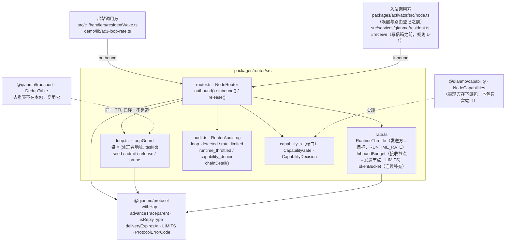

<!-- Copyright 2026 Qianmo AgentNest Team -->
<!-- SPDX-License-Identifier: MIT -->

# @qianmo/router —— 判环、两层限流与它们欠下的审计

**一句话定位**：一个节点在**不读消息内容**的前提下要做的三个判断——这个处理者是不是已经被派过同一个任务、跳数有没有跑飞、对端的入站预算还剩多少 / 我还能不能再往这个地址发一条；外加这三件事各自欠下的审计事件。

| 项 | 指针 |
| --- | --- |
| 任务包 | roadmap **P4.2**（防循环与限流）；判环粒度由 **D-2** 定（P0.8 已通过） |
| 章程条目 | charter **§3.3 C-4**（防循环与限流，基座起点：自研）；验收线是 **AC-3** |
| 协议真源 | `protocol.md` §6.1（判环主机制）、§6.2（hops 降为兜底）、§6.3（`withHop` 接线点）、§6.4（与两层限流的关系）、§10.1 规则 S-2 |
| 完成状态 | roadmap「完成状态速查」P4.2 行；一键复现 `demo/ac3-loop-rate.sh`（十条 check 全绿） |

## 1. 模块架构图



`inbound()` 的顺序：**授权 → 跳数兜底 → 判环 → 入站预算**。前一半是规则 S-2（未授权的消息不该花掉本节点任何东西，一条表项也不行）；后两步与 S-2 表的列举**相反且有意**——洪水之下若预算先拒，那条本该出现的 `loop_detected` 会被一条速率拒绝顶掉。同一段理由写在 `src/router.ts` 头注释与 `protocol.md` §10.1。

`outbound()` 是 `protocol.md` §6.3 里 `withHop` 的**唯一**调用点：起始播种与转发追加是同一个动作，因此只有一个方法而不是两个可能被选错的方法。

## 2. 对外 API 面

读 `src/index.ts`：

- **`NodeRouter` / `NodeRouterOptions`** —— 每节点一个对象，双向共用同一张判环表（拆成两个对象，A→B→A 就无法在第一次回访时被 A 抓到，而那正是 AC-3 的构造）。
  - `outbound(message)`：过运行时令牌桶（回复类免过）、`withHop` 盖章、中继时 `advanceTraceparent`、起始节点自我播种。
  - `inbound(message)`：上述四步，成功分支带回消息**携带的能力等级**（是天花板，不是授予）。
  - `release(taskId)`：终态释放该任务的全部判环键。
- **`InboundVerdict` / `OutboundVerdict` / `RouterVerdict` / `RouterRejectionCode`** —— 判决类型。**`InboundVerdict` 的失败分支被窄化到 `ProtocolErrorCode`**，运行时码在类型上够不到它。
- **`E_RUNTIME_THROTTLED`** —— 运行时层的拒绝码，**刻意不是** `ProtocolErrorCode` 成员，永不上线。
- **`LoopGuard` / `LoopVerdict` / `LoopGuardOptions` / `DEFAULT_LOOP_CAPACITY`** —— 判环表。四种判决：`fresh` / `revisited` / `hop-limit-exceeded` / `not-subject`（回复类）。
- **`RuntimeThrottle` / `InboundBudget` / `TokenBucket` / `RUNTIME_RATE` / `DEFAULT_MAX_RATE_KEYS`** —— 两层限流。**两个类、两套键、两个上限出处**：协议层的上限取自 `@qianmo/protocol` 的 `LIMITS`，运行时层的 `RUNTIME_RATE` 是本包自己的，理由见 `rate.ts` 头（协议级数值的唯一出处约定是章程 §3.3 C-4，运行时旋钮塞进 `LIMITS` 会被下一个读者当成协议保证）。
- **`RouterAuditLog` / `RouterEventType` / `RouterAuditSink` / `chainDetail` / `DEFAULT_ROUTER_AUDIT_CAPACITY`** —— 审计。**三个事件类型而不是一个带 `layer` 字段的类型**，让「把两层混在一起查」这个错误问法问不出来。
- **`CapabilityGate` / `CapabilityDecision`** —— 授权端口，实现在 `@qianmo/capability`。端口留在这里，本包才能只依赖 `@qianmo/protocol`。

## 3. 最容易被改坏的五条不变式

| # | 不变式 | 改坏了会怎样 | 钉住它的测试 |
| --- | --- | --- | --- |
| 1 | **判环键是 `(处理者地址, taskId)`，不是节点** | 退回节点粒度会误杀合法 spiral（一个节点上两个不同 agent 因同一任务被先后经过），失败静默且看起来像网络故障——RFC 3261 附录 A 已把它定性为规范级 bug | `test/loop.test.ts`「handler granularity — the D-2 key」组，含反向用例「the same node reached for a different handler is not a loop」；`test/router.test.ts`「the same node reached for a second handler is not cut」 |
| 2 | **回复类消息（`ack` / `task.result` / `error` / `pong` 与三类协商回程）不进判环表** | 它们按 C-1 带原任务 `taskId` 回请求方，形状与「回访」完全一致——照判据字面实现会在**第一条 ack** 上切断 AC-2 的回程 | `test/loop.test.ts`「replies are never judged by the loop key」组；`test/router.test.ts`「the reply path survives the seeding — ack and result are not loops」 |
| 3 | **起始节点自我播种**：`hops[0]` 与判环键在 `outbound()` 里同时播下 | 不播种，A→B→A 的第一次回访读起来是新流量，要到第二圈才可能被抓到 | `test/loop.test.ts`「origin seeding — D-2s second defect」组（含「without seeding the same return reads as fresh traffic」）；`test/router.test.ts`「the origin writes itself into hops[0]」 |
| 4 | **两层限流不得合并**：两个类、两套键、两个上限出处、两类审计事件、两个拒绝码；`E_RUNTIME_THROTTLED` 不入协议码表，且入站判决的返回类型窄化使「把它回给对端」成为**编译错误** | 合成一个带 `layer` 标志的实现，AC-3 要求的「两层独立验证、不得混写」当场失效；把运行时码回给对端，对端会收到一个码表里没有的字符串 | `test/rate.test.ts`「the two layers are independent」组（含「the runtime ceiling is not a protocol number」）；`test/router.test.ts`「the two rate layers, through the router」组 |
| 5 | **入站顺序：授权 → 跳数 → 判环 → 预算**，判环在预算之前是有意为之 | 预算先拒，洪水之下 AC-3 要的那条 `loop_detected` 会被顶掉，运维只看到「某对端很吵」而不是「流量在打转」 | `test/router.test.ts`「a loop is reported as a loop even while the sender is flooding」「a throttled send never reaches the loop table」 |

另有一条边界值得记牢：**乒乓（每圈换新 `taskId`）判环与跳数都看不见，只有运行时令牌桶抓得住**——`test/router.test.ts`「ping-pong — the case the loop key cannot see」专门把这件事说明白，而不是假装判环能管。

## 4. 与基座的关系

- **定性：自研**（charter §3.3 C-4「基座信箱有配额但无跳数与循环概念」）。
- [`base-adoption.md`](../../docs/dev/base-adoption.md) §3.2「防循环」「限流 / 配额」两行判定为**部分（形态不同）**：基座有的是**结构性禁止团队嵌套**与**信箱存储配额 / 客户端重试预算**，不是跳数计数、回环检测或「单发送方对单目标的令牌桶」。
- 代码层面：本包对基座 `src/` **零 import**，只依赖 `@qianmo/protocol`。
- **去重表不在本包**：`@qianmo/transport` 的 `DedupTable` 本就以投递时限为表项 TTL，与本包判环表同一口径。再造一张只会让网络有两张表、一份契约（`src/index.ts` 头注释写明）。
- P4.2 顺带给 `@qianmo/protocol` 补了两个函数：`isReplyType`（哪些类型是回答属线上契约）与 `advanceTraceparent`（§7.1 早就要求逐跳换 `parent-id`，此前无人实现）。

## 5. 边界与已知未做

照 roadmap「完成状态速查」P4.2 行与 P4.2 任务包「实施记录（v2.21）」的**边界如实记**，此处只给指针 + 一行摘要：

- **运行时令牌桶在 M0 没有长驻的生产调用方**——agent 面的跨节点发送工具不在章程 §3 范围内；现有生产接线只有一次性的 `residentWake` CLI（每次进程新起、桶总是满的）与复现脚本。
- **`withHop` 的「转发前追加」半边有实现有用例，但 M0 没有第三方中转节点**，同样无生产调用方。
- **同一任务并发派给同一节点的两个不同 agent**：在判环层通过（不写 `loop_detected`），但会被 P4.1 的回程路由以 `E_BAD_ENVELOPE` 拒——**那是相关性约束，不是判环**。两件事分别断言在 `packages/activator/test/chain.test.ts`。
- 两条都不影响 AC-3 判据成立（判据要的是机制存在且可验证），但**不得据此宣称限流已在生产链路上长期运行**。

## 6. 怎么跑测试

```bash
bun test packages/router
```

实测：**39 pass / 0 fail，3 个测试文件**（`loop` / `rate` / `router`），零 mock。另有集成用例 `tests/integration/qianmo-loop-and-rate.test.ts` 与 `demo/lib/ac3-report-core.ts` 的报告核心用例（进 CI 分片），一键复现是 `demo/ac3-loop-rate.sh`。

## 7. P9.3 双人签字

> owner 栏语义见 roadmap「任务包字段说明」（v2.3）：主开发一律是喻永昌，owner 栏原名单读作「方向辅助人 / 第二知情人」，括号内 backup 读作「第二辅助」。下表按 P4.2 的 owner 栏填名。

| 角色 | 姓名 | 签字 | 日期 |
| --- | --- | --- | --- |
| owner（P4.2 owner 栏） | 陈曦宇 | | |
| backup（P4.2 括号内） | 陈子轩 | | |

### backup 需能独立复述的 3 道题

1. 判环键为什么不是「节点」？请举出一个会被节点粒度误杀的合法路由，并说明这个误判为什么难以诊断。再说：`LIMITS.maxHops` 在现在的设计里承担什么角色，AC-3 的复现脚本靠什么证明「不是它救的场」。
2. `ack` 为什么不能进判环表？如果进了，会在 AC-2 那条链的第几条消息上出事？做出这个区分的函数为什么放在 `@qianmo/protocol` 而不是本包？
3. 两层限流的上限分别从哪里取？为什么运行时那个上限**不能**放进 `LIMITS`？「把运行时拒绝码回给对端」这件事，现在是靠约定拦住的还是靠别的——具体是哪个类型上的哪一处收窄？
