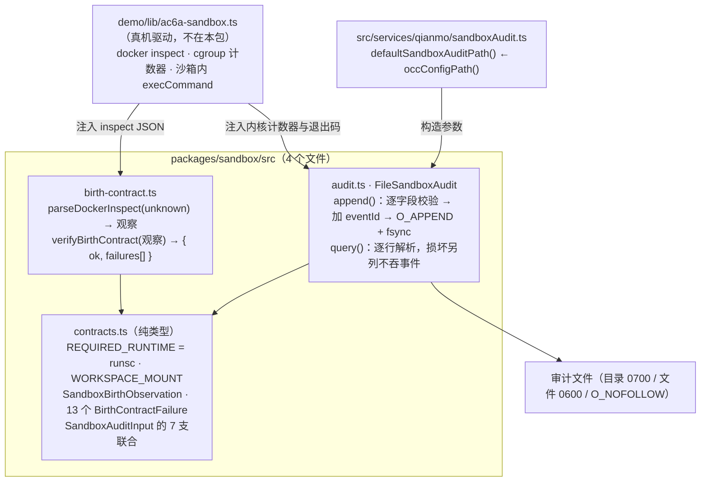

<!-- Copyright 2026 Qianmo AgentNest Team -->
<!-- SPDX-License-Identifier: AGPL-3.0-or-later -->

# @qianmo/sandbox —— 沙箱边界的出生契约与持久审计

**一句话定位**：沙箱边界的**判据与留痕**两件事，且只有这两件——把一次 `docker inspect` 的观察收窄成一张出生契约的通过 / 失败清单，把「越权被拒 / 超时被杀 / CPU 被节流 / 内存被 OOM」写成一条**字段封闭、必须带内核或控制面证据**的追加式审计。它自己**不执行、不联网、不碰宿主控制面**。

| 项 | 指针 |
| --- | --- |
| 任务包 | roadmap **P1.3**（沙箱执行环境 v0）；宿主侧安全面前提归 **P0.7**（`scripts/ops/`） |
| 章程条目 | charter **§3.1 A-1**（云端沙箱执行环境，基座起点：部分；选型 Dormice + gVisor，架构钉死「occ 跑在沙箱内」）；验收线是 **AC-6(a)** |
| 完成状态 | roadmap「完成状态速查」P1.3 行；真机 5/5 的证据在 `demo/ac6a-sandbox.sh` |

## 1. 模块架构图



**数据方向只有一个：证据从外面注入进来，本包判断它是否成立并留痕。**本包不产生证据——它连 `child_process` 和 `fetch` 都没有，`test/deployment-contract.test.ts` 把这条扫成硬断言。

## 2. 对外 API 面

读 `src/index.ts`（只有 5 个值导出 + 9 个类型）：

- **`parseDockerInspect(value: unknown)`** —— 把 `docker inspect` 的输出**收窄到契约真正消费的那几个字段**；畸形输入变成一份「注定失败的观察」，而不是抛异常。
- **`verifyBirthContract(observation)`** —— 返回 `{ ok, failures }`。13 个失败码逐条对应一项边界：非 `runsc`、root 用户、无 init、根文件系统可写、缺 `no-new-privileges`、缺 CPU / 内存 / PID 上限、缺 `/tmp` tmpfs、多余的可写 tmpfs、工作区 bind 缺失、多余的可写挂载、宿主控制 socket 被挂进来。
- **`FileSandboxAudit`** —— `append(input)` / `query()` / `close()` / `path`。`append` 先逐字段校验再写，`query` 返回 `{ events, integrityIssues }`。
- **`REQUIRED_RUNTIME` / `WORKSPACE_MOUNT`** —— 两个契约常量。
- **类型**：`SandboxBirthObservation` / `SandboxMountObservation` / `BirthContractFailure` / `BirthContractResult` / `SandboxAuditInput` / `SandboxAuditEvent` / `SandboxAuditIntegrityIssue` / `SandboxAuditQueryResult` / `SandboxWriteTarget`。

审计文件的**默认路径不在本包**——由调用方注入，默认值在基座侧的 `src/services/qianmo/sandboxAudit.ts`（`occConfigPath('sandbox', 'audit.ndjson')`）。这样本包连路径约定都不继承。

## 3. 最容易被改坏的五条不变式

| # | 不变式 | 改坏了会怎样 | 钉住它的测试 |
| --- | --- | --- | --- |
| 1 | **本包不得拥有任何宿主控制能力**：无 `child_process` / 无 `fetch` 或 `node:http(s)/net` / 不读 daemon bearer / 不碰 `docker.sock` / 源码里不出现 `execCommand` 或 `destroySandbox`；且这条是**会变红的扫描**，红方向有 fixture | 它是唯一一个既跑在沙箱边界判定链上、又可能被复用到别处的包。一旦它能执行或联网，AC-6(c) 的「智能体物理上够不到 daemon」就多了一条绕路 | `test/deployment-contract.test.ts`「the reusable boundary package has no host control capability」三条（含「the scan has source files」防空扫、「red direction catches every prohibited capability class」） |
| 2 | **出生契约钉死 gVisor**：`runtime !== 'runsc'` 即失败；非 root、init、只读根、`no-new-privileges`、CPU / 内存 / PID 三个上限缺一不可；**唯一可写的 bind 是工作区**，唯一允许的 tmpfs 是 `/tmp`；任何以 `.sock` 结尾的挂载点一律失败（哪怕只读） | 章程 A-1 把架构钉死为「occ 跑在沙箱内」，理由是 daemon 凭据无权限分级——放宽任何一项，「物理上够不到」就不再成立 | `test/birth-contract.test.ts` 六条，含「rejects a second writable host bind」「rejects host control sockets even when mounted read-only」「malformed input becomes a failing observation, never an exception」 |
| 3 | **审计事件必须携带内核或控制面证据，且字段精确封闭**：退出码为 0 不能记成 denial；超时必须是 137 且带真实秒数；CPU / 内存必须给出**正的**计数器增量；只读宿主拒绝必须带 `hostUnchanged: true` | 没有证据的审计事件就是一句自称。AC-6(a) 要的是「有内核或控制面证据」，不是「程序说它拒了」 | `test/audit.test.ts`「a successful write cannot masquerade as a denial」「exit 137 plus an actual timeout is required」「resource events require a positive kernel-counter delta」「a read-only host denial requires host-integrity evidence」 |
| 4 | **审计里没有命令、输出、路径、stderr 与凭据字段**，且目录 0700 / 文件 0600 / `O_APPEND` + `fsync` + `O_NOFOLLOW` | 往事件里加一个自由字段，审计文件就会变成把沙箱内命令与凭据搬到宿主的通道 | `test/audit.test.ts`「appends a queryable event with private file mode」「rejects command, path, stderr, token and arbitrary detail fields」「rejects an unknown runtime event kind」 |
| 5 | **损坏必须可见，且不吃掉前后的事件**：断尾（`torn_tail`）与中间损坏（`corrupt_line`）分开报，其余事件照常返回 | 静默跳过坏行，一次崩溃就能让审计悄悄少几条——那正好是需要它的时候 | `test/audit.test.ts`「visible corruption」组两条 |

另有一条属于交付面的守卫：**真机验收入口 fail-closed**——缺部署输入时 `demo/ac6a-sandbox.sh` 以退出码 2 报错，而不是「跳过验收」（`test/deployment-contract.test.ts`「the real-machine acceptance entrypoint fails closed」）。

## 4. 与基座的关系

- **定性：部分**（charter §3.1 A-1）——基座有工具权限模型与 hooks 可作第一道，**容器化与路径白名单仍需自研**。
- [`base-adoption.md`](../../docs/dev/base-adoption.md) §3.1「工具权限与审批」行：基座**无容器化沙箱、无路径白名单、无宿主只读挂载、无 CPU/内存上限**，AC-6(a) 仍需自研。
- 代码层面：本包对基座 `src/` **零 import**，只用 `node:fs` / `node:path` / `node:crypto`。连审计文件的默认路径都由调用方注入。
- 沙箱平台本身（Dormice + gVisor）是**外部系统**，不是基座；宿主侧的绑定加固与前向守卫归 P0.7 的 `scripts/ops/`。

## 5. 边界与已知未做

- roadmap「完成状态速查」P1.3 行：AC-6(a) 真机 5/5（白名单外写入被拒、超时强杀、CPU 节流、内存 OOM、持久审计），**证据来自真实 Docker inspect 与内核计数器**；验收沙箱与前置探针已精确删除，存量业务沙箱未动。
- **包内不产生证据**：所有真机步骤都在 `demo/ac6a-sandbox.sh` + `demo/lib/ac6a-sandbox.ts`，本包只判断注入进来的证据是否成立。
- **AC-6(b)(c) 的沙箱挂载边界只在本机测过**——见 roadmap 完成状态速查 P4.4 行的「边界」与 P8.2 行（`docs/dev/acceptance-m0.md` 把它列为最可能需要豁免的一条）。真机部署仍须把备份 store 放在沙箱挂载之外。
- roadmap 现状基线登记的实验服务器遗留项（`dormice-base` 镜像为重建件、`workbench` 模板镜像缺失、`dormice.service` 为 active 但 disabled）由 P0.1 承接，不在本包。

## 6. 怎么跑测试

```bash
bun test packages/sandbox
```

实测：**28 pass / 0 fail，3 个测试文件**（`audit` / `birth-contract` / `deployment-contract`），零 mock；`deployment-contract` 会真的去 `bash -n` 校验并空跑一次 `demo/ac6a-sandbox.sh`。

## 7. P9.3 双人签字

> owner 栏语义见 roadmap「任务包字段说明」（v2.3）：主开发一律是喻永昌，owner 栏原名单读作「方向辅助人 / 第二知情人」，括号内 backup 读作「第二辅助」。下表按 P1.3 的 owner 栏填名。

| 角色 | 姓名 | 签字 | 日期 |
| --- | --- | --- | --- |
| owner（P1.3 owner 栏） | 董宗岳 | | |
| backup（P1.3 括号内） | 陈曦宇 | | |

### backup 需能独立复述的 3 道题

1. 这个包为什么连 `fetch` 和 `child_process` 都不许出现？它跟 AC-6(c) 的关系是什么？「红方向 fixture」在那条扫描里起什么作用，去掉它之后剩下的断言还证明了什么？
2. 出生契约里，为什么「只读挂载的 `.sock`」也算失败？为什么可写挂载只允许工作区那一个 bind 和 `/tmp` 一个 tmpfs？如果多允许一个可写 bind，具体是哪条验收标准先松动？
3. 一条 `resource.memory_oom_killed` 审计事件要成立，必须带什么？为什么「程序自己说它被 OOM 了」不够？再说一条：为什么审计事件里坚决不放命令与 stderr。
