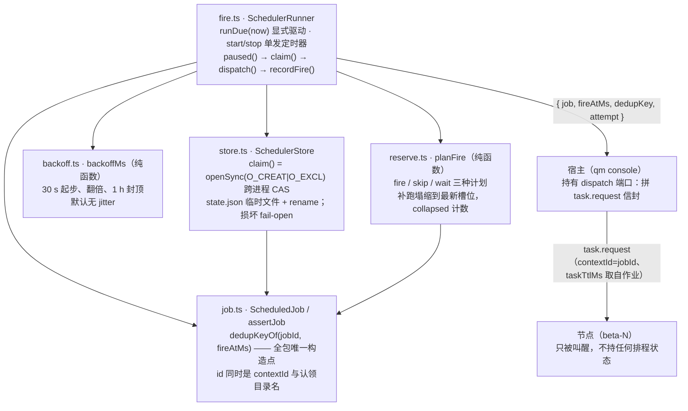

<!-- Copyright 2026 Qianmo AgentNest Team -->
<!-- SPDX-License-Identifier: MIT -->

# @qianmo/scheduler —— 中枢持有定时，节点零调度状态

**一句话定位**：把值守作业的「什么时候跑」**整个搬到中枢**（`qm console` 进程内），节点侧连排程 API 都不存在；用**一次性预约**代替周期唤醒、用**文件系统的原子独占创建**做跨进程 at-most-once、用**补跑塌缩**把停机期间欠下的一堆槽位收成一次。

| 项 | 指针 |
| --- | --- |
| 任务包 | roadmap **P13.6**（定时反转与主动通知接线） |
| 设计出处 | `docs/dev/resident-botization.md` **§4.1**（锚点① 值守场景原型）、**§3.A 行 A6**（外部一次性预约替代常驻 ticker）、**§3.A 行 A7**（「降级绝不失去触发器」的刻意背离）、**§3.F 行 F7**（单派发者姿态 + 原子事件认领）、**§3.B6**（ESTOP 三个检查点之一） |
| 章程条目 | charter **§3.2 R-3**（休眠与唤醒）——本包存在的理由就是不去抵消它 |
| 协议真源 | `LIMITS` 全部取自 `@qianmo/protocol`，本包**不复制任何协议数值**（CLAUDE.md §2.2）；地址合法性走 `assertAddress` |
| 依赖 | 只有 `@qianmo/protocol`。**不依赖** transport / router / resident，也不 import 基座 `src/` |

## 1. 模块架构图



**这张图里没有从本包指向 `node` 的边，这是不变式而不是省略**：本包一次都不拨号，唯一的出口是注入进来的 `dispatch` 端口（见 §3 不变式 6）。

## 2. 对外 API 面

读 `src/index.ts`：

- **`assertJob` / `ScheduledJob` / `JobSchedule` / `NotifyPolicy` / `NOTIFY_POLICIES`** —— 作业定义与注册期校验。`notifyPolicy` **本包从不解读**，只随 dispatch 传给宿主。
- **`dedupKeyOf(jobId, fireAtMs)`** —— `"<jobId>:<fireAtMs>"`，A6 逐字。**全包唯一构造点**。
- **`planFire` / `FirePlan`（`FireNowPlan` / `SkipPlan` / `WaitPlan`）/ `PlanFireInput`** —— 纯排程计算。
- **`catchUpGraceMs` / `MIN_CATCH_UP_GRACE_MS` / `MAX_CATCH_UP_GRACE_MS`** —— 补跑宽限窗口 `clamp(everyMs / 2, 120 s, 7200 s)`。
- **`backoffMs` / `BackoffOptions` / `DEFAULT_BACKOFF`** —— 失败退避（纯函数）。
- **`SchedulerStore` / `SchedulerStoreOptions` / `JobState` / `FireOutcome`**、**`claimRetentionMs` / `MIN_CLAIM_RETENTION_MS` / `MAX_CLAIMS_PER_JOB`** —— 崩溃安全存储 + 认领 CAS + 认领文件的有界回收。
- **`SchedulerRunner` / `SchedulerRunnerOptions` / `SchedulerDispatch` / `FireDispatch` / `SchedulerStatus` / `SchedulerJobStatus`** —— 运行器与它的注入端口、状态面。

**宿主要实现的只有一个端口**：

```ts
type SchedulerDispatch = (input: FireDispatch) => Promise<void>
// FireDispatch = { job, fireAtMs, dedupKey, attempt }
```

resolve = 本次 fire 成功（失败计数清零），throw = 失败（退避推进）。**信封由宿主拼，不由本包拼**——理由见不变式 6。

## 3. 最容易被改坏的八条不变式

| # | 不变式 | 改坏了会怎样 | 钉住它的测试 |
| --- | --- | --- | --- |
| 1 | **`dedupKey = "<jobId>:<fireAtMs>"` 只在 `dedupKeyOf` 里拼一次**，且 `fireAtMs` 是**排定时刻**不是尝试时刻 | 第二处拼法不会报错，它只是**不与第一处相撞**——而「没相撞」正是重复派发从内部看到的样子；按尝试时刻做键 = 每次重试都是新键 = 等于没有键 | `test/job.test.ts`「is "\<jobId\>:\<fireAtMs\>", spelled in one function」「keys on the scheduled instant, so a retry of one slot keeps one key」；`test/fire.test.ts`「reserving one (jobId, fireAtMs) repeatedly fires exactly once」「the key the host receives is the one job.ts builds, never a second spelling」 |
| 2 | **认领用 `openSync(path, 'wx')`（`O_CREAT|O_EXCL`），不是 `existsSync` 后写、也不是内存 `Set`** | `existsSync` + 写是 **TOCTOU**，而那个竞态窗口正是「运维随手起了第二个 console」（F7）会产生的东西；内存 `Set` 根本不是 CAS——它对另一个进程的那一半问题毫无所知却答得斩钉截铁 | `test/store.test.ts`「two stores over one directory agree on who owns a slot」；`test/fire.test.ts`「two instances racing one slot produce one claim and one dispatch」（**两个 store + 两个 runner + 同一目录**） |
| 3 | **认领是墓碑不是锁：永不释放，失败也不释放** | 失败即释放 = at-most-once 变成 at-least-once，而且恰好发生在目标已经不健康的时刻；要租约就要两个中枢对时钟达成一致，而一个在**慢派发**下过期的租约会把 turn 投两次 | `test/store.test.ts`「a claim survives a reopen — it is a tombstone, not a lock」；`test/fire.test.ts`「a restart that lost its state file still cannot re-fire a claimed slot」 |
| 4 | **补跑塌缩到最新槽位，且丢掉的槽位要被**计数**（`collapsed`）** | 只断言「派发了一次」的用例，对「五个全丢了」的实现同样是绿的——这条 DoD 必须两半一起断言；真去重放五次则是把五个 turn 塞给一个串行执行的节点，后四个各自带着已经在排队时开始倒数的 `taskTtlMs` | `test/reserve.test.ts`「collapses five missed periods into a single make-up run」（断言 `collapsed === 4`）「the make-up run is the latest missed slot, never the oldest」；`test/fire.test.ts`「five missed periods produce one make-up run, and the loss is counted」「a make-up run does not also replay the periods it skipped」 |
| 5 | **超过 grace 的窗口是**放弃**，不是延后**；grace = `clamp(everyMs/2, 120 s, 7200 s)` | 代价要说清楚：停机超过 grace 的作业**永久失去那个窗口**。这是刻意的——过期的值守结论比没有结论更糟，因为总有人把它当作现在的情况读。反过来，没有那个 7200 s 上限，日频作业会带着 12 h 的 grace，中枢过完一个长周末回来会在同一秒把它拥有的每个作业向每个节点打出去（全是有真实副作用的） | `test/reserve.test.ts`「an outage past the grace skips the window and reserves the next one」「a slot exactly at the grace boundary still runs」「the ceiling is what stops a restarted hub from firing everything at once」 |
| 6 | **本包一次都不拨号**：唯一出口是注入的 `dispatch`，信封由宿主拼 | 让调度器自己拼信封 = 它得认识 `@qianmo/protocol` 的消息形状、`@qianmo/transport` 的连接、节点身份与 PSK，于是**排程算术这一真正难的部分反而不可测**；而 `contextId = jobId`（§4.1 ③）与 `taskTtlMs` 取自作业（§4.1 ④）这两条恰恰是信封的**入参**，把它们放在 dispatch 入参里宿主想漏都难 | `test/fire.test.ts`「carries the job, so contextId and taskTtlMs come from it and not from LIMITS」；本包 `package.json` 只有 `@qianmo/protocol` 一个依赖 |
| 7 | **没有周期性 ticker**：`start()` 只武装**一个**一次性定时器，且只在一次运行**完成之后**重排（与 `packages/resident/src/poller.ts` 同一套纪律）；测试一律用注入时钟 + 显式 `runDue(now)` | 节点侧的周期唤醒会让节点永不空闲、从而永不冻结，直接抵消 charter R-3——A6 的整条理由就是这个；中枢侧留一条自走的 cadence 则会让「完成后重排」这条性质无法被观察，一个卡住的派发会被下一拍盖过去 | `test/fire.test.ts`「start arms exactly one timer and re-arms only after a run completes」「stop cancels the outstanding reservation and arms nothing more」「overlapping runDue calls do not both plan from the same state」 |
| 8 | **ESTOP 谓词在**每次 fire 之前**问一次，且抛异常时 fail-open**；暂停期间**不取认领** | 谓词抛异常就停摆 = 可靠性件套自己把值守停了，这是它能造成的最坏结果（与 `resident` 的 poller 同一条总纪律）；暂停期间取了认领 = 松闸之后那次本该发生的运行被自己刚写下的墓碑压掉 | `test/fire.test.ts`「a pause is consulted before every fire and takes no claim」「a predicate that throws fails open and is reported」「a pause is a skip, not a stop: lastTickAt keeps moving」 |

另有两条与 hermes 的**刻意背离**，写在这里以免它们看起来像漏做：

- **失败退避存在**（hermes cron 没有，§3.G 表第三行）。理由：值守作业有真实副作用——它在节点上开/恢复一条 ACP 会话、烧掉一个串行 turn、吃掉对端入站配额、可能写仓库。对着一个已经挂了的目标按原节奏重试，不叫「继续尝试」，叫让节点一分钟一次地忙于失败，而唯一会告诉人的那条通道按设计是静默的。代价也说清楚：目标在第八次失败后两分钟恢复的作业，仍要把那一小时的封顶罚站走完。
- **没有节点内 ticker 兜底**（hermes A7 的降级路径是「回落节点内建 ticker」）。理由同不变式 7。补偿是**缺席必须刺眼**：`status()` 带 `lastTickAt`，控制台显示「调度器最后一次 tick：N 分钟前」（§4.1 ⑥）。一个只是没在跑的调度器，看起来和一个没事可做的调度器**一模一样**，只有那个时间戳能把两者分开。

## 4. 三处容易误读

- **`lastFiredAt` 是「已退休的排定时刻」，不是「turn 跑完的墙上时间」。** 网格不漂移全靠这一条：把完成时刻喂回去，一个占用五分钟周期里四分钟的作业会每圈往前走四分钟，直到自己撞上自己。因此 `skip` 与 `preempted` 也写 `lastFiredAt`——退休一个槽位不等于跑过它。
- **不带 `anchorMs` 的作业在第一次 plan 时就会 fire**，这不是风格选择。锚点缺省取 `lastFiredAt ?? now`，若不靠第一次 fire 把网格钉住，每次 `planFire` 都会把锚点挪到当前 `now`、把首个槽位再推远一个周期——那个作业将**永远不会运行**。想要相位而不想立刻跑，就显式给 `anchorMs`：锚点是**相位**，从来不是一个到期的槽位；未来的锚点就是开始日期。
- **`state.json` 是记忆，认领文件才是承诺。** 两个中枢共享同一目录时 `state.json` 是 last-writer-wins，这之所以可以容忍，正因为 at-most-once 不建立在它上面：状态写丢了最多让某个中枢忘记作业上次何时跑过，而认领文件会把这份遗忘本来会引发的补跑挡掉。**凡是正确性依赖「两个中枢达成一致」的东西，都该放进认领而不是放进它。**

## 5. 边界与已知未做

- **本包只到「派发」为止。**`notify` 端到端（agent 工具 → 中枢 → 审计链）、MCP 工具面只含 `qianmo_notify` 的结构性断言（E4）、出站滑动窗口限流、节点零拨号的扫描断言，都属 P13.6 的**宿主接线**那一半，已在同批次落地但不在本包：见 `packages/resident/src/notify.ts` 与 README §3.4、`src/services/qianmo/notifyTool.ts`、`src/cli/handlers/watch.ts`。
- **`notifyPolicy` 本包不解读**，只做校验与透传。
- **没有优先级轴**，作业之间按注册顺序遍历。与 `NodeTurnGate` 同一个理由（README of `@qianmo/resident` §3.2）：值守作业与人工请求谁更急是产品判断，M1 没有判据要求它。
- **一个真实值守作业连续跑 ≥ 24 h 的留档**属 P13.6 DoD，产物不在包内。
- **控制台没有作业页与通知页。**本批次的作业出口是 `qm watch`（`docs/dev/console.md` §10）加审计链的 `source=scheduler`；`packages/console` 一行没动，`SchedulerPort` / `NotifyPort` 是遗留项。

## 6. 怎么跑测试

```bash
bun test packages/scheduler
cd packages/scheduler && bun run typecheck
```

实测：**70 pass / 0 fail，5 个测试文件**（`job` 10 / `backoff` 7 / `reserve` 13 / `store` 20 / `fire` 20），**零 mock**——真实临时目录（`mkdtempSync` + `afterEach` 清理）、注入时钟、注入 dispatch 闭包 spy。**没有任何用例等待真实定时器**：`runDue(now)` 是公开的、由测试直接驱动，`start()/stop()` 的重排纪律用注入的 `schedule` 观察。
