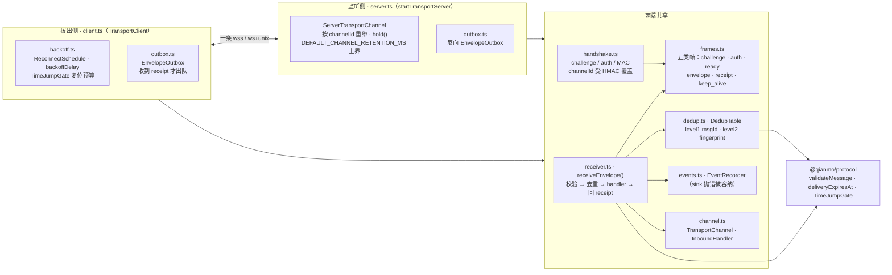

<!-- Copyright 2026 Qianmo AgentNest Team -->
<!-- SPDX-License-Identifier: AGPL-3.0-or-later -->

# @qianmo/transport —— 阡陌网络的一跳

**一句话定位**：两个节点之间的一条长连 WebSocket，只做四件事——**监听半边**（基座完全没有的那半）、**预共享密钥握手**（明确非生产级）、**带时间跳跃闸门的退避重连**、**at-least-once 投递 + 接收端两级去重**。路由、判环、限流、TTL 强制与信箱交接都不在这里。

| 项 | 指针 |
| --- | --- |
| 任务包 | roadmap **P2.2**（节点间传输通道）；双向逻辑通道与 receipt 驱动 outbox 由 **P4.1** 补入 |
| 章程条目 | charter **§3.3 C-3**（长连接 + TLS + PSK 握手，基座起点：部分）；非生产级由 **N-3** 限定 |
| 协议真源 | `protocol.md` §7.2（两级去重与 TTL 口径）、§5.3（时间跳跃闸门 T-2） |
| 完成状态 | roadmap「完成状态速查」P2.2 行（**附报警**，见下文第 4 节）与 P4.1 行 |

## 1. 模块架构图



一条入站信封的经过：`parseFrame` → （未握手则先 challenge/auth）→ `receiveEnvelope` → `validateMessage`（用**过闸门的**时钟判投递时限）→ `DedupTable.admit` → 调用方 handler → 回一枚 `ReceiptFrame`。handler 抛错则 `dedup.forget` 并回 `rejected`，让发送方的重试还能落地。

## 2. 对外 API 面

读 `src/index.ts`：

- **`startTransportServer` / `TransportServerOptions` / `TransportServerHandle`** —— 监听半边。可绑 TCP 端口或 unix socket；`DEFAULT_IDLE_TIMEOUT_SEC` / `DEFAULT_MAX_CHANNELS` / `DEFAULT_CHANNEL_RETENTION_MS` 是它的三条上界。
- **`TransportClient` / `TransportClientOptions` / `TransportEndpoint` / `ClientTlsOptions` / `dialUrl`** —— 拨出半边，本身实现 `TransportChannel`。
- **`TransportChannel` / `InboundHandler` / `InboundContext`** —— 业务层看到的**受限**通道面：`send` / `sendAndWait` / `waitForDrain` / `hold()` / `id` / `peerNode` / `pending`。业务层拿不到裸 socket。
- **`FrameType` / `ReceiptStatus` / `parseFrame` / `serializeFrame` / `FRAME_VERSION` 与五类帧类型** —— 帧语法。**receipt 不是协议的 `ack`**，本包从不构造 `MessageType.Ack`。
- **`DedupTable` / `DedupVerdict` / `DEFAULT_MAX_ENTRIES`** —— 两级去重表，表项按**投递时限**过期。`@qianmo/router` 直接复用它，不另造第二张。
- **`ReconnectSchedule` / `backoffDelay` / `DEFAULT_BACKOFF`** —— 退避与时间跳跃闸门参数（含 `timeJumpFactor`）。
- **`assertUsablePsk` / `pskFromEnv` / `verifyAuth` / `computeMac` / `newNonce` / `newChannelId` / `isChannelId` / `PSK_MIN_LENGTH` / `PSK_ENV_VAR` / `HandshakeRejection` / `WeakSecretError` / `CLOSE_UNAUTHORIZED` / `CLOSE_PROTOCOL_ERROR`** —— 握手面。密钥**永不是字面量**，由调用方注入。
- **`EventRecorder` / `TransportEventType` / `TransportEventSink`** —— 可观测面，是 `@qianmo/audit` 的上游。
- **`OutboxFullError` / `TransportReceiptError` / `SuccessfulReceiptStatus` / `DEFAULT_MAX_QUEUED`** —— outbox 的失败面。

协议级数值（消息体积、跳数、两个时限、入站预算）**不在本包**，一律以 `@qianmo/protocol` 的 `LIMITS` 为唯一出处。

## 3. 最容易被改坏的五条不变式

| # | 不变式 | 改坏了会怎样 | 钉住它的测试 |
| --- | --- | --- | --- |
| 1 | **一条信封只有收到 receipt 才离开 outbox**——这就是 at-least-once 的全部内容 | 改成「写出去就出队」，一次断线就是静默丢消息 | `test/integration.test.ts`「DoD 1 — an outage is survived and nothing is lost」；`test/outbox.test.ts` |
| 2 | **两级去重（`msgId` / `fingerprint`），表项按投递时限过期，且全网只有这一张表** | 少一级，重启后重建同一件工作会被当成新活干第二遍；再造一张，网络就有两张表一份契约 | `test/dedup.test.ts` 全部；`test/integration.test.ts`「DoD 2 — three deliveries, one handling」两条 |
| 3 | **回程走同一条逻辑通道，没有第二条连接**：`channelId` 受握手 MAC 覆盖，物理断线后按同一 id 重绑并重放反向 outbox；无人认领的通道有保留上界 | 另开一条反向连接，AC-2 已验收的「`link.opened=1`」独立核验就不成立；去掉保留上界，通道会永久滞留直到容量耗尽、每条新握手都被拒 | `test/handshake.test.ts`「the mac covers the node name and logical channel id」；`test/integration.test.ts`「the server returns an envelope on the same physical socket」「a disconnected logical channel rebinds and replays its reverse outbox」「a channel nobody comes back for is reclaimed, not retained forever」 |
| 4 | **解冻不是失败**：超过阈值的间隔判为「刚解冻」，**复位**重连预算而不是消耗它，静默看门狗也先 rebase | 去掉闸门，睡了几十秒的节点一醒来就发现预算已耗尽、自我判死 | `test/backoff.test.ts`「a freeze resets the budget instead of consuming it」「the 34.7 s E4 gap distinguishes factor 2 from the A/B candidate」「maximum legal jitter is never mistaken for a freeze by the candidate」；`test/integration.test.ts`「rule T-2 — thaw does not kill a healthy link」 |
| 5 | **调用方给的事件 sink 抛异常不得带崩服务端**——异常被容纳并记为 `sink_failed`，原记录仍在 | 让它冒泡，一个日志回调的 bug 就能打掉整个监听侧（这是 v2.12 跨机实验真抓到的缺陷） | `test/sink-isolation.test.ts` 四条 |

## 4. 与基座的关系

- **定性：部分**（charter §3.3 C-3）——基座有数千行在用的传输代码，我方缺的是服务端半边与跨节点会话路由。
- **但请连同报警一起读**：roadmap v2.6「⚠️ P2.2 报警」记录了实施时的逐行核实结论——基座 `Transport` 钉死在 SDK 控制协议类型上、全仓没有 WebSocket 服务端、与会话面硬耦合，**直接 import 的行数 = 0**。真正复用的是**设计**：退避公式与常量、10 分钟预算、「休眠检测阈值 = 2× 上限」、永久关闭码，以及「代理不数控制帧、必须发 keep-alive 数据帧」这条硬经验。代码里对应的出处注释就写在 `backoff.ts` 与 `frames.ts` 的常量旁边。
- 逐项缺口见 [`base-adoption.md`](../../docs/dev/base-adoption.md) §3.2「跨节点传输通道」「加密消息」两行。
- 代码层面：本包对基座 `src/` **零 import**。运行时依赖只有 `ws`（在根 `package.json` 声明一次，本包不重复声明——knip 的未用依赖门禁会把二次声明报成死重）与 Bun 的 `Bun.serve`。

## 5. 边界与已知未做

- **PSK 非生产级**（章程 N-3，`handshake.ts` 头逐条列明）：一把对称密钥全网共用、无轮换 / 无过期 / 无吊销、只认证连接不认证单条信封。因此握手里的 `node` 是**审计标签，不是授权身份**——真正的授权在 `@qianmo/capability`，`from` 的重渲染在 `@qianmo/adapter`（规则 E-1）。
- **服务端半边不能主动向已连对端发起投递**：它只应答 receipt。宿主要主动进沙箱，靠 `@qianmo/activator` 在宿主侧拨出（见 `packages/activator/src/link.ts` 的说明）。
- **receipt 只能回一个固定的 `E_UNDELIVERABLE`**，处理器选的具体码回不到发送方——该限制记在 `packages/activator/src/node.ts` 的「Known limitation」段，改它属于本包的帧语法改动。
- **测试口径**（roadmap P2.2）：单机集成测试走 unix domain socket，**只有跨机 e2e 才用 TCP**——两个 server 绑同一端口在 Linux 上会非确定性分流。真实跨机跨架构验证记录见 roadmap v2.12。

## 6. 怎么跑测试

```bash
bun test packages/transport
```

实测：**61 pass / 0 fail，9 个测试文件**（`backoff` / `dedup` / `frames` / `handshake` / `integration` / `outbox` / `shutdown-race` / `sink-isolation` / `tls`），零 mock；集成与 TLS 用例起真实 server。

## 7. P9.3 双人签字

> owner 栏语义见 roadmap「任务包字段说明」（v2.3）：主开发一律是喻永昌，owner 栏原名单读作「方向辅助人 / 第二知情人」，括号内 backup 读作「第二辅助」。下表按 P2.2 的 owner 栏填名。

| 角色 | 姓名 | 签字 | 日期 |
| --- | --- | --- | --- |
| owner（P2.2 owner 栏） | 陈曦宇 | | |
| backup（P2.2 括号内） | 陈子轩 | | |

### backup 需能独立复述的 3 道题

1. 一条 `ack` 从沙箱内回到发送方，走的是哪条连接？请说清 `channelId` 由谁生成、被什么覆盖、物理断线之后凭什么还能对上；再说明「无人认领的通道」为什么必须有保留上界。
2. 帧层的 `receipt` 和协议层的 `ack` 差在哪里？为什么本包从不构造 `MessageType.Ack`？如果在本包里「写出去就回 ack」，哪条验收标准会先出问题？
3. 一个被冻结 30 多秒的节点醒来时，重连预算为什么没有被烧光？闸门的阈值是怎么算出来的，为什么最大合法抖动不会被误判成一次冻结？
