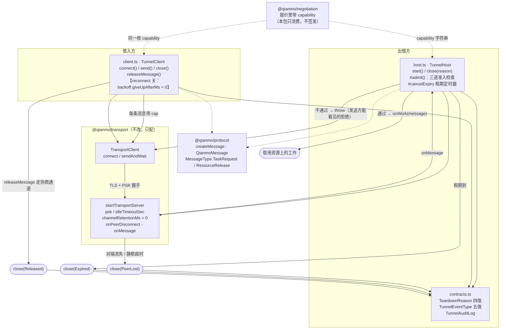

<!-- Copyright 2026 Qianmo AgentNest Team -->
<!-- SPDX-License-Identifier: AGPL-3.0-or-later -->

# @qianmo/tunnel —— 按需加密隧道

一条**只在租约存续期间存在**的连接：协商之前没有任何东西在监听，租约结束之后同样没有；三条拆除路径中有两条**完全不需要对端配合**。

| 项 | 指针 |
| --- | --- |
| 任务包 | roadmap **P5.3 按需加密隧道**（交付物「三种拆除路径 + 建立与拆除均产生审计事件」在那里） |
| 章程条目 | charter §3.4 **S-3 按需加密隧道**（基座起点「自研」）；**N-3** 限定 M0 只用 TLS + 预共享密钥，本包**不引入第二套加密** |
| 协议级数值 | 本包不定义协议级上限；`DEFAULT_IDLE_TIMEOUT_SEC = 30`（AC-7 要求 ≤ 60 s）是本地策略。跨节点上限一律见 `@qianmo/protocol` 的 `LIMITS` |

**「按需加密隧道」买到的是哪四个字**：不是「加密」——那是 `@qianmo/transport` 已有的 TLS + PSK；是**「按需」**。在 `@qianmo/transport` 之上只加三件事：① 租约存在之后才开、并与之绑定的监听器；② 首条消息上的准入检查（借入方必须出示出借方自己签发的 capability）；③ 三条拆除路径。

---

## 1. 模块架构图



**三条拆除路径**：

| 路径 | 触发者 | 需要谁配合 |
| --- | --- | --- |
| `Released` | 借入方说自己做完了 | 借入方——但正因为它靠不住，才有下面两条 |
| `Expired` | 租约自己的期限，跑在出借方的钟上 | 没有人 |
| `PeerLost` | 套接字关闭，或静默超过 idle 窗口 | 没有人 |

（第四个值 `Withdrawn` 留给出借方主动撤回 / 本侧失败。）

---

## 2. 对外 API 面（`src/index.ts`）

| 导出 | 一句话 |
| --- | --- |
| `TunnelHost` / `TunnelHostOptions` / `TunnelAddress` | 出借方一侧：`start()` 开监听并返回拨号地址、`close(reason)` 幂等拆除；`open` / `closedBecause` / `carried` 三个只读状态 |
| `DEFAULT_IDLE_TIMEOUT_SEC` | 判定「对端没了」的静默窗口，30 s |
| `TunnelClient` / `TunnelClientOptions` | 借入方一侧：`connect()` / `send()`（每条消息带 `cap`）/ `close()`；`releaseMessage(offerId)` 产出的是走**协商通道**的信封，不是本连接上的消息 |
| `TeardownReason` | 拆除原因闭集：`released` / `expired` / `peer-lost` / `withdrawn`——「不明原因关闭」不在集合里 |
| `TunnelEventType` / `TunnelEvent` / `TunnelAuditLog` / `TunnelAuditSink` | 五种事件（`Opened` / `Admitted` / `Refused` / `Carried` / `Closed`）；有界环形 + 无界计数，sink 抛错被吞（一个坏 sink 不能让隧道关不掉） |
| `Scheduler` / `timerScheduler` / `CancelTimer` | 可注入定时器（`setTimeout` + `unref`） |

---

## 3. 最容易被改坏的五条不变式

| # | 不变式 | 改坏会怎样 | 哪个测试钉住 |
| --- | --- | --- | --- |
| 1 | **客户端关重连**（`backoff.giveUpAfterMs = 0`）——这是本仓库唯一一处刻意关掉重连的客户端 | `@qianmo/transport` 默认重连，对节点长连是对的，对隧道恰好是错的：一条在租约结束后、或借入方死掉重启后**又回来**的隧道，就是一份活过了自己条款的租约 | `test/tunnel.test.ts`：`a reconnect attempt after teardown does not resurrect the lease` |
| 2 | **隧道断 ≠ 租约还**：`releaseMessage()` 产生的是**协商通道**上的 `resource.release`；关掉连接本身不等于归还了租约，反过来租约到期也一定会关掉连接 | 把「关连接」当成「已归还」，出借方那边的预留要等到租期自然到点才被回收；把「归还」实现成隧道内的一条消息，借入方崩溃时就永远归还不了 | `tests/integration/qianmo-lease-tunnel.test.ts`：`releasing the lease takes the tunnel with it, and the address stops answering` / `a borrower that dies mid-task loses the tunnel without releasing anything` |
| 3 | **`channelRetentionMs: 0`**——不给对端留任何可以回来续上的逻辑通道 | 留一个哪怕很短的重连窗口，`PeerLost` 就从「拆除」退化成「重连窗口」，第三条拆除路径名存实亡 | `test/tunnel.test.ts`：`3. the peer disappears: teardown without a release` / `after teardown the address refuses connections` |
| 4 | **准入三查且拒绝要让发送方看得见**：`from` 必须是本租约的借入方、`taskId` 必须是本租约、配了 capability 时 `message.cap` 必须**逐字节相等**；不通过就 `throw`，好让传输层把它回执成 rejected | 少查一项，别的对端或别的租约就能借道这条隧道；把拒绝改成静默丢弃，发送方看不见的拒绝它只会一遍遍重发 | `test/tunnel.test.ts`：`a message without the lease capability is refused` / `a message with somebody else's capability is refused` / `a message for another lease is refused even with the right token` / `another peer's address is refused` |
| 5 | **`close()` 幂等且保留第一个原因**；早拆时必须取消租期定时器 | 关闭路径被跑两次比预想的常见得多；第二次覆盖掉原因，审计里就只剩下最后那个（往往最没信息量的）理由。残留的定时器会在租约早就结束之后再触发一次拆除 | `test/tunnel.test.ts`：`teardown is idempotent and keeps the first reason` / `the expiry timer does not outlive an early teardown` |

---

## 4. 与基座的关系

- **定性**：**完全自研**（charter §3.4 S-3；`docs/dev/base-adoption.md` §3.2「资源协商 / 加密隧道 / 预测性扩容」行判「无」）。基座 2026-07 已整体删除远程传输层，跨节点传输是从零自研（`CLAUDE.md` §1.2）。
- 本包**不改基座核心、不导入基座模块**，依赖只有 `@qianmo/protocol` 与 `@qianmo/transport`。
- 基座改造点全量清单见 `docs/dev/base-modifications.md`。

---

## 5. 边界与已知未做

| 事项 | 一行摘要 | 指针 |
| --- | --- | --- |
| **不是新的加密层** | M0 就是 TLS + 预共享密钥，且这是被写明的局限；在这里再发明一套只会比现有的更差 | 章程 N-3；`src/contracts.ts` 顶部注释 |
| 「无残留」的诚实边界 | 拆除后：服务停了（后续拨号报连接错误，测试是**实测**不是假设）、不留逻辑通道、凭据字段随对象释放。**但这是 GC 运行时，「从内存里抹掉」本文件不做这个承诺** | `src/host.ts`「what "no residue" means here, precisely」 |
| 不配 capability 时的口径 | 没接凭据体系的部署，隧道对持有 PSK 的任何人开放——代码里直说，不暗示更多 | `src/host.ts` `TunnelHostOptions.capability` 注释 |
| 只做字节相等，不重验签名 | 只有本节点能产出这个串（协议规则 S-1），而它正是报价里递出去的那一个；再验一次签名是把同一件事挪远一步 | `src/host.ts` `#admit` 注释 |
| 一条隧道一份租约 | 不做复用、不做多路租约共享一个监听器 | `src/host.ts` `TunnelHostOptions.offerId` 注释 |

---

## 6. 怎么跑测试

```bash
bun test packages/tunnel/test                             # 包内：15 用例 / 1 文件（实跑 2026-08-15）
bun test tests/integration/qianmo-lease-tunnel.test.ts    # 与 negotiation 的联跑：3 用例
```

- 包内 **15 pass / 0 fail / 33 expect**，四组：`the tunnel carries work while the lease lives` 2 / `admission` 5 / `the three teardown paths` 5 / `no residue` 3。用真 unix socket 起真传输服务，不 mock 传输层。
- 集成腿 **3 pass / 19 expect**：协商拿到的 token 就是隧道准入用的 token、归还租约会带走隧道、借入方中途死掉时隧道自己消失。

---

## 7. P9.3 双人签字栏

> roadmap v2.3 起 owner 栏语义为「方向辅助人」，主开发统一为喻永昌；**P9.3 双人签字属明确写「双人」的流程要件，不受该条影响**，仍按本任务包 owner / backup 执行（roadmap v2.3 例外条款）。

| 角色 | 姓名（按 roadmap P5.3 owner 栏） | 签名 | 日期 |
| --- | --- | --- | --- |
| owner | 陈曦宇 | | |
| backup | 董宗岳 | | |

**owner 出给 backup 的三道题**：

1. 「按需加密隧道」这五个字里，本包真正实现的是哪两个字、哪三个字是别人已经给的？如果有人提议在这里加一层自己的加密，用章程的哪一条拒绝他？
2. 三条拆除路径分别是什么？说出每条**需要谁配合**。为什么单靠第一条不够——举出借入方中途崩溃的那个场景，说明另外两条各在什么时刻兜住它。另外：`channelRetentionMs: 0` 拿掉会让哪一条退化成什么？
3. 为什么 `TunnelClient` 是本仓库唯一一个关掉重连的客户端？「隧道断了」和「租约还了」是不是一回事——各自由哪条代码路径完成、走的是哪条通道？
